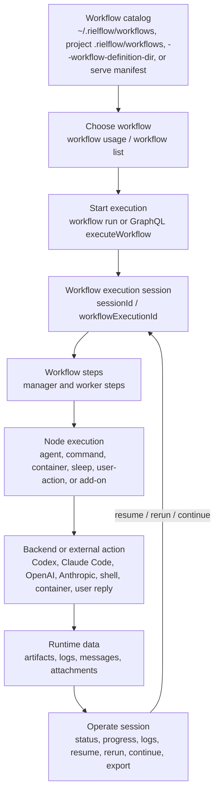

# Rielflow

Rielflow (`rielflow`) is a TypeScript/Bun workflow runner for cooperative
multi-agent work.
It lets you define reusable workflows, choose the right workflow by purpose, run
them locally or through a GraphQL control plane, and inspect execution progress
afterward.



## What You Can Do

- Store reusable workflow bundles in a user catalog (`~/.rielflow/workflows`), a project catalog (`<project>/.rielflow/workflows`), or an explicit workflow definition directory.
- Discover available workflows and their callable contracts before running them.
- Run workflows using agent backends such as `codex-agent`,
  `claude-code-agent`, `cursor-cli-agent`, `official/openai-sdk`, and
  `official/anthropic-sdk`.
- Run deterministic mock scenarios for demos, tests, and documentation without real agent calls.
- Pause a workflow with `nodeType: "sleep"` without blocking the worker; the runtime registers a scheduled continuation event and resumes the queued steps when it fires.
- Monitor, resume, rerun, continue, export, and inspect workflow executions.
- Start workflows with supervisor-backed execution by default; `--no-auto-improve` disables workflow patching but keeps deterministic supervision.
- Start a local GraphQL control plane for remote execution and manager/control-plane operations.
- Receive external events, replay event receipts, inspect reply dispatch records, and register chat-created workflow schedules.
- Install shell hooks/snippets for Claude Code, Codex, and Gemini.

## Install

Install with Homebrew after publishing the release archives and formula to a
tap:

```bash
brew tap tacogips/tap
brew install rielflow
```

Homebrew release archives are standalone `bun build --compile` executables, so
the installed `rielflow` binary embeds the Bun runtime and does not require Bun
as a runtime dependency. See `packaging/homebrew/README.md` for the release
archive and formula generation workflow. The formula is published from the
existing `tacogips/homebrew-tap` repository under `Formula/rielflow.rb`.

Install dependencies for local development:

```bash
bun install
```

Run commands from source:

```bash
bun run packages/rielflow/src/bin.ts <command>
```

The repository no longer keeps a root `src/` runtime tree. Source-based CLI
examples should use the package-local executable under `packages/rielflow/src`.

Run directly from the Nix flake on Linux or Darwin:

```bash
nix run github:tacogips/rielflow -- workflow list
```

Install the flake package into your user profile:

```bash
nix profile install github:tacogips/rielflow
```

The flake package provides a `rielflow` wrapper. Development still uses `nix
develop` or direnv when you want the full local toolchain.

Entering the repository through `nix develop` or direnv also provides
`gitleaks`, generates the repo-local `.pre-commit-config.yaml`, and installs a
Nix-managed `pre-commit` hook that scans staged changes for secrets before
`git commit` completes. If you need to install or refresh the hook without
opening an interactive shell, run `task install-git-hooks`.

GitHub Actions also runs `gitleaks` on `push` and `pull_request` as a repo-side
backstop in case a local hook was not installed yet.

## Package Architecture

The repository is a Bun workspace with package roots under `packages/*`. The
root `package.json` stays private and orchestrates shared build, test, lint, and
typecheck commands for the workspace.

- `packages/rielflow-core` exposes the core workflow runtime, session/runtime DB,
  supervisor, manager control, catalog, inspection, shared library contracts,
  dedicated retrospective self-improve service APIs, deterministic supervisor
  runner-pool lifecycle APIs, backend constants/normalization helpers, and
  filesystem helpers used by the runtime.
- `packages/rielflow-addons` exposes built-in node add-on registries and native
  add-on execution helpers, including the package-owned
  `isContainerRunnerWithDockerCli` predicate for container runners that can
  satisfy Docker CLI requirements (`podman`, `docker`, and `nerdctl`). It
  depends inward on `rielflow-core`; core does not export native add-on
  execution or add-on registry construction.
- `packages/rielflow` is the compatibility facade named `rielflow`; it preserves
  the current `import "rielflow"` library surface, `./cli` export, and CLI binary
  behavior. The `rielflow/cli` export is import-safe and exposes `runCli` without
  starting the command or mutating `process.exitCode`; executable startup lives
  in the package `bin` wrapper.

Use the root commands for repository development and verification:

```bash
bun run build
bun run typecheck
bun run lint:biome
bun run test
```

CLI, GraphQL, event-source, and HTTP server code remain in the compatibility
package for this stage because those areas currently share command dispatch and
transport wiring. They can become separate packages after their imports depend
only on core contracts and no longer require compatibility-facade internals.
Runner-pool state is owned by core supervision code; the `rielflow` package is a
compatibility facade and must not maintain a separate supervisor run pool.
Temporary CLI imports from root workflow modules are tracked by package-boundary
tests while package-owned adapters are still being split out; new root imports
must be explicit compatibility entries, not broad allowlist patterns.

The removed root `src/` directory is guarded by package-boundary and source
filename checks; runtime and test ownership for the compatibility package stays
under `packages/rielflow/src`.

## Development Checks

`bun run lint:biome` is the shared Biome lint path for local development, task
automation, and CI checks. It runs Biome with the repository's configured
diagnostic level and also rejects source files named `part-<digits>.ts` or
`part-<digits>.tsx`. When splitting code, use descriptive source filenames such
as `workflow-loader.ts`, `node-output-contract.ts`, or
`session-partition.ts`. The filename policy is implemented by
`bun run check:source-filenames`; run the shared `lint:biome` script instead of
calling `biome check` directly when validating repository changes.

## OpenTelemetry And Jaeger

Rielflow can emit coarse OpenTelemetry spans for workflow runs, step execution,
adapter calls, mailbox handoff, server requests, GraphQL handling, and event
listener startup. Telemetry is disabled unless an OTLP endpoint is configured or
`RIELFLOW_OTEL_ENABLED=true` is set. Message bodies are not exported by
default; keep `RIELFLOW_OTEL_EXPORT_MESSAGES` unset or `false` unless you are
debugging a trusted local fixture.

Local Jaeger smoke verification:

```bash
docker compose -f compose.jaeger.yaml up -d
docker compose -f compose.jaeger.yaml ps
OTEL_SERVICE_NAME=rielflow OTEL_EXPORTER_OTLP_ENDPOINT=http://localhost:4318 \
  bun run packages/rielflow/src/bin.ts workflow run first-four-arithmetic-pipeline \
  --workflow-definition-dir ./examples \
  --mock-scenario ./examples/first-four-arithmetic-pipeline/mock-scenario.json \
  --output json
curl -fsS http://localhost:16686/api/services | jq -e '.data | index("rielflow") != null'
curl -fsS 'http://localhost:16686/api/traces?service=rielflow&limit=20' \
  | jq -e '[.data[]?.spans[]?.operationName] | length > 0'
docker compose -f compose.jaeger.yaml down
```

Use `RIELFLOW_OTEL_EXPORT_MESSAGES=true` only for trusted fixtures. Redaction
still runs when message export is enabled, but prompts, model output,
authorization headers, GraphQL variables, stdout/stderr, attachments, and file
contents should not be treated as routine telemetry attributes.

## Workflow Locations

By default, rielflow looks for workflow bundles in scoped catalogs:

- User catalog: `~/.rielflow/workflows/<workflow-name>/workflow.json`
- Project catalog: `<project>/.rielflow/workflows/<workflow-name>/workflow.json`

For examples, tests, or one-off runs, bypass scoped lookup with:

```bash
--workflow-definition-dir ./examples
```

This option points at a directory containing workflow bundle directories. It
does not control where logs, sessions, artifacts, or attachments are stored.

`rielflow serve` can publish an explicit workflow allowlist from a server
manifest:

```bash
bun run packages/rielflow/src/bin.ts serve --workflow-manifest ./workflow-manifest.json
```

`RIEL_WORKFLOW_MANIFEST` is the environment fallback when
`--workflow-manifest` is omitted. A manifest-backed server exposes only enabled
manifest entries through the browser overview, GraphQL catalog, and
server-backed start paths. `serve [workflow-name]` narrows by manifest `id`.
When a manifest is present, it is authoritative over
`--workflow-definition-dir`; the direct definition directory is ignored for
serve catalog selection.

Manifest version `1` uses `workflows[]` entries with stable `id`, optional
`enabled`, `workflowDirectory.absolute` or `workflowDirectory.relative`,
optional `cwd.absolute` or `cwd.relative`, optional `autoImprove.mode`
(`active` or `disabled`), `defaultVariables`, and display `metadata`. Relative
paths resolve from the current directory by default. Set
`RIEL_WORKFLOW_MANIFEST_ROOT` to make relative manifest paths resolve from a
specific root instead. Each path object must use exactly one of `absolute` or
`relative`. Validate a manifest and every referenced workflow bundle with:

```bash
bun run packages/rielflow/src/bin.ts workflow manifest validate ./workflow-manifest.json
```

The manifest path can also come from `--workflow-manifest` or
`RIEL_WORKFLOW_MANIFEST`. Add `--executable` to include active node
executability preflight. Manifest `defaultVariables` are merged before request
variables so the request wins. `autoImprove.mode: "disabled"` keeps
deterministic lifecycle supervision while disabling workflow patching.
`metadata.allowDuplicateSource` is the only reserved metadata key that affects
validation; when set to `true`, duplicate enabled workflowDirectory/cwd pairs
are allowed intentionally.

Install a workflow bundle from a public GitHub directory with
`workflow checkout`:

```bash
bun run packages/rielflow/src/bin.ts workflow checkout \
  https://github.com/<owner>/<repo>/tree/<ref>/.rielflow/workflows/<workflow-name>
```

Checkout validates the remote bundle in a temporary staging directory before it
creates or replaces the destination. By default it installs into project scope
at `<project>/.rielflow/workflows/<workflow-name>`; use `--user-scope` to install
under `~/.rielflow/workflows`. Duplicate checkouts fail unless `--overwrite` is
set. Each successful checkout writes provenance to
`~/.rielflow/workflow-registry/checkouts/<scope>-<workflow-name>.json` with the
source URL, scope, checkout time, destination directory, and a SHA-256 content
digest over the checked-out workflow files, including workflow-local prompts,
scripts, skills, and other bundle files. When `--workflow-definition-dir <path>`
is supplied, checkout writes directly to `<path>/<workflow-name>` instead of a
scoped workflow catalog.

Workflow packages add a registry-backed catalog on top of scoped workflow
checkout. Registries are GitHub repositories recorded in
`~/.rielflow/workflow-packages/registries.json`; the built-in default is
`https://github.com/tacogips/rielflow-packages` with local development path
`/Users/taco/gits/tacogips/rielflow-packages`. Register another registry with:

```bash
bun run packages/rielflow/src/bin.ts workflow package registry add personal \
  --registry-url https://github.com/<owner>/<repo> \
  --local-path /path/to/local/clone
```

Display configured registries, including the built-in default registry, with:

```bash
bun run packages/rielflow/src/bin.ts workflow registry list --output json
```

The existing `workflow package registry list --output json` form remains
available for compatibility.

Each package contains `rielflow-package.json` plus a workflow bundle directory
and may also contain a separate skill directory. The manifest stores package
metadata, structured workflow metadata from
`workflow.json.metadata.rielflowPackage`, tags, `workflowDirectory`,
`skillDirectory`, a legacy md5 checksum, and sha256 integrity metadata over
deterministic package contents. Package checkout content digest metadata remains
separate from package integrity: it identifies only the installed workflow bundle
files, not `rielflow-package.json` or other package-root registry metadata.
Search reads registry metadata and uses the cache under
`~/.rielflow/workflow-packages/cache` unless `--refresh` or `--no-cache` is set:

```bash
bun run packages/rielflow/src/bin.ts workflow package search review --refresh
```

Checkout installs a package workflow into project scope by default, or user
scope with `--user-scope`. When `--workflow-definition-dir <path>` is supplied,
package checkout writes the workflow directly to
`<path>/<workflow-name>`; do not combine direct workflow-definition
destinations with `--user-scope`:

```bash
bun run packages/rielflow/src/bin.ts workflow package checkout worker-only-single-step
```

Run a registry workflow without installing it first by adding `--from-registry`
to `workflow run`. The target can be an existing package id, including scoped
package ids such as `@scope/name`, a GitHub workflow directory URL, or a
registered shorthand like `<github-owner>/<workflow-dir>` when that shorthand
resolves unambiguously through configured registries.
Rielflow stages the workflow bundle in a command-owned temporary
workflow-definition directory, runs the normal local workflow path, reports
registry provenance in JSON output, and removes the temporary checkout after a
terminal run or a pre-start failure:

```bash
bun run packages/rielflow/src/bin.ts workflow run worker-only-single-step \
  --from-registry \
  --registry default \
  --branch main \
  --mock-scenario ./path/to/mock-scenario.json \
  --output json
```

```bash
bun run packages/rielflow/src/bin.ts workflow run \
  https://github.com/<owner>/<repo>/tree/main/.rielflow/workflows/<workflow-name> \
  --from-registry \
  --output json
```

Branchless GitHub directory URLs, such as
`https://github.com/<owner>/<repo>/.rielflow/workflows/<workflow-name>`, resolve
the checkout ref from `--branch`, then a matching registered registry default
branch, then the GitHub repository default branch.

```bash
bun run packages/rielflow/src/bin.ts workflow run <owner>/<workflow-dir> \
  --from-registry \
  --registry default \
  --output json
```

Registry-backed runs are explicit and local-only: bare `workflow run <name>`
never fetches from the registry, and `--from-registry` cannot be combined with
`--endpoint`. Temporary runs validate package metadata, checksum/integrity, and
the workflow bundle for package-backed targets. Raw GitHub directory URL runs
validate the workflow bundle and report reduced `workflow-bundle-only`
provenance because package checksum metadata may not exist. Temporary runs do
not write normal checkout catalog records, mutate project/user catalogs, or
install package skills. If a registry-backed run pauses or otherwise returns a
non-terminal session status, rielflow keeps the temporary checkout in place,
stores retained run provenance for the session, and reports skipped cleanup
metadata so later local `session resume` or `session continue` operations can
still read workflow-local files. Those lifecycle commands use the retained
checkout automatically when no explicit `--workflow-definition-dir` is supplied
and remove the retained checkout and provenance record after the resumed or
continued execution reaches a terminal status.

Package skills are accepted only under the package skill directory for the
supported vendors and current vendor layouts:

- `skills/agents/AGENTS.md`
- `skills/claude/<name>/SKILL.md`
- `skills/codex/<name>/SKILL.md`
- `skills/cursor/*.mdc`
- `skills/gemini/GEMINI.md`

Package checkout stores installed skills under a managed package area before
projection. Project-scope checkout projects all supported vendors into the
current project locations: `AGENTS.md`, `.claude/skills/<name>/SKILL.md`,
`.codex/skills/<name>/SKILL.md`, `.cursor/rules/*.mdc`, and `GEMINI.md`.
User-scope installs and projects Claude and Codex skills into user-level vendor
roots; `agents`, `cursor`, and `gemini` remain managed-only in user scope.
Symlinks, path escapes, unknown vendors, and invalid vendor layouts are
rejected before install.

Package checkout can run an optional pre-install security check before it
copies the workflow or writes checkout records. `--pre-install-check` runs the
built-in static scanner and rejects high or critical findings by default. Use
`--pre-install-check-mode warn` to report findings without blocking checkout.
Add `--pre-install-check-container docker|podman|auto` to request an additional
container inspection with network disabled and the staged package mounted
read-only.

Each successful package checkout persists a package record with the registry
URL/ref, workflow name, package version, package hash/checksum, integrity
metadata, install id, destination, direct `--workflow-definition-dir` override
when used, and installed skill metadata. Use status to compare the installed
record against the registry, or update to refresh the installed workflow and
skills from the package record. Ambiguous records require `--install-id`;
mutating updates require `--yes`, while up-to-date updates return without
rewriting files:

```bash
bun run packages/rielflow/src/bin.ts workflow package status worker-only-single-step
bun run packages/rielflow/src/bin.ts workflow package update worker-only-single-step --yes
bun run packages/rielflow/src/bin.ts workflow package status --install-id <install-id> --output json
```

Publish stages a workflow directory into the selected registry local clone,
writes package metadata and integrity, commits it, and pushes the requested
branch. Publish validates `workflow.metadata.rielflowPackage` before writing the
package. Set `RIEL_WORKFLOW_PACKAGE_SIGNER_ID` plus
`RIEL_WORKFLOW_PACKAGE_SIGNING_KEY` or `RIEL_WORKFLOW_PACKAGE_SIGNING_KEY_FILE`
to add an Ed25519 package signature. Checkout always rejects sha256 digest
mismatches, and it requires trusted signatures when the registry config sets
`requireSignature`, has `trustedSigners`, or
`RIEL_WORKFLOW_PACKAGE_REQUIRE_SIGNATURE=true` is set. Use `--pr` to push a
publish branch and create a pull request when direct branch push is unavailable:

```bash
bun run packages/rielflow/src/bin.ts workflow package publish .rielflow/workflows/demo \
  --package-name demo-workflow \
  --registry default \
  --branch main
```

## Workflow Discovery

Use `workflow usage` when an LLM or automation needs to decide which workflow to
call. With no workflow name, it emits the full workflow catalog with each
workflow's purpose, callable step, callable role, input/output summary, and
compact step overview.

```bash
bun run packages/rielflow/src/bin.ts workflow usage --workflow-definition-dir ./examples --output json
```

Use `workflow list` for a human-facing catalog overview:

```bash
bun run packages/rielflow/src/bin.ts workflow list --workflow-definition-dir ./examples
```

Use `workflow status` for recent execution status for one workflow:

```bash
bun run packages/rielflow/src/bin.ts workflow status <workflow-name> --workflow-definition-dir ./examples
```

`workflow list` and `workflow status` report active executions only when those
`running` or `paused` session ids are loadable from the same runtime storage
context used by session commands. If a local `--workflow-definition-dir` points
at a recognized scoped catalog such as `<project>/.rielflow/workflows`,
workflow overview commands infer that project-scoped runtime data root so the
reported `sessionId` can be passed directly to `session status`,
`session progress`, and `session step-runs`. Explicit storage overrides such as
`--session-store`, `--artifact-root`, `RIEL_SESSION_STORE`, and
`RIEL_ARTIFACT_ROOT` still take precedence.

Derived runtime database rows, cached summaries, and session-index entries are
secondary overview inputs. If a `running` or `paused` candidate cannot be loaded
by `session status <session-id>` with the same `--workflow-definition-dir` and
storage options, overview commands exclude it from `activeExecutionCount`,
`newestActiveExecution`, active recent rows, and aggregate `running` or `paused`
status derivation.

Use `workflow inspect <workflow-name> --structure` only after you have selected
a workflow and need a compact human-facing structure view. The structure view
prints each step id on its own line, followed by the step description or `-` on
the next line indented one level deeper. It preserves indentation where the
workflow graph exposes nesting. Text `--structure` output is rendered directly
from the loaded workflow bundle after validation, so it avoids the full
inspection summary and runtime readiness checks that compact output does not
display:

```bash
bun run packages/rielflow/src/bin.ts workflow inspect <workflow-name> \
  --workflow-definition-dir ./examples \
  --structure
```

Use JSON inspection when you need the full machine-readable workflow summary,
including runtime readiness and other detailed inspection fields:

```bash
bun run packages/rielflow/src/bin.ts workflow inspect <workflow-name> \
  --workflow-definition-dir ./examples \
  --output json
```

## Run A Workflow

Create a starter workflow in the selected catalog:

```bash
bun run packages/rielflow/src/bin.ts workflow create <workflow-name>
```

Create a manager-less starter workflow:

```bash
bun run packages/rielflow/src/bin.ts workflow create <workflow-name> --worker-only
```

Validate before running:

```bash
bun run packages/rielflow/src/bin.ts workflow validate <workflow-name> --workflow-definition-dir ./examples
```

Validate local executability before running agent workflows:

```bash
bun run packages/rielflow/src/bin.ts workflow validate <workflow-name> \
  --workflow-definition-dir ./examples \
  --executable \
  --output json
```

Plain validation is passive and does not spawn backend probes. `--executable`
adds bounded local preflight for node add-ons and supported agent backends, and
returns `nodeValidationResults` with `valid`, `warning`, `invalid`, or
`unknown` status values. JSON validation preserves add-on `validate` hook
results for loaded workflows, so CLI `workflow validate`, GraphQL
`validateWorkflowDefinition`, submitted-bundle validation, and library detailed
validation expose consistent add-on `nodeValidationResults` before any
agent-backend preflight entries are appended.

Backend names are normalized through the core-owned constants and helpers
exported from `rielflow-core` and re-exported by the `rielflow` compatibility
facade. The canonical backend set is `codex-agent`, `claude-code-agent`,
`cursor-cli-agent`, `official/openai-sdk`, and `official/anthropic-sdk`.
Compatibility wrappers in `rielflow` keep the historical `null` return value for
invalid backend normalization while core validation continues to report
`undefined` for invalid values and preserves existing validation issue shapes.
For local agent backends that expose separate prompt fields, rielflow keeps
stable system instructions separate from each turn's user prompt. `codex-agent`
and `cursor-cli-agent` starts and reused-session resumes pass the user prompt as
the backend prompt while forwarding `systemPromptText` through the backend
`systemPrompt` option; this avoids duplicating system instructions when a
backend assembles the final CLI prompt during resume. Stall-watch resume nudges
keep their nudge prompt and still forward the same stable system prompt option.
Runtime readiness for container nodes reuses the add-ons-owned
`isContainerRunnerWithDockerCli` predicate so Docker CLI requirements are
recognized consistently for `podman`, `docker`, and `nerdctl`; readiness
reporting and native executor policy errors remain separate caller-owned
decisions.

Async validation and async workflow loading also treat third-party add-on
resolver calls as validation boundaries. Throwing resolvers, rejected resolver
promises, and malformed resolver return values are reported as
`ValidationIssue` records from `validateWorkflowBundleDetailedAsync` and the
async load path instead of escaping validation. Valid resolver-provided
`nodeValidationResults` remain additive and are preserved in detailed validation
output.

Run with JSON output:

```bash
bun run packages/rielflow/src/bin.ts workflow run <workflow-name> \
  --workflow-definition-dir ./examples \
  --output json
```

Run with runtime variables:

```bash
bun run packages/rielflow/src/bin.ts workflow run <workflow-name> \
  --workflow-definition-dir ./examples \
  --variables '{"hours":48}' \
  --output json
```

File-based runtime variables are also supported with explicit `@file` and the
historical bare file path form:

```bash
bun run packages/rielflow/src/bin.ts workflow run <workflow-name> \
  --workflow-definition-dir ./examples \
  --variables @./variables.json \
  --output json

bun run packages/rielflow/src/bin.ts workflow run <workflow-name> \
  --workflow-definition-dir ./examples \
  --variables ./variables.json \
  --output json
```

Patch node settings for a single validation or run without editing workflow
files:

```bash
bun run packages/rielflow/src/bin.ts workflow validate <workflow-name> \
  --workflow-definition-dir ./examples \
  --node-patch '{"worker":{"executionBackend":"cursor-cli-agent","model":"claude-sonnet-4-5"}}'

bun run packages/rielflow/src/bin.ts workflow run <workflow-name> \
  --workflow-definition-dir ./examples \
  --node-patch @./node-patch.json \
  --output json
```

`--node-patch` accepts the same inline JSON, `@file`, and bare file path forms
as `--variables`. The patch object is keyed by reusable workflow node id, not
step id, so every step that references the node sees the same invocation-local
settings. Patch values may contain only `executionBackend`, `model`, and
`effort`; unsupported effort values and invalid backend/model combinations fail
validation against the patched workflow state.
For local agent nodes, authored or patched `effort` values of `low`, `medium`,
`high`, or `xhigh` are passed through using the selected backend's concrete
control: Codex receives `model_reasoning_effort` config overrides, Claude Code
receives the native `--effort` option, and Cursor receives SDK-owned model-id
effort selection. The effective effort is reported in runtime output artifacts.

Run with a deterministic mock scenario:

```bash
bun run packages/rielflow/src/bin.ts workflow run <workflow-name> \
  --workflow-definition-dir ./examples \
  --mock-scenario ./examples/<workflow-name>/mock-scenario.json \
  --output json
```

`workflow run` starts with supervised recovery by default. `--auto-improve`
remains accepted for scripts that spell the policy explicitly, and
`--nested-supervisor` opts into running the supervisor bundle as a paired nested
workflow when that bundle is available in the workflow catalog:

```bash
bun run packages/rielflow/src/bin.ts workflow run <workflow-name> \
  --workflow-definition-dir ./examples \
  --auto-improve \
  --nested-supervisor \
  --max-supervised-attempts 3 \
  --workflow-mutation-mode execution-copy \
  --output json
```

Use `--no-auto-improve` when a quick check or isolated fixture must disable
workflow patching while preserving supervisor retry and stall detection.
Workflow bundles can set supervision defaults in `workflow.defaults.supervision`
and long-running steps can override stall detection with `steps[].stallTimeoutMs`
or node payload `stallTimeoutMs`; CLI flags still take precedence.

`workflow self-improve` is a separate retrospective feature. It reads recent
workflow execution records, writes durable reports about purpose achievement,
workflow structure, and prompts, and can be explicitly run in report-only or
report-and-auto-improve mode:

```bash
bun run packages/rielflow/src/bin.ts workflow self-improve <workflow-name> \
  --workflow-definition-dir ./examples \
  --latest \
  --limit 10 \
  --mode report-only \
  --output json
```

Workflow defaults live under `workflow.defaults.selfImprove` with `enabled`,
`mode`, and `defaultLogLimit`. Source selection defaults to runs since the last
successful self-improve marker, or the latest configured limit when no marker
exists. Use `--since-last`, `--latest`, or repeated `--session <session-id>` to
choose the source runs explicitly. `RIEL_SELF_IMPROVE_DEFAULT_LIMIT` changes
the global fallback, `--limit` overrides it for one call, and
`RIEL_SELF_IMPROVE_LOG_ROOT` can move the report store from the default
`~/.rielflow/self-improve-log/<workflow-directory-name>/<self-improve-id>/`.
Disabled workflows reject self-improve unless the caller passes
`--enable-disabled`. Public CLI, GraphQL, and library inputs are validated
before report creation or workflow writes; explicit session ids must be
non-empty ids without path separators, and `sourceMode: "explicit"` requires at
least one session id.

`report-and-auto-improve` creates a workflow-directory backup before any
canonical workflow write, validates changes, records patch status, restores the
backup if validation or patching fails, and creates a local git commit for
git-managed workflow changes without pushing. Reports are still written for
failed or reverted patch attempts, but the since-last marker advances only after
a completed report whose patch and git-commit phases did not fail. The same
patch, report, source-selection, and git paths reuse shared rielflow validation
semantics: prompt files stay workflow-relative, report and marker JSON must be
objects, source runs are hydrated from file-backed session state even when a
runtime DB index is present, and commits reject escaped, directory, empty, or
unexpected pre-staged paths.

The core service is exposed through GraphQL `executeWorkflowSelfImprove` plus
`workflowSelfImproveReport`/`workflowSelfImproveReports`, and through library
APIs `executeWorkflowSelfImprove`, `getWorkflowSelfImproveReport`, and
`listWorkflowSelfImproveReports`. These APIs are intentional public surfaces of
`rielflow-core` and the compatibility `rielflow` library facade; the CLI can use
temporary root self-improve imports only as explicitly tested compatibility
imports until package-owned CLI adapters replace them. Endpoint-backed CLI and
library calls use the GraphQL mutation and preserve selected source-run node
execution evidence in the returned report. `serve --read-only` and
`serve --no-exec` reject self-improve execution.

Supervised event and GraphQL runs are tracked by a deterministic in-process
runner pool. Use `runnerPoolRunId`, `supervisedRunId`, or
`workflowExecutionId` as the strongest identifiers for live wait, cancel, and
status operations. `workflowKey`, `alias`, and correlation-key lookup remain
convenience routes; mutating operations reject ambiguous active matches instead
of choosing one arbitrarily. Waiting and cancellation require a live
in-process handle. After a handle reaches a terminal state or the process is
restarted, durable status and progress inspection continue through persisted
supervised-run/session records, but live `runnerPoolRunId` lookup is no longer
durable.

## Session Operations

After a workflow starts, keep the returned `sessionId` / workflow execution id.

Check status:

```bash
bun run packages/rielflow/src/bin.ts session status <session-id> --output json
```

Show progress:

```bash
bun run packages/rielflow/src/bin.ts session progress <session-id>
```

List merged step-run history for the same workflow execution:

```bash
bun run packages/rielflow/src/bin.ts session step-runs <session-id> --output json
```

For any active `sessionId` reported by local `workflow status` in the same
storage context, `session status`, `session progress`, and `session step-runs`
should load that session instead of returning `session not found`.
If `session status <session-id>` would return `session not found` for that same
context, the local workflow overview should not report the session as active.

Resume a paused or resumable execution:

```bash
bun run packages/rielflow/src/bin.ts session resume <session-id>
```

Rerun from a step without importing prior step artifacts:

```bash
bun run packages/rielflow/src/bin.ts session rerun <session-id> <step-id>
```

Continue from a concrete prior step-run boundary:

```bash
bun run packages/rielflow/src/bin.ts session continue <session-id> \
  --start-step <step-id> \
  --after-step-run <step-run-id>
```

## Direct Step Calls

Use `call-step` for local debugging or direct step-addressed integration:

```bash
bun run packages/rielflow/src/bin.ts call-step <workflow-id> <workflow-run-id> <step-id> \
  --message-file ./message.json \
  --output json
```

Useful `call-step` options:

- `--message-json <json>`
- `--message-file <path>`
- `--prompt-variant <name>`
- `--continue-session`
- `--timeout-ms <ms>`
- `--resume-step-exec <id>`

## GraphQL Control Plane

Start the local server:

```bash
bun run packages/rielflow/src/bin.ts serve --workflow-definition-dir ./examples
```

Defaults:

- Host: `127.0.0.1`
- Port: `43173`
- GraphQL endpoint: `http://127.0.0.1:43173/graphql`
- Health check: `GET /healthz`

Run a GraphQL query from the CLI:

```bash
bun run packages/rielflow/src/bin.ts graphql '
  query {
    workflows(input: {})
  }
'
```

Without `--endpoint`, `graphql` executes against the local in-process GraphQL
schema using project-scoped workflow/session storage. Use `--endpoint` or
`RIEL_GRAPHQL_ENDPOINT` to send the same document to a remote server.

Run a workflow through a remote endpoint:

```bash
bun run packages/rielflow/src/bin.ts workflow run <workflow-name> \
  --workflow-definition-dir ./examples \
  --endpoint http://127.0.0.1:43173/graphql \
  --output json
```

Endpoint-backed `workflow run` uses the same default supervised recovery policy
as local execution. Pass `--no-auto-improve` when the remote GraphQL
`executeWorkflow` start must receive lifecycle-only supervision
(`maxWorkflowPatches: 0`). `--node-patch` is forwarded to endpoint-backed
`executeWorkflow` starts and validated by the remote server against the patched
workflow state.

GraphQL supervised dispatch returns `runnerPoolRunId` on
`dispatchSupervisedWorkflowCommand`. Use that id with
`supervisedWorkflowRun(input: { runnerPoolRunId })` while the server process is
still alive to target the active in-process run across later HTTP requests. For
durable inspection after terminal completion or process restart, query by
`supervisedRunId`, `workflowExecutionId`, workflow key/alias, or
source/binding/correlation data. If a GraphQL lookup supplies multiple strong
ids, such as `runnerPoolRunId` plus `workflowExecutionId`, they must identify
the same active run; conflicting strong ids fail through the shared runner-pool
ambiguity checks.

Remote-capable CLI operations include `workflow list`, `workflow status`,
`workflow run`, `session resume`, and `session rerun`. Detailed execution
inspection, logs, health-style diagnostics, and export-shaped payloads are
accessed through GraphQL rather than separate CLI subcommands.

## Events

Event commands load source configuration from `.rielflow-events` next to the
workflow root, or from `--event-root`.

Validate event configuration:

```bash
bun run packages/rielflow/src/bin.ts events validate --workflow-definition-dir ./examples --event-root ./examples/event-sources/.rielflow-events
```

Emit a fixture event:

```bash
bun run packages/rielflow/src/bin.ts events emit <source-id> \
  --event-root ./examples/event-sources/.rielflow-events \
  --event-file ./examples/event-sources/payloads/chat-message.json
```

Start listener adapters:

```bash
bun run packages/rielflow/src/bin.ts events serve --event-root ./examples/event-sources/.rielflow-events
```

List and replay receipts:

```bash
bun run packages/rielflow/src/bin.ts events list --event-root ./examples/event-sources/.rielflow-events
```

```bash
bun run packages/rielflow/src/bin.ts events replay <receipt-id> --event-root ./examples/event-sources/.rielflow-events
```

Inspect reply dispatch records for a workflow execution:

```bash
bun run packages/rielflow/src/bin.ts events replies <workflow-execution-id>
```

Set `RIEL_EVENTS_READ_ONLY=true` or pass `--read-only` to validate and
persist event receipts without dispatching workflow execution.

Element/Matrix chat sources use `kind: "matrix"` and read credentials from env
var names in source config, for example `RIEL_MATRIX_HOMESERVER_URL` and
`RIEL_MATRIX_ACCESS_TOKEN`. Matrix receive normalizes text-like
`m.room.message` events to `chat.message`; chat replies send through the Matrix
Client-Server room send API with the reply idempotency key as the transaction
id. The first slice excludes encrypted rooms, attachments, reactions, edits,
redactions, and Application Service transactions.

Chat SDK chat sources use `kind: "chat-sdk"` with the first-pass generic
webhook/send boundary. Supported providers are `slack`, `teams`, `gchat`,
`discord`, `telegram`, `github`, `linear`, `whatsapp`, `messenger`, and `web`.
Inbound webhook payloads normalize to `chat.message`, and chat replies dispatch
through a configured send endpoint referenced by env-var names. Each served
chat-sdk webhook must configure a bearer token or signing secret env var, and
the webhook path must remain relative and provider-scoped, such as
`chat-sdk/slack`. rielflow does not import direct `@chat-adapter/*` packages in
this boundary; direct provider SDK integration remains future scope after
dependency and credential review.

Local file change sources use `kind: "file-change"` and are served by
`events serve`. Configure `directory` with an absolute path or a path relative
to the source JSON file, and set `changeTypes` to the non-empty subset of
`create`, `modify`, and `delete` that should dispatch events. Created,
modified, and deleted files normalize to `file.change.created`,
`file.change.modified`, and `file.change.deleted`; payloads include a safe
relative `file.path`, file name/extension, metadata for create/modify when
available, and the configured watch label. File contents are not read. Optional
`filters.suffixes`, `recursive`, and `stabilityWindowMs` settings constrain
matching and coalesce noisy create/modify notifications. Suffix filters match
the normalized relative path by filename suffix and must not contain path
separators. `stabilityWindowMs` must be an integer from `0` through `60000`.

Sequential instruction lists use `kind: "sequential-list"` and are served by
`events serve`. Configure a non-empty ordered `entries` array where each entry
has a unique safe `id`, a non-empty `prompt`, and optional JSON-object
`metadata`. Each entry normalizes to one `sequential-list.item.ready` event;
the event input includes `prompt`, optional `metadata`, and `sequence`
metadata with source id, config revision id, run id, item id, index, total,
and prior receipt or workflow execution references. The adapter persists
sequence state under the runtime data root and dispatches the next entry only
after the previous workflow execution or supervised run reaches a terminal
state. `events list` shows the normal receipts, and the normalized receipt
artifact contains the sequence metadata for inspection. `events replay
<receipt-id>` replays only that persisted item with a replay-specific event id
and does not reset the sequence cursor. In read-only mode, rielflow records a
skipped receipt and state for the current item without dispatching and without
advancing the durable cursor.

Chat event bindings can use `execution.mode: "schedule-registration"` to run a
resolver workflow that returns a structured schedule decision. Ready decisions
are validated against the workflow catalog, persisted in the runtime database,
and enqueued as the next `workflow-schedule` event. Confirmation,
clarification, and refusal replies are sent only when the event has a safe reply
destination. Unsafe successful registrations still persist and enqueue the
schedule without dispatching a chat reply; unsafe clarification or refusal
decisions do not persist schedules. Operators can inspect and cancel registered
schedules from the same artifact root:

Schedule-registration bindings use binding `inputMapping` to choose the
resolver workflow input, including timezone-relevant event fields. The
schedule-registration execution policy only selects the resolver workflow/node
and optional confidence threshold; it does not support `execution.inputPath` or
`execution.timezonePath`.

Schedule registration treats resolver output as untrusted until runtime
validation succeeds. When a binding sets `minConfidence`, a ready decision must
include numeric `confidence`; missing or below-threshold confidence produces
clarification when a safe reply destination exists and refusal otherwise.
One-time schedules accept absolute `dueAt` timestamps with `Z` or a numeric UTC
offset, and also accept offset-less wall-clock timestamps such as
`2026-05-19T09:00:00` only when `schedule.timezone` is a valid IANA timezone.
Offset-less values are resolved in that timezone before rielflow stores the
canonical UTC `nextDueAt`; invalid, ambiguous, or unresolvable wall-clock times
do not persist a schedule.

```bash
bun run packages/rielflow/src/bin.ts events schedules list --artifact-root ./tmp/event-source-demo/workflow-artifacts --source chat-sdk-slack --status active
bun run packages/rielflow/src/bin.ts events schedules inspect <schedule-id> --artifact-root ./tmp/event-source-demo/workflow-artifacts --output json
bun run packages/rielflow/src/bin.ts events schedules cancel <schedule-id> --artifact-root ./tmp/event-source-demo/workflow-artifacts --reason "operator cleanup"
```

## Scheduling

Workflow sleep nodes use `nodeType: "sleep"` with a `sleep` payload containing
exactly one wake condition: `durationMs` as a positive integer or `until` as a
timestamp with an explicit `Z` timezone or numeric UTC offset. Sleep nodes are
worker-only and cannot declare agent, command, container, user-action, or addon
execution payload fields.

During workflow execution, a sleep node records a `workflow-sleep` scheduled
event on the session and returns while the workflow is paused. The shared
scheduled event manager owns the in-process timer, fires due sleep events,
re-loads the paused session before continuation, and resumes queued workflow
steps only when the session still owns the pending event. Pending sleep events
are cancelled or marked failed across cancellation, rerun or replacement, and
terminal session lifecycle paths so stale timers do not revive superseded work.
Cancellation only transitions pending scheduled events; firing, fired, failed,
and already-cancelled event states remain authoritative for inspection and
failure handling.

Cron event sources also register `cron` events through the shared scheduled
event manager. `events serve` passes that manager into local workflow triggers,
the cron adapter registers the next occurrence on startup, and each fired cron
event computes and registers the following occurrence while preserving existing
binding, dedupe, receipt, and input-mapping behavior.

Persisted chat-created workflow schedules use the same shared event manager.
Schedule registration, recurring re-arm, and event listener startup enqueue the
next `workflow-schedule` occurrence. When a due occurrence fires, rielflow builds
an internal `rielflow-scheduler` event and dispatches it through generated
bindings so normal event receipts, dedupe keys, workflow input mapping, and
workflow trigger execution remain in the event path.

## Hooks

Run a hook receiver:

```bash
bun run packages/rielflow/src/bin.ts hook --vendor claude-code
```

Print an install snippet:

```bash
bun run packages/rielflow/src/bin.ts hook snippet --vendor codex
```

Supported vendors:

- `claude-code`
- `codex`
- `gemini`

## Common Options

- `--workflow-definition-dir <path>`: directory containing workflow bundles.
- `--workflow-manifest <path>`: workflow allowlist manifest for `serve` and
  `workflow manifest validate`. In serve mode, the server exposes enabled
  manifest entries only and ignores `--workflow-definition-dir` for catalog
  selection.
- `--scope auto|project|user`: choose scoped catalog lookup.
- `--user-root <path>`: override the user scope root.
- `--project-root <path>`: override the project scope root.
- `--addon-root <path>`: use a direct add-on root override.
- `--worker-only`: create a manager-less starter workflow.
- `--artifact-root <path>`: override execution artifact storage.
- `--session-store <path>`: override session JSON storage.
- `--working-directory <path>`: run workflow work relative to a specific directory.
- `--variables <json|@file|file>`: load runtime variables from an inline JSON
  object, explicit `@file`, or a JSON object file path.
- `--node-patch <json|@file|file>`: apply invocation-local workflow node
  settings for `workflow validate` and `workflow run` without rewriting the
  workflow bundle.
- `--mock-scenario <path>`: use deterministic mock backend responses.
- `--output json`: emit structured output.
- `--dry-run`: plan/check without normal execution where supported.
- `--auto-improve`: explicitly request the default supervised recovery policy.
- `--no-auto-improve`: keep supervised recovery but set the workflow patch budget
  to zero, including through remote GraphQL `workflow run --endpoint ...` starts.
- `--verbose` / `-v`: print local workflow step-start progress to stderr.
- `--max-steps <n>`: cap workflow execution steps.
- `--max-concurrency <n>`: cap fanout concurrency for a workflow run.
- `--max-loop-iterations <n>`: cap loop iterations.
- `--default-timeout-ms <ms>`: override default node timeout.

## Runtime Data

Default runtime data lives under:

```text
~/.rielflow/artifacts/
```

For project-catalog workflows discovered from `<project>/.rielflow/workflows`,
the default is project-namespaced under the user root:

```text
~/.rielflow/projects/{project_basename}-{project_root_hash}/artifacts/
```

By default this root contains:

- `workflow/`: execution artifacts
- `sessions/`: persisted session JSON files
- `files/`: attachments
- `rielflow.db`: runtime index database

Each workflow node execution stores runtime-owned audit records under its
artifact directory. Agent executions include `input.json`, `mailbox/inbox/`
metadata and input, final `output.json`, `meta.json`, `handoff.json`, and, for
structured-output attempts, `output-attempts/attempt-*/request.json`,
`candidate.json`, and `validation.json`. Request artifacts record the configured
`executionBackend` and `model`, while `mailbox/inbox/input.json` preserves full
`latestOutputs` for downstream review steps even when prompt summaries are
truncated.
Workflow communication deliveries are also persisted under the workflow
artifact root in `communications/<communication-id>/` with `message.json`,
`meta.json`, `outbox/`, `inbox/`, and `attempts/<attempt-id>/` records. Replay,
retry, manager-message, and mailbox delivery paths use this same artifact shape,
so operators can inspect one communication id consistently across normal
delivery and manual rerun flows.

Relocate storage with the runtime environment variables:

- `RIEL_ARTIFACT_DIR`
- `RIEL_ARTIFACT_ROOT`
- `RIEL_SESSION_STORE`
- `RIEL_ATTACHMENT_ROOT`
- `RIEL_RUNTIME_DB`

Workflow and server environment variables use the `RIEL_*` prefix:

- `RIEL_WORKFLOW_DEFINITION_DIR`
- `RIEL_WORKFLOW_MANIFEST`
- `RIEL_WORKFLOW_MANIFEST_ROOT`
- `RIEL_WORKFLOW_SCOPE`
- `RIEL_USER_ROOT`
- `RIEL_PROJECT_ROOT`
- `RIEL_ADDON_ROOT`
- `RIEL_SERVE_HOST`
- `RIEL_SERVE_PORT`
- `RIEL_GRAPHQL_ENDPOINT`
- `RIEL_MANAGER_AUTH_TOKEN`
- `RIEL_MANAGER_SESSION_ID`
- `RIEL_MANAGER_STEP_ID`
- `RIEL_MANAGER_NODE_EXEC_ID`
- `RIEL_EVENT_ROOT`
- `RIEL_EVENTS_HOST`
- `RIEL_EVENTS_PORT`
- `RIEL_EVENTS_READ_ONLY`
- `RIEL_MAILBOX_DIR`
- `RIEL_WORKFLOW_ID`
- `RIEL_WORKFLOW_EXECUTION_ID`
- `RIEL_NODE_ID`
- `RIEL_NODE_EXEC_ID`
- `RIEL_AGENT_BACKEND`
- `RIEL_HOOK_RECORDING`
- `RIEL_HOOK_STRICT`
- `RIEL_HOOK_CAPTURE_RAW`
- `RIEL_LLM_STALL_CHECK_INTERVAL_MS`
- `RIEL_LLM_STALL_NUDGE_MAX_ATTEMPTS`
- `RIEL_LLM_STALL_NUDGE_PROMPT`
- `RIEL_MATRIX_HOMESERVER_URL`
- `RIEL_MATRIX_ACCESS_TOKEN`

Example event-source bundles also use `RIEL_*` names for provider-specific
credentials such as `RIEL_EXAMPLE_REPLY_ENDPOINT`,
`RIEL_CHAT_SDK_SLACK_*`, and `RIEL_CHAT_SDK_DISCORD_*`.

## Example Workflows

Reference workflow bundles live under `examples/`. See
`examples/README.md` for the full catalog.

Recommended starting points:

- `worker-only-single-step`: minimal manager-less workflow.
- `claude-rielflow-codex-coding`: mixed backend workflow with coordination on Claude Code and coding work on Codex.
- `workflow-call-simple`: parent workflow that calls a worker-only review workflow.
- `node-combinations-showcase`: examples for command, container, and foreach-style workflow lanes.
- `scheduled-sleep`: minimal workflow that waits with `nodeType: "sleep"` before continuing to a worker step.
- `supervised-mock-retry`: deterministic example for `--auto-improve` retry behavior.
- `chat-reply-webhook`: event-driven chat reply workflow using the built-in reply worker add-on.
- `event-sources`: includes webhook, cron, S3, Element/Matrix, and Chat SDK source fixtures.

## Repository Workflows

Repository-local workflow bundles live under `.rielflow/workflows/` and are
intended for maintaining this repository.

Use `refactoring-divide-and-conquer` for bounded maintainability refactors. It
slices the codebase, fans out read-only `refactoring-slice-review` child runs,
merges findings into an implementation plan, implements one ready task at a
time, self-reviews, independently post-reviews, and loops until the plan is
complete or only accepted residual risks remain.

Duplicate-scavenge refactoring is an additive mode of the same workflow, not a
separate workflow. Request it with `workflowInput.refactoringMode: "duplicate-scavenge"`
or equivalent `requestedOutcome` / constraint text when you want the workflow
to search for duplicate implementations, parallel custom implementations of the
same concept, repeated validation/parsing/normalization or control-flow
logic, and code that can safely move behind an existing helper, API, workflow
primitive, add-on, or narrow abstraction. Slice reviews stay read-only, and
plan merge should create consolidation tasks only when owned paths, counterpart
paths, behavioral differences, conflict notes, risks, and verification commands
are explicit.

The current product-code duplicate-scavenge pass completed the unblocked
consolidation tasks in
`impl-plans/active/refactoring-duplicate-scavenge-product-code.md`, including
shared artifact hashing/sanitization, workflow scope and validation helpers,
communication artifact persistence, node output publication, official SDK and
local-agent adapter helpers, workflow run option projection, GraphQL response
handling, GraphQL DTO projection, `REF-003` container-runner predicate
consolidation, and `REF-015` backend constant/normalization consolidation.
`REF-003` is resolved through the narrow add-ons-owned
`isContainerRunnerWithDockerCli` export used by runtime readiness. `REF-015` is
resolved through core-owned backend constants and normalization helpers exposed
by `packages/rielflow-core/src/workflow-model.ts` and re-exported through the
compatibility facade while preserving existing caller null-versus-undefined
semantics. The owner decisions that unblocked these public-surface changes are
recorded in
`design-docs/user-qa/qa-product-code-duplicate-scavenge-blockers.md`; the
active implementation plan records both tasks as completed.

Run the local refactoring workflow with project workflow definitions:

```bash
bun run packages/rielflow/src/bin.ts workflow run refactoring-divide-and-conquer \
  --workflow-definition-dir .rielflow/workflows \
  --variables '{"workflowInput":{"requestedOutcome":"Run duplicate-scavenge refactoring: find duplicate implementations and consolidate safe candidates behind shared helpers or APIs.","refactoringMode":"duplicate-scavenge","targetPaths":["packages/rielflow/src","packages",".rielflow/workflows"],"excludePaths":["dist","node_modules","impl-plans/completed"],"maxSlices":8,"constraints":["Do not stage, commit, or push unless explicitly requested.","Do not revert unrelated dirty worktree changes.","Preserve public behavior and public APIs unless the plan explicitly authorizes a change.","Record duplicate evidence, chosen consolidation target, behavioral differences, risks, and verification commands."],"verificationPreferences":["Run focused tests for each consolidated behavior.","Run workflow validate when workflow bundles change.","Run git diff --check before completion."]}}' \
  --output json --verbose --no-auto-improve
```

## Library API

The package root (`import ... from "rielflow"`) exposes programmatic workflow
execution and inspection helpers.

Common entry points:

- `createWorkflowExecutionClient()`
- `createSupervisorRunnerPool()`
- `NODE_EXECUTION_BACKEND`
- `NODE_EXECUTION_BACKENDS`
- `CLI_AGENT_BACKENDS`
- `normalizeNodeExecutionBackend()`
- `normalizeCliAgentBackend()`
- `executeWorkflow()`
- `resumeWorkflow()`
- `rerunWorkflow()`
- `continueWorkflowFromHistory()`
- `getRuntimeSessionView()`
- `callWorkflowStep()`
- `inspectWorkflow()`
- `inspectWorkflowUsage()`
- `listWorkflowUsage()`
- `executeGraphqlRequest()`
- `createGraphqlSchema()`

Minimal local example:

```ts
import { executeWorkflow, getRuntimeSessionView } from "rielflow";

const run = await executeWorkflow({
  workflowName: "worker-only-single-step",
  workflowRoot: "./examples",
  env: process.env,
  runtimeVariables: {
    humanInput: {
      request: "Run this workflow",
    },
  },
});

const runtime = await getRuntimeSessionView(run.sessionId, {
  env: process.env,
});

console.log(runtime.session.status);
```

Use `createWorkflowExecutionClient()` when the same integration should work
locally or through a GraphQL endpoint.

Programmatic `executeWorkflow`, `createWorkflowExecutionClient`, GraphQL
`executeWorkflow`, and GraphQL `validateWorkflowDefinition` accept `nodePatch`
with the same node-id keyed `executionBackend`/`model`/`effort` shape used by
the CLI.

The core supervision surface is exported from both `rielflow` and
`rielflow-core`. `createSupervisorRunnerPool()` provides `dispatch`, `lookup`,
`cancel`, `wait`, `lookupHandle`, and `lookupHandles` for in-process supervised
workflow runs. Strong ids (`runnerPoolRunId`, `supervisedRunId`,
`workflowExecutionId`) should be preferred over workflow aliases or correlation
keys when more than one run can be active. If callers provide more than one
strong id, all supplied ids must resolve to the same active handle. Workflow
aliases, workflow keys, and source/binding/correlation lookup are convenience
routes and can fail when more than one active run matches.

## Development Commands

```bash
bun run build
bun run test
bun run typecheck
bun run format:check
task install-git-hooks
task gitleaks
```

Runtime is Bun, and the project is written in strict TypeScript. Optional shell
tooling is provided through Nix flakes and direnv. The generated
`.pre-commit-config.yaml` is ephemeral and intentionally ignored by Git.

The repository-local `design-and-implement-review-loop` workflow refreshes
user-facing docs after implementation review acceptance and before commit/push.
Issue-resolution runs that audit real backend behavior should run without
`--mock-scenario`, then use the runtime artifact records above to verify the
configured backend/model, mailbox `latestOutputs`, request, candidate, and
validation evidence. Its required documentation targets are `README.md` and
`.agents/skills/rielflow-impl-workflow/SKILL.md` so shipped behavior and the
LLM-facing workflow skill stay aligned. When implementation changes CLI,
GraphQL, library, or workflow-operation behavior, the matching user-facing
workflow skills under `.agents/skills/` should be refreshed in the same step.
For Codex-agent workflow runs, the Codex-specific workflow skill target is
`.agents/skills/rielflow-codex-impl-workflow/SKILL.md` when present; if that
repository-local alias is not installed, refresh the active workflow skill that
routes to `codex-design-and-implement-review-loop`.

For active implementation-plan completion handoffs, this documentation refresh
should preserve the accepted review decision: unresolved blocker tasks stay
blocked unless the workflow input includes explicit owner approval or accepted
residual-risk closure, and `codex-agent` references remain execution-backend and
adapter-behavior references unless a local or remote Codex source reference is
provided.
