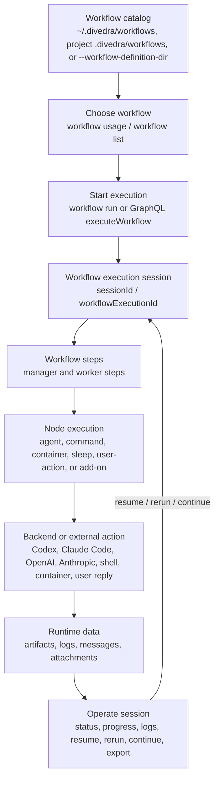

# divedra

`divedra` is a TypeScript/Bun workflow runner for cooperative multi-agent work.
It lets you define reusable workflows, choose the right workflow by purpose, run
them locally or through a GraphQL control plane, and inspect execution progress
afterward.



## What You Can Do

- Store reusable workflow bundles in a user catalog (`~/.divedra/workflows`), a project catalog (`<project>/.divedra/workflows`), or an explicit workflow definition directory.
- Discover available workflows and their callable contracts before running them.
- Run workflows using agent backends such as `codex-agent`, `claude-code-agent`, `official/openai-sdk`, and `official/anthropic-sdk`.
- Run deterministic mock scenarios for demos, tests, and documentation without real agent calls.
- Pause a workflow with `nodeType: "sleep"` without blocking the worker; the runtime registers a scheduled continuation event and resumes the queued steps when it fires.
- Monitor, resume, rerun, continue, export, and inspect workflow executions.
- Start workflows with supervisor-backed execution by default; `--no-auto-improve` disables workflow patching but keeps deterministic supervision.
- Start a local GraphQL control plane for remote execution and manager/control-plane operations.
- Receive external events, replay event receipts, and inspect reply dispatch records.
- Install shell hooks/snippets for Claude Code, Codex, and Gemini.

## Install

Install dependencies for local development:

```bash
bun install
```

Run commands from source:

```bash
bun run src/main.ts <command>
```

Run directly from the Nix flake on Linux or Darwin:

```bash
nix run github:tacogips/divedra -- workflow list
```

Install the flake package into your user profile:

```bash
nix profile install github:tacogips/divedra
```

The flake package provides a `divedra` wrapper. Development still uses `nix
develop` or direnv when you want the full local toolchain.

Entering the repository through `nix develop` or direnv also provides
`gitleaks`, generates the repo-local `.pre-commit-config.yaml`, and installs a
Nix-managed `pre-commit` hook that scans staged changes for secrets before
`git commit` completes. If you need to install or refresh the hook without
opening an interactive shell, run `task install-git-hooks`.

GitHub Actions also runs `gitleaks` on `push` and `pull_request` as a repo-side
backstop in case a local hook was not installed yet.

## Package Architecture

The repository is a Bun workspace with package roots under `packages/*`. The
root `package.json` stays private and orchestrates shared build, test, lint, and
typecheck commands for the workspace.

- `packages/divedra-core` exposes the core workflow runtime, session/runtime DB,
  supervisor, manager control, catalog, inspection, shared library contracts,
  deterministic supervisor runner-pool lifecycle APIs, and filesystem helpers
  used by the runtime.
- `packages/divedra-addons` exposes built-in node add-on registries and native
  add-on execution helpers. It depends inward on `divedra-core`; core does not
  export native add-on execution or add-on registry construction.
- `packages/divedra` is the compatibility facade named `divedra`; it preserves
  the current `import "divedra"` library surface, `./cli` export, and CLI binary
  behavior. The `divedra/cli` export is import-safe and exposes `runCli` without
  starting the command or mutating `process.exitCode`; executable startup lives
  in the package `bin` wrapper.

Use the root commands for repository development and verification:

```bash
bun run build
bun run typecheck
bun run lint:biome
bun run test
```

CLI, GraphQL, event-source, and HTTP server code remain in the compatibility
package for this stage because those areas currently share command dispatch and
transport wiring. They can become separate packages after their imports depend
only on core contracts and no longer require compatibility-facade internals.
Runner-pool state is owned by core supervision code; the `divedra` package is a
compatibility facade and must not maintain a separate supervisor run pool.

## Development Checks

`bun run lint:biome` is the shared Biome lint path for local development, task
automation, and CI checks. It runs Biome with the repository's configured
diagnostic level and also rejects source files named `part-<digits>.ts` or
`part-<digits>.tsx`. When splitting code, use descriptive source filenames such
as `workflow-loader.ts`, `node-output-contract.ts`, or
`session-partition.ts`. The filename policy is implemented by
`bun run check:source-filenames`; run the shared `lint:biome` script instead of
calling `biome check` directly when validating repository changes.

## Workflow Locations

By default, divedra looks for workflow bundles in scoped catalogs:

- User catalog: `~/.divedra/workflows/<workflow-name>/workflow.json`
- Project catalog: `<project>/.divedra/workflows/<workflow-name>/workflow.json`

For examples, tests, or one-off runs, bypass scoped lookup with:

```bash
--workflow-definition-dir ./examples
```

This option points at a directory containing workflow bundle directories. It
does not control where logs, sessions, artifacts, or attachments are stored.

Install a workflow bundle from a public GitHub directory into the scoped
catalog with `workflow checkout`:

```bash
bun run src/main.ts workflow checkout \
  https://github.com/<owner>/<repo>/tree/<ref>/.divedra/workflows/<workflow-name>
```

Checkout validates the remote bundle in a temporary staging directory before it
creates or replaces the destination. By default it installs into project scope
at `<project>/.divedra/workflows/<workflow-name>`; use `--user-scope` to install
under `~/.divedra/workflows`. Duplicate checkouts fail unless `--overwrite` is
set. Each successful checkout writes provenance to
`~/.divedra/workflow-registry/checkouts/<scope>-<workflow-name>.json` with the
source URL, scope, checkout time, and destination directory. Do not combine
checkout with `--workflow-definition-dir`; checkout is a scoped catalog write.

## Workflow Discovery

Use `workflow usage` when an LLM or automation needs to decide which workflow to
call. With no workflow name, it emits the full workflow catalog with each
workflow's purpose, callable step, callable role, input/output summary, and
compact step overview.

```bash
bun run src/main.ts workflow usage --workflow-definition-dir ./examples --output json
```

Use `workflow list` for a human-facing catalog overview:

```bash
bun run src/main.ts workflow list --workflow-definition-dir ./examples
```

Use `workflow status` for recent execution status for one workflow:

```bash
bun run src/main.ts workflow status <workflow-name> --workflow-definition-dir ./examples
```

`workflow list` and `workflow status` report active executions only when those
`running` or `paused` session ids are loadable from the same runtime storage
context used by session commands. If a local `--workflow-definition-dir` points
at a recognized scoped catalog such as `<project>/.divedra/workflows`,
workflow overview commands infer that project-scoped runtime data root so the
reported `sessionId` can be passed directly to `session status`,
`session progress`, and `session step-runs`. Explicit storage overrides such as
`--session-store`, `--artifact-root`, `DIVEDRA_SESSION_STORE`, and
`DIVEDRA_ARTIFACT_ROOT` still take precedence.

Derived runtime database rows, cached summaries, and session-index entries are
secondary overview inputs. If a `running` or `paused` candidate cannot be loaded
by `session status <session-id>` with the same `--workflow-definition-dir` and
storage options, overview commands exclude it from `activeExecutionCount`,
`newestActiveExecution`, active recent rows, and aggregate `running` or `paused`
status derivation.

Use `workflow inspect <workflow-name> --structure` only after you have selected
a workflow and need a compact human-facing structure view. The structure view
prints each step id on its own line, followed by the step description or `-` on
the next line indented one level deeper. It preserves indentation where the
workflow graph exposes nesting. Text `--structure` output is rendered directly
from the loaded workflow bundle after validation, so it avoids the full
inspection summary and runtime readiness checks that compact output does not
display:

```bash
bun run src/main.ts workflow inspect <workflow-name> \
  --workflow-definition-dir ./examples \
  --structure
```

Use JSON inspection when you need the full machine-readable workflow summary,
including runtime readiness and other detailed inspection fields:

```bash
bun run src/main.ts workflow inspect <workflow-name> \
  --workflow-definition-dir ./examples \
  --output json
```

## Run A Workflow

Create a starter workflow in the selected catalog:

```bash
bun run src/main.ts workflow create <workflow-name>
```

Create a manager-less starter workflow:

```bash
bun run src/main.ts workflow create <workflow-name> --worker-only
```

Validate before running:

```bash
bun run src/main.ts workflow validate <workflow-name> --workflow-definition-dir ./examples
```

Validate local executability before running agent workflows:

```bash
bun run src/main.ts workflow validate <workflow-name> \
  --workflow-definition-dir ./examples \
  --executable \
  --output json
```

Plain validation is passive and does not spawn backend probes. `--executable`
adds bounded local preflight for node add-ons and supported agent backends, and
returns `nodeValidationResults` with `valid`, `warning`, `invalid`, or
`unknown` status values. JSON validation preserves add-on `validate` hook
results for loaded workflows, so CLI `workflow validate`, GraphQL
`validateWorkflowDefinition`, submitted-bundle validation, and library detailed
validation expose consistent add-on `nodeValidationResults` before any
agent-backend preflight entries are appended.

Async validation and async workflow loading also treat third-party add-on
resolver calls as validation boundaries. Throwing resolvers, rejected resolver
promises, and malformed resolver return values are reported as
`ValidationIssue` records from `validateWorkflowBundleDetailedAsync` and the
async load path instead of escaping validation. Valid resolver-provided
`nodeValidationResults` remain additive and are preserved in detailed validation
output.

Run with JSON output:

```bash
bun run src/main.ts workflow run <workflow-name> \
  --workflow-definition-dir ./examples \
  --output json
```

Run with runtime variables:

```bash
bun run src/main.ts workflow run <workflow-name> \
  --workflow-definition-dir ./examples \
  --variables '{"hours":48}' \
  --output json
```

File-based runtime variables are also supported with explicit `@file` and the
historical bare file path form:

```bash
bun run src/main.ts workflow run <workflow-name> \
  --workflow-definition-dir ./examples \
  --variables @./variables.json \
  --output json

bun run src/main.ts workflow run <workflow-name> \
  --workflow-definition-dir ./examples \
  --variables ./variables.json \
  --output json
```

Patch node settings for a single validation or run without editing workflow
files:

```bash
bun run src/main.ts workflow validate <workflow-name> \
  --workflow-definition-dir ./examples \
  --node-patch '{"worker":{"executionBackend":"cursor-cli-agent","model":"claude-sonnet-4-5"}}'

bun run src/main.ts workflow run <workflow-name> \
  --workflow-definition-dir ./examples \
  --node-patch @./node-patch.json \
  --output json
```

`--node-patch` accepts the same inline JSON, `@file`, and bare file path forms
as `--variables`. The patch object is keyed by reusable workflow node id, not
step id, so every step that references the node sees the same invocation-local
settings. Patch values may contain only `executionBackend`, `model`, and
`effort`; unsupported effort values and invalid backend/model combinations fail
validation against the patched workflow state.

Run with a deterministic mock scenario:

```bash
bun run src/main.ts workflow run <workflow-name> \
  --workflow-definition-dir ./examples \
  --mock-scenario ./examples/<workflow-name>/mock-scenario.json \
  --output json
```

`workflow run` starts with supervised recovery by default. `--auto-improve`
remains accepted for scripts that spell the policy explicitly, and
`--nested-supervisor` opts into running the supervisor bundle as a paired nested
workflow when that bundle is available in the workflow catalog:

```bash
bun run src/main.ts workflow run <workflow-name> \
  --workflow-definition-dir ./examples \
  --auto-improve \
  --nested-supervisor \
  --max-supervised-attempts 3 \
  --workflow-mutation-mode execution-copy \
  --output json
```

Use `--no-auto-improve` when a quick check or isolated fixture must disable
workflow patching while preserving supervisor retry and stall detection.
Workflow bundles can set supervision defaults in `workflow.defaults.supervision`
and long-running steps can override stall detection with `steps[].stallTimeoutMs`
or node payload `stallTimeoutMs`; CLI flags still take precedence.

Supervised event and GraphQL runs are tracked by a deterministic in-process
runner pool. Use `runnerPoolRunId`, `supervisedRunId`, or
`workflowExecutionId` as the strongest identifiers for live wait, cancel, and
status operations. `workflowKey`, `alias`, and correlation-key lookup remain
convenience routes; mutating operations reject ambiguous active matches instead
of choosing one arbitrarily. Waiting and cancellation require a live
in-process handle. After a handle reaches a terminal state or the process is
restarted, durable status and progress inspection continue through persisted
supervised-run/session records, but live `runnerPoolRunId` lookup is no longer
durable.

## Session Operations

After a workflow starts, keep the returned `sessionId` / workflow execution id.

Check status:

```bash
bun run src/main.ts session status <session-id> --output json
```

Show progress:

```bash
bun run src/main.ts session progress <session-id>
```

List merged step-run history for the same workflow execution:

```bash
bun run src/main.ts session step-runs <session-id> --output json
```

For any active `sessionId` reported by local `workflow status` in the same
storage context, `session status`, `session progress`, and `session step-runs`
should load that session instead of returning `session not found`.
If `session status <session-id>` would return `session not found` for that same
context, the local workflow overview should not report the session as active.

Resume a paused or resumable execution:

```bash
bun run src/main.ts session resume <session-id>
```

Rerun from a step without importing prior step artifacts:

```bash
bun run src/main.ts session rerun <session-id> <step-id>
```

Continue from a concrete prior step-run boundary:

```bash
bun run src/main.ts session continue <session-id> \
  --start-step <step-id> \
  --after-step-run <step-run-id>
```

## Direct Step Calls

Use `call-step` for local debugging or direct step-addressed integration:

```bash
bun run src/main.ts call-step <workflow-id> <workflow-run-id> <step-id> \
  --message-file ./message.json \
  --output json
```

Useful `call-step` options:

- `--message-json <json>`
- `--message-file <path>`
- `--prompt-variant <name>`
- `--continue-session`
- `--timeout-ms <ms>`
- `--resume-step-exec <id>`

## GraphQL Control Plane

Start the local server:

```bash
bun run src/main.ts serve --workflow-definition-dir ./examples
```

Defaults:

- Host: `127.0.0.1`
- Port: `43173`
- GraphQL endpoint: `http://127.0.0.1:43173/graphql`
- Health check: `GET /healthz`

Run a GraphQL query from the CLI:

```bash
bun run src/main.ts graphql '
  query {
    workflows(input: {})
  }
'
```

Without `--endpoint`, `graphql` executes against the local in-process GraphQL
schema using project-scoped workflow/session storage. Use `--endpoint` or
`DIVEDRA_GRAPHQL_ENDPOINT` to send the same document to a remote server.

Run a workflow through a remote endpoint:

```bash
bun run src/main.ts workflow run <workflow-name> \
  --workflow-definition-dir ./examples \
  --endpoint http://127.0.0.1:43173/graphql \
  --output json
```

Endpoint-backed `workflow run` uses the same default supervised recovery policy
as local execution. Pass `--no-auto-improve` when the remote GraphQL
`executeWorkflow` start must receive lifecycle-only supervision
(`maxWorkflowPatches: 0`). `--node-patch` is forwarded to endpoint-backed
`executeWorkflow` starts and validated by the remote server against the patched
workflow state.

GraphQL supervised dispatch returns `runnerPoolRunId` on
`dispatchSupervisedWorkflowCommand`. Use that id with
`supervisedWorkflowRun(input: { runnerPoolRunId })` while the server process is
still alive to target the active in-process run across later HTTP requests. For
durable inspection after terminal completion or process restart, query by
`supervisedRunId`, `workflowExecutionId`, workflow key/alias, or
source/binding/correlation data. If a GraphQL lookup supplies multiple strong
ids, such as `runnerPoolRunId` plus `workflowExecutionId`, they must identify
the same active run; conflicting strong ids fail through the shared runner-pool
ambiguity checks.

Remote-capable CLI operations include `workflow list`, `workflow status`,
`workflow run`, `session resume`, and `session rerun`. Detailed execution
inspection, logs, health-style diagnostics, and export-shaped payloads are
accessed through GraphQL rather than separate CLI subcommands.

## Events

Event commands load source configuration from `.divedra-events` next to the
workflow root, or from `--event-root`.

Validate event configuration:

```bash
bun run src/main.ts events validate --event-root ./examples/event-sources
```

Emit a fixture event:

```bash
bun run src/main.ts events emit <source-id> \
  --event-root ./examples/event-sources \
  --event-file ./examples/event-sources/payloads/chat-message.json
```

Start listener adapters:

```bash
bun run src/main.ts events serve --event-root ./examples/event-sources
```

List and replay receipts:

```bash
bun run src/main.ts events list --event-root ./examples/event-sources
```

```bash
bun run src/main.ts events replay <receipt-id> --event-root ./examples/event-sources
```

Inspect reply dispatch records for a workflow execution:

```bash
bun run src/main.ts events replies <workflow-execution-id>
```

Set `DIVEDRA_EVENTS_READ_ONLY=true` or pass `--read-only` to validate and
persist event receipts without dispatching workflow execution.

Element/Matrix chat sources use `kind: "matrix"` and read credentials from env
var names in source config, for example `DIVEDRA_MATRIX_HOMESERVER_URL` and
`DIVEDRA_MATRIX_ACCESS_TOKEN`. Matrix receive normalizes text-like
`m.room.message` events to `chat.message`; chat replies send through the Matrix
Client-Server room send API with the reply idempotency key as the transaction
id. The first slice excludes encrypted rooms, attachments, reactions, edits,
redactions, and Application Service transactions.

Chat SDK chat sources use `kind: "chat-sdk"` with the first-pass generic
webhook/send boundary. Supported providers are `slack`, `teams`, `gchat`,
`discord`, `telegram`, `github`, `linear`, `whatsapp`, `messenger`, and `web`.
Inbound webhook payloads normalize to `chat.message`, and chat replies dispatch
through a configured send endpoint referenced by env-var names. Each served
chat-sdk webhook must configure a bearer token or signing secret env var, and
the webhook path must remain relative and provider-scoped, such as
`chat-sdk/slack`. divedra does not import direct `@chat-adapter/*` packages in
this boundary; direct provider SDK integration remains future scope after
dependency and credential review.

## Scheduling

Workflow sleep nodes use `nodeType: "sleep"` with a `sleep` payload containing
exactly one wake condition: `durationMs` as a positive integer or `until` as a
timestamp with an explicit `Z` timezone or numeric UTC offset. Sleep nodes are
worker-only and cannot declare agent, command, container, user-action, or addon
execution payload fields.

During workflow execution, a sleep node records a `workflow-sleep` scheduled
event on the session and returns while the workflow is paused. The shared
scheduled event manager owns the in-process timer, fires due sleep events,
re-loads the paused session before continuation, and resumes queued workflow
steps only when the session still owns the pending event. Pending sleep events
are cancelled or marked failed across cancellation, rerun or replacement, and
terminal session lifecycle paths so stale timers do not revive superseded work.
Cancellation only transitions pending scheduled events; firing, fired, failed,
and already-cancelled event states remain authoritative for inspection and
failure handling.

Cron event sources also register `cron` events through the shared scheduled
event manager. `events serve` passes that manager into local workflow triggers,
the cron adapter registers the next occurrence on startup, and each fired cron
event computes and registers the following occurrence while preserving existing
binding, dedupe, receipt, and input-mapping behavior.

## Hooks

Run a hook receiver:

```bash
bun run src/main.ts hook --vendor claude-code
```

Print an install snippet:

```bash
bun run src/main.ts hook snippet --vendor codex
```

Supported vendors:

- `claude-code`
- `codex`
- `gemini`

## Common Options

- `--workflow-definition-dir <path>`: directory containing workflow bundles.
- `--scope auto|project|user`: choose scoped catalog lookup.
- `--user-root <path>`: override the user scope root.
- `--project-root <path>`: override the project scope root.
- `--addon-root <path>`: use a direct add-on root override.
- `--worker-only`: create a manager-less starter workflow.
- `--artifact-root <path>`: override execution artifact storage.
- `--session-store <path>`: override session JSON storage.
- `--working-directory <path>`: run workflow work relative to a specific directory.
- `--variables <json|@file|file>`: load runtime variables from an inline JSON
  object, explicit `@file`, or a JSON object file path.
- `--node-patch <json|@file|file>`: apply invocation-local workflow node
  settings for `workflow validate` and `workflow run` without rewriting the
  workflow bundle.
- `--mock-scenario <path>`: use deterministic mock backend responses.
- `--output json`: emit structured output.
- `--dry-run`: plan/check without normal execution where supported.
- `--auto-improve`: explicitly request the default supervised recovery policy.
- `--no-auto-improve`: keep supervised recovery but set the workflow patch budget
  to zero, including through remote GraphQL `workflow run --endpoint ...` starts.
- `--verbose` / `-v`: print local workflow step-start progress to stderr.
- `--max-steps <n>`: cap workflow execution steps.
- `--max-concurrency <n>`: cap fanout concurrency for a workflow run.
- `--max-loop-iterations <n>`: cap loop iterations.
- `--default-timeout-ms <ms>`: override default node timeout.

## Runtime Data

Default runtime data lives under:

```text
~/.divedra/artifacts/
```

For project-catalog workflows discovered from `<project>/.divedra/workflows`,
the default is project-namespaced under the user root:

```text
~/.divedra/projects/{project_basename}-{project_root_hash}/artifacts/
```

By default this root contains:

- `workflow/`: execution artifacts
- `sessions/`: persisted session JSON files
- `files/`: attachments
- `divedra.db`: runtime index database

Each workflow node execution stores runtime-owned audit records under its
artifact directory. Agent executions include `input.json`, `mailbox/inbox/`
metadata and input, final `output.json`, `meta.json`, `handoff.json`, and, for
structured-output attempts, `output-attempts/attempt-*/request.json`,
`candidate.json`, and `validation.json`. Request artifacts record the configured
`executionBackend` and `model`, while `mailbox/inbox/input.json` preserves full
`latestOutputs` for downstream review steps even when prompt summaries are
truncated.

Relocate storage with:

- `DIVEDRA_ARTIFACT_DIR`
- `DIVEDRA_ARTIFACT_ROOT`
- `DIVEDRA_SESSION_STORE`
- `DIVEDRA_ATTACHMENT_ROOT`
- `DIVEDRA_RUNTIME_DB`

Workflow and server environment variables:

- `DIVEDRA_WORKFLOW_DEFINITION_DIR`
- `DIVEDRA_WORKFLOW_SCOPE`
- `DIVEDRA_USER_ROOT`
- `DIVEDRA_PROJECT_ROOT`
- `DIVEDRA_ADDON_ROOT`
- `DIVEDRA_SERVE_HOST`
- `DIVEDRA_SERVE_PORT`
- `DIVEDRA_GRAPHQL_ENDPOINT`
- `DIVEDRA_MANAGER_AUTH_TOKEN`
- `DIVEDRA_MANAGER_SESSION_ID`
- `DIVEDRA_EVENT_ROOT`
- `DIVEDRA_EVENTS_READ_ONLY`
- `DIVEDRA_MATRIX_HOMESERVER_URL`
- `DIVEDRA_MATRIX_ACCESS_TOKEN`

## Example Workflows

Reference workflow bundles live under `examples/`. See
`examples/README.md` for the full catalog.

Recommended starting points:

- `worker-only-single-step`: minimal manager-less workflow.
- `claude-divedra-codex-coding`: mixed backend workflow with coordination on Claude Code and coding work on Codex.
- `workflow-call-simple`: parent workflow that calls a worker-only review workflow.
- `node-combinations-showcase`: examples for command, container, and foreach-style workflow lanes.
- `scheduled-sleep`: minimal workflow that waits with `nodeType: "sleep"` before continuing to a worker step.
- `supervised-mock-retry`: deterministic example for `--auto-improve` retry behavior.
- `chat-reply-webhook`: event-driven chat reply workflow using the built-in reply worker add-on.
- `event-sources`: includes webhook, cron, S3, Element/Matrix, and Chat SDK source fixtures.

## Library API

The package root (`import ... from "divedra"`) exposes programmatic workflow
execution and inspection helpers.

Common entry points:

- `createWorkflowExecutionClient()`
- `createSupervisorRunnerPool()`
- `executeWorkflow()`
- `resumeWorkflow()`
- `rerunWorkflow()`
- `continueWorkflowFromHistory()`
- `getRuntimeSessionView()`
- `callWorkflowStep()`
- `inspectWorkflow()`
- `inspectWorkflowUsage()`
- `listWorkflowUsage()`
- `executeGraphqlRequest()`
- `createGraphqlSchema()`

Minimal local example:

```ts
import { executeWorkflow, getRuntimeSessionView } from "divedra";

const run = await executeWorkflow({
  workflowName: "worker-only-single-step",
  workflowRoot: "./examples",
  env: process.env,
  runtimeVariables: {
    humanInput: {
      request: "Run this workflow",
    },
  },
});

const runtime = await getRuntimeSessionView(run.sessionId, {
  env: process.env,
});

console.log(runtime.session.status);
```

Use `createWorkflowExecutionClient()` when the same integration should work
locally or through a GraphQL endpoint.

Programmatic `executeWorkflow`, `createWorkflowExecutionClient`, GraphQL
`executeWorkflow`, and GraphQL `validateWorkflowDefinition` accept `nodePatch`
with the same node-id keyed `executionBackend`/`model`/`effort` shape used by
the CLI.

The core supervision surface is exported from both `divedra` and
`divedra-core`. `createSupervisorRunnerPool()` provides `dispatch`, `lookup`,
`cancel`, `wait`, `lookupHandle`, and `lookupHandles` for in-process supervised
workflow runs. Strong ids (`runnerPoolRunId`, `supervisedRunId`,
`workflowExecutionId`) should be preferred over workflow aliases or correlation
keys when more than one run can be active. If callers provide more than one
strong id, all supplied ids must resolve to the same active handle. Workflow
aliases, workflow keys, and source/binding/correlation lookup are convenience
routes and can fail when more than one active run matches.

## Development Commands

```bash
bun run build
bun run test
bun run typecheck
bun run format:check
task install-git-hooks
task gitleaks
```

Runtime is Bun, and the project is written in strict TypeScript. Optional shell
tooling is provided through Nix flakes and direnv. The generated
`.pre-commit-config.yaml` is ephemeral and intentionally ignored by Git.

The repository-local `design-and-implement-review-loop` workflow refreshes
user-facing docs after implementation review acceptance and before commit/push.
Issue-resolution runs that audit real backend behavior should run without
`--mock-scenario`, then use the runtime artifact records above to verify the
configured backend/model, mailbox `latestOutputs`, request, candidate, and
validation evidence. Its required documentation targets are `README.md` and
`.agents/skills/divedra-impl-workflow/SKILL.md` so shipped behavior and the
LLM-facing workflow skill stay aligned. When implementation changes CLI,
GraphQL, library, or workflow-operation behavior, the matching user-facing
workflow skills under `.agents/skills/` should be refreshed in the same step.
