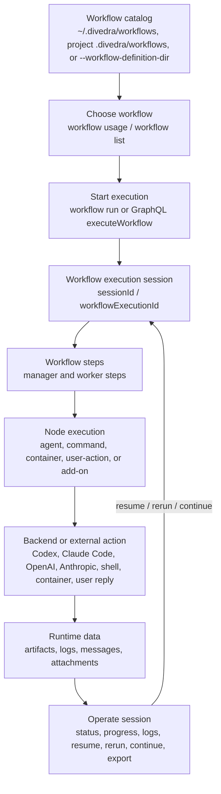

# divedra

`divedra` is a TypeScript/Bun workflow runner for cooperative multi-agent work.
It lets you define reusable workflows, choose the right workflow by purpose, run
them locally or through a GraphQL control plane, and inspect execution progress
afterward.



## What You Can Do

- Store reusable workflow bundles in a user catalog (`~/.divedra/workflows`), a project catalog (`<project>/.divedra/workflows`), or an explicit workflow definition directory.
- Discover available workflows and their callable contracts before running them.
- Run workflows using agent backends such as `codex-agent`, `claude-code-agent`, `official/openai-sdk`, and `official/anthropic-sdk`.
- Run deterministic mock scenarios for demos, tests, and documentation without real agent calls.
- Monitor, resume, rerun, continue, export, and inspect workflow executions.
- Start workflows with supervisor-backed execution by default; `--no-auto-improve` disables workflow patching but keeps deterministic supervision.
- Start a local GraphQL control plane for remote execution and manager/control-plane operations.
- Receive external events, replay event receipts, and inspect reply dispatch records.
- Install shell hooks/snippets for Claude Code, Codex, and Gemini.

## Install

Install dependencies for local development:

```bash
bun install
```

Run commands from source:

```bash
bun run src/main.ts <command>
```

Run directly from the Nix flake on Linux or Darwin:

```bash
nix run github:tacogips/divedra -- workflow list
```

Install the flake package into your user profile:

```bash
nix profile install github:tacogips/divedra
```

The flake package provides a `divedra` wrapper. Development still uses `nix
develop` or direnv when you want the full local toolchain.

## Workflow Locations

By default, divedra looks for workflow bundles in scoped catalogs:

- User catalog: `~/.divedra/workflows/<workflow-name>/workflow.json`
- Project catalog: `<project>/.divedra/workflows/<workflow-name>/workflow.json`

For examples, tests, or one-off runs, bypass scoped lookup with:

```bash
--workflow-definition-dir ./examples
```

This option points at a directory containing workflow bundle directories. It
does not control where logs, sessions, artifacts, or attachments are stored.

## Workflow Discovery

Use `workflow usage` when an LLM or automation needs to decide which workflow to
call. With no workflow name, it emits the full workflow catalog with each
workflow's purpose, callable step, callable role, input/output summary, and
compact step overview.

```bash
bun run src/main.ts workflow usage --workflow-definition-dir ./examples --output json
```

Use `workflow list` for a human-facing catalog overview:

```bash
bun run src/main.ts workflow list --workflow-definition-dir ./examples
```

Use `workflow status` for recent execution status for one workflow:

```bash
bun run src/main.ts workflow status <workflow-name> --workflow-definition-dir ./examples
```

Use `workflow inspect <workflow-name>` only after you have selected a workflow
and need deeper per-workflow detail:

```bash
bun run src/main.ts workflow inspect <workflow-name> \
  --workflow-definition-dir ./examples \
  --output json
```

## Run A Workflow

Create a starter workflow in the selected catalog:

```bash
bun run src/main.ts workflow create <workflow-name>
```

Create a manager-less starter workflow:

```bash
bun run src/main.ts workflow create <workflow-name> --worker-only
```

Validate before running:

```bash
bun run src/main.ts workflow validate <workflow-name> --workflow-definition-dir ./examples
```

Run with JSON output:

```bash
bun run src/main.ts workflow run <workflow-name> \
  --workflow-definition-dir ./examples \
  --output json
```

Run with runtime variables:

```bash
bun run src/main.ts workflow run <workflow-name> \
  --workflow-definition-dir ./examples \
  --variables '{"hours":48}' \
  --output json
```

File-based runtime variables are also supported with explicit `@file` and the
historical bare file path form:

```bash
bun run src/main.ts workflow run <workflow-name> \
  --workflow-definition-dir ./examples \
  --variables @./variables.json \
  --output json

bun run src/main.ts workflow run <workflow-name> \
  --workflow-definition-dir ./examples \
  --variables ./variables.json \
  --output json
```

Run with a deterministic mock scenario:

```bash
bun run src/main.ts workflow run <workflow-name> \
  --workflow-definition-dir ./examples \
  --mock-scenario ./examples/<workflow-name>/mock-scenario.json \
  --output json
```

`workflow run` starts with supervised recovery by default. `--auto-improve`
remains accepted for scripts that spell the policy explicitly, and
`--nested-supervisor` opts into running the supervisor bundle as a paired nested
workflow when that bundle is available in the workflow catalog:

```bash
bun run src/main.ts workflow run <workflow-name> \
  --workflow-definition-dir ./examples \
  --auto-improve \
  --nested-supervisor \
  --max-supervised-attempts 3 \
  --workflow-mutation-mode execution-copy \
  --output json
```

Use `--no-auto-improve` when a quick check or isolated fixture must disable
workflow patching while preserving supervisor retry and stall detection.
Workflow bundles can set supervision defaults in `workflow.defaults.supervision`
and long-running steps can override stall detection with `steps[].stallTimeoutMs`
or node payload `stallTimeoutMs`; CLI flags still take precedence.

## Session Operations

After a workflow starts, keep the returned `sessionId` / workflow execution id.

Check status:

```bash
bun run src/main.ts session status <session-id> --output json
```

Show progress:

```bash
bun run src/main.ts session progress <session-id>
```

Resume a paused or resumable execution:

```bash
bun run src/main.ts session resume <session-id>
```

Rerun from a step without importing prior step artifacts:

```bash
bun run src/main.ts session rerun <session-id> <step-id>
```

Continue from a concrete prior step-run boundary:

```bash
bun run src/main.ts session continue <session-id> \
  --start-step <step-id> \
  --after-step-run <step-run-id>
```

## Direct Step Calls

Use `call-step` for local debugging or direct step-addressed integration:

```bash
bun run src/main.ts call-step <workflow-id> <workflow-run-id> <step-id> \
  --message-file ./message.json \
  --output json
```

Useful `call-step` options:

- `--message-json <json>`
- `--message-file <path>`
- `--prompt-variant <name>`
- `--continue-session`
- `--timeout-ms <ms>`
- `--resume-step-exec <id>`

## GraphQL Control Plane

Start the local server:

```bash
bun run src/main.ts serve --workflow-definition-dir ./examples
```

Defaults:

- Host: `127.0.0.1`
- Port: `43173`
- GraphQL endpoint: `http://127.0.0.1:43173/graphql`
- Health check: `GET /healthz`

Run a GraphQL query from the CLI:

```bash
bun run src/main.ts graphql '
  query {
    workflows(input: {})
  }
'
```

Without `--endpoint`, `graphql` executes against the local in-process GraphQL
schema using project-scoped workflow/session storage. Use `--endpoint` or
`DIVEDRA_GRAPHQL_ENDPOINT` to send the same document to a remote server.

Run a workflow through a remote endpoint:

```bash
bun run src/main.ts workflow run <workflow-name> \
  --workflow-definition-dir ./examples \
  --endpoint http://127.0.0.1:43173/graphql \
  --output json
```

Endpoint-backed `workflow run` uses the same default supervised recovery policy
as local execution. Pass `--no-auto-improve` when the remote GraphQL
`executeWorkflow` start must receive lifecycle-only supervision
(`maxWorkflowPatches: 0`).

Remote-capable CLI operations include `workflow list`, `workflow status`,
`workflow run`, `session resume`, and `session rerun`. Detailed execution
inspection, logs, health-style diagnostics, and export-shaped payloads are
accessed through GraphQL rather than separate CLI subcommands.

## Events

Event commands load source configuration from `.divedra-events` next to the
workflow root, or from `--event-root`.

Validate event configuration:

```bash
bun run src/main.ts events validate --event-root ./examples/event-sources
```

Emit a fixture event:

```bash
bun run src/main.ts events emit <source-id> \
  --event-root ./examples/event-sources \
  --event-file ./examples/event-sources/payloads/chat-message.json
```

Start listener adapters:

```bash
bun run src/main.ts events serve --event-root ./examples/event-sources
```

List and replay receipts:

```bash
bun run src/main.ts events list --event-root ./examples/event-sources
```

```bash
bun run src/main.ts events replay <receipt-id> --event-root ./examples/event-sources
```

Inspect reply dispatch records for a workflow execution:

```bash
bun run src/main.ts events replies <workflow-execution-id>
```

Set `DIVEDRA_EVENTS_READ_ONLY=true` or pass `--read-only` to validate and
persist event receipts without dispatching workflow execution.

## Hooks

Run a hook receiver:

```bash
bun run src/main.ts hook --vendor claude-code
```

Print an install snippet:

```bash
bun run src/main.ts hook snippet --vendor codex
```

Supported vendors:

- `claude-code`
- `codex`
- `gemini`

## Common Options

- `--workflow-definition-dir <path>`: directory containing workflow bundles.
- `--scope auto|project|user`: choose scoped catalog lookup.
- `--user-root <path>`: override the user scope root.
- `--project-root <path>`: override the project scope root.
- `--addon-root <path>`: use a direct add-on root override.
- `--worker-only`: create a manager-less starter workflow.
- `--artifact-root <path>`: override execution artifact storage.
- `--session-store <path>`: override session JSON storage.
- `--working-directory <path>`: run workflow work relative to a specific directory.
- `--variables <json|@file|file>`: load runtime variables from an inline JSON
  object, explicit `@file`, or a JSON object file path.
- `--mock-scenario <path>`: use deterministic mock backend responses.
- `--output json`: emit structured output.
- `--dry-run`: plan/check without normal execution where supported.
- `--auto-improve`: explicitly request the default supervised recovery policy.
- `--no-auto-improve`: keep supervised recovery but set the workflow patch budget
  to zero, including through remote GraphQL `workflow run --endpoint ...` starts.
- `--verbose` / `-v`: print local workflow step-start progress to stderr.
- `--max-steps <n>`: cap workflow execution steps.
- `--max-concurrency <n>`: cap fanout concurrency for a workflow run.
- `--max-loop-iterations <n>`: cap loop iterations.
- `--default-timeout-ms <ms>`: override default node timeout.

## Runtime Data

Default runtime data lives under:

```text
~/.divedra/artifacts/
```

For project-catalog workflows discovered from `<project>/.divedra/workflows`,
the default is project-namespaced under the user root:

```text
~/.divedra/projects/{project_basename}-{project_root_hash}/artifacts/
```

By default this root contains:

- `workflow/`: execution artifacts
- `sessions/`: persisted session JSON files
- `files/`: attachments
- `divedra.db`: runtime index database

Each workflow node execution stores runtime-owned audit records under its
artifact directory. Agent executions include `input.json`, `mailbox/inbox/`
metadata and input, final `output.json`, `meta.json`, `handoff.json`, and, for
structured-output attempts, `output-attempts/attempt-*/request.json`,
`candidate.json`, and `validation.json`. Request artifacts record the configured
`executionBackend` and `model`, while `mailbox/inbox/input.json` preserves full
`latestOutputs` for downstream review steps even when prompt summaries are
truncated.

Relocate storage with:

- `DIVEDRA_ARTIFACT_DIR`
- `DIVEDRA_ARTIFACT_ROOT`
- `DIVEDRA_SESSION_STORE`
- `DIVEDRA_ATTACHMENT_ROOT`
- `DIVEDRA_RUNTIME_DB`

Workflow and server environment variables:

- `DIVEDRA_WORKFLOW_DEFINITION_DIR`
- `DIVEDRA_WORKFLOW_SCOPE`
- `DIVEDRA_USER_ROOT`
- `DIVEDRA_PROJECT_ROOT`
- `DIVEDRA_ADDON_ROOT`
- `DIVEDRA_SERVE_HOST`
- `DIVEDRA_SERVE_PORT`
- `DIVEDRA_GRAPHQL_ENDPOINT`
- `DIVEDRA_MANAGER_AUTH_TOKEN`
- `DIVEDRA_MANAGER_SESSION_ID`
- `DIVEDRA_EVENT_ROOT`
- `DIVEDRA_EVENTS_READ_ONLY`

## Example Workflows

Reference workflow bundles live under `examples/`. See
`examples/README.md` for the full catalog.

Recommended starting points:

- `worker-only-single-step`: minimal manager-less workflow.
- `claude-divedra-codex-coding`: mixed backend workflow with coordination on Claude Code and coding work on Codex.
- `workflow-call-simple`: parent workflow that calls a worker-only review workflow.
- `node-combinations-showcase`: examples for command, container, and foreach-style workflow lanes.
- `supervised-mock-retry`: deterministic example for `--auto-improve` retry behavior.
- `chat-reply-webhook`: event-driven chat reply workflow using the built-in reply worker add-on.

## Library API

The package root (`import ... from "divedra"`) exposes programmatic workflow
execution and inspection helpers.

Common entry points:

- `createWorkflowExecutionClient()`
- `executeWorkflow()`
- `resumeWorkflow()`
- `rerunWorkflow()`
- `continueWorkflowFromHistory()`
- `getRuntimeSessionView()`
- `callWorkflowStep()`
- `inspectWorkflow()`
- `inspectWorkflowUsage()`
- `listWorkflowUsage()`
- `executeGraphqlRequest()`
- `createGraphqlSchema()`

Minimal local example:

```ts
import { executeWorkflow, getRuntimeSessionView } from "divedra";

const run = await executeWorkflow({
  workflowName: "worker-only-single-step",
  workflowRoot: "./examples",
  env: process.env,
  runtimeVariables: {
    humanInput: {
      request: "Run this workflow",
    },
  },
});

const runtime = await getRuntimeSessionView(run.sessionId, {
  env: process.env,
});

console.log(runtime.session.status);
```

Use `createWorkflowExecutionClient()` when the same integration should work
locally or through a GraphQL endpoint.

## Development Commands

```bash
bun run build
bun run test
bun run typecheck
bun run format:check
```

Runtime is Bun, and the project is written in strict TypeScript. Optional shell
tooling is provided through Nix flakes and direnv.

The repository-local `design-and-implement-review-loop` workflow refreshes
user-facing docs after implementation review acceptance and before commit/push.
Issue-resolution runs that audit real backend behavior should run without
`--mock-scenario`, then use the runtime artifact records above to verify the
configured backend/model, mailbox `latestOutputs`, request, candidate, and
validation evidence. Its required documentation targets are `README.md` and
`.agents/skills/divedra-impl-workflow/SKILL.md` so shipped behavior and the
LLM-facing workflow skill stay aligned.
