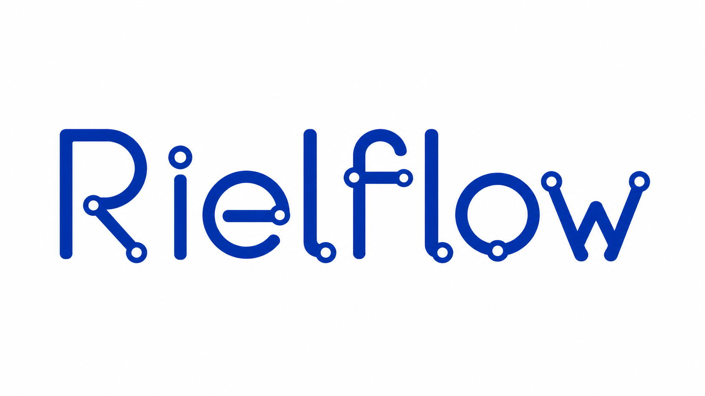

<p align="center">
  
</p>

# Rielflow

Rielflow is a local workflow runner for cooperative multi-agent work. It lets
you install reusable workflows, run them with LLM agent backends, inspect each
execution, and connect workflows to events such as chat messages, webhooks,
cron jobs, file changes, and manual commands.

Use Rielflow when one prompt is not enough: planning, delegation, review,
retry, waiting for user input, calling tools, and handing work between agents
can all be described as a reusable workflow.

Swift native migration work is tracked on the `swift-migration` branch. The
top-level SwiftPM package mirrors the current package boundaries, and branch
production Homebrew packaging now builds macOS Swift executable archives after
TASK-009 parity acceptance and the dedicated release cutover. The branch
currently includes Swift targets for `RielflowCore`,
`RielflowAdapters`, `RielflowAddons`, `RielflowEvents`, `RielflowGraphQL`,
`RielflowServer`, `RielflowHook`, `CodexAgent`, `ClaudeCodeAgent`,
`CursorCLIAgent`, and the `rielflow` executable; see
`design-docs/specs/design-swift-native-migration.md` and
`impl-plans/completed/swift-native-migration.md`. TASK-002 through TASK-009 now
have accepted parity evidence for the current additive Swift migration scope,
including the final security, persistence, macOS archive smoke, and
adversarial-review handoff. The dedicated production cutover changed
`packaging/homebrew/swift-cutover-gates.json` to
`productionRuntime=swift-native`,
`homebrewFormulaSource=swift-executable-archive`, and
`allowsProductionCutover=true`, while GitHub release upload and Homebrew tap
pushes remain operator actions. Completed focused migration slices are
archived under `impl-plans/completed/`, including
`impl-plans/completed/swift-native-migration-task-009-final-cutover-gate.md`
for the final parity/security/cutover handoff,
`impl-plans/completed/swift-native-migration-task-007-cli-parity.md` for the
Swift CLI validate, inspect, and deterministic mock-run parity slice and
`impl-plans/completed/swift-native-migration-task-008-packaging-cutover-readiness.md`
for the local-only Swift packaging readiness slice.

## What You Can Do

- Run reusable workflow bundles from a project catalog, user catalog, example
  directory, package registry, or GitHub workflow URL.
- Run one-off temporary workflow payloads from inline JSON or one JSON file
  without installing them into a catalog.
- Use agent backends such as `codex-agent`, `claude-code-agent`,
  `cursor-cli-agent`, `official/openai-sdk`, `official/anthropic-sdk`, and
  `official/cursor-sdk`.
- Combine agent steps with command, container, sleep, user-action,
  workflow-call, and add-on-backed steps.
- Discover workflow purpose and callable inputs before running anything.
- Run deterministic mock scenarios for demos, tests, and documentation.
- Inspect workflow status, progress, logs, step runs, artifacts, and exported
  session data.
- Resume, continue, or rerun workflow executions.
- Run supervised workflows with retry, stall handling, and auto-improve policy
  controls.
- Serve a local HTTP and GraphQL control plane for browser overview, remote
  execution, and typed manager actions.
- Connect event sources such as webhooks, cron, file changes, S3-style object
  events, sequential lists, Discord Gateway, Telegram Gateway, Matrix, and
  generic Chat SDK adapters.
- Use built-in chat add-ons for persona routing and chat replies.
- Install workflow packages and optional agent skills from Git-backed package
  registries.
- Install hook snippets for Claude Code, Codex, and Gemini.

## Install

Homebrew is the recommended install path for normal use:

```bash
brew tap tacogips/tap
brew install rielflow
rielflow --help
```

The installed binary is `rielflow`.
On macOS, the current Homebrew formula installs the Swift-native executable
archive. Built-in add-ons are bundled into the installed command; they do not
require a separate add-on package install. Linux Homebrew archives are
intentionally unsupported for this cutover until a reviewed Swift Linux build
contract exists.

### Run With Bun

For development, or when you want to run directly from a source checkout, use
Bun:

```bash
git clone https://github.com/tacogips/rielflow.git
cd rielflow
bun install
bun run packages/rielflow/src/bin.ts --help
```

You can pass normal CLI commands after the entry file:

```bash
bun run packages/rielflow/src/bin.ts workflow list
bun run packages/rielflow/src/bin.ts serve --workflow-definition-dir ./examples
```

To run the built package entry point from the checkout:

```bash
bun run build
bun run packages/rielflow/dist/main.js --help
```

`bunx rielflow` only works when the `rielflow` npm package is available from
the npm registry. If Bun reports that the package cannot be found, use
Homebrew, Nix, or the source-checkout commands above.

### Swift Migration Development

On the `swift-migration` branch, the SwiftPM package is additive, and the
branch-local production Homebrew path now installs the Swift-native macOS
executable. The TypeScript/Bun source path remains available for development,
compatibility checks, and workflows that have not yet been moved to a reviewed
Swift production surface. The repository-owned local agent backends remain
stable as workflow `executionBackend` strings:
`codex-agent`, `claude-code-agent`, and `cursor-cli-agent`; the Swift targets
that currently map them are `CodexAgent`, `ClaudeCodeAgent`, and
`CursorCLIAgent`.

The Swift adapter scaffold also preserves the public official SDK backend
strings `official/openai-sdk`, `official/anthropic-sdk`, and
`official/cursor-sdk`. The local-agent Swift targets now own backend-faithful
command builders for `codex-agent`, `claude-code-agent`, and
`cursor-cli-agent` instead of relying on a generic subprocess argv shape.
`RielflowAdapters` provides the shared injected process runner, deadline
handling, output-contract parsing, image-path resolution, descriptor isolation,
and redacted failure handling; provider-specific argv, auth/model preflights,
stream normalization, and readiness interpretation stay in `CodexAgent`,
`ClaudeCodeAgent`, and `CursorCLIAgent`.

Swift readiness APIs model tool, auth, and model states as `available`,
`unavailable`, `unknown`, or `not_checked`, matching the practical behavior
from the TypeScript readiness and runtime-readiness probes. Adapter preflights
map unavailable local tools, failed auth checks, and failed model probes to
redacted `policy_blocked` failures without requiring a workflow execution.

`DispatchingNodeAdapter` also registers default Swift adapter factories for
`official/openai-sdk` and `official/anthropic-sdk` under `RielflowAdapters`,
including HTTP-backed request execution, configured or default API-key
environment lookup, optional base URL propagation, bounded retry, deadline
timeout handling, provider error normalization, credential redaction, provider
text extraction, and output-envelope normalization. `official/cursor-sdk`
remains recognized but intentionally unimplemented in this slice. Local-agent
and official SDK adapter tests use injected process runners, readiness probes,
request executors, or HTTP transports with synthetic responses; they do not
require live local CLI tools, provider credentials, or network access.

The TASK-002/TASK-003 Swift prerequisite closure adds prompt rendering, prompt
asset loading, and output-envelope parity needed before TASK-009. Swift
`renderPromptTemplate` now matches the TypeScript/Bun placeholder contract for
`{{ path }}` dotted object traversal: strings render unchanged, booleans and
numbers render as scalar text, arrays and objects render as compact JSON,
missing or null values render as an empty string, and unsupported placeholder
syntax stays literal. Number formatting follows the TypeScript/Bun fixed
decimal thresholds, including `0.000001` for `1e-6`, exponential output for
`1e-7`, and decimal output for `1e20`.

Prompt template asset loading supports `systemPromptTemplateFile`,
`promptTemplateFile`, and `sessionStartPromptTemplateFile` on top-level agent
payloads and prompt variants. Paths are workflow-relative only; empty paths,
absolute paths, Windows drive-letter paths, `.` or `..` segments, symlink
escapes, `workflow.json`, and canonical `node-*.json` targets fail
deterministically. Hydration preserves the authored file-reference fields while
populating the inline templates used for execution.

Swift adapter output normalization now covers output-contract envelopes without
moving publication ownership into backend adapters. When no node output
contract is present, provider text remains provider text even when it looks
like JSON. When a contract is present, provider text must yield a JSON object
candidate; `when` must be an object of booleans, `payload` must be an object,
and `completionPassed` must be a boolean when supplied. Candidate extraction
ignores braces inside quoted and escaped string content. Runtime-owned
candidate-path handling, output validation, accepted output artifacts, workflow
message publication, communication ids, and final root output selection remain
outside backend adapters.

The TASK-005 Swift runtime slice adds deterministic in-memory
`RielflowCore` APIs for runtime-owned workflow sessions, step executions,
workflow message records, message input resolution, candidate-path staging,
output validation, and publication. Adapters still own only provider output:
they may return inline candidate payloads or use a runtime-reserved candidate
path, but they do not allocate communication ids, mutate session state, write
final workflow output, or publish downstream workflow messages. Candidate-path
publication is runtime-owned and rejects missing, stale, malformed,
outside-staging, ambiguous, or unreserved candidate sources before accepted
output or workflow message publication.

The Swift runtime boundary intentionally avoids the legacy execution-local
mailbox contract: do not add `RIEL_MAILBOX_DIR`, `inbox/input.json`,
`outbox/output.json`, or worker-managed inbox/outbox message APIs to the Swift
path. Message input resolution consumes only delivered or already consumed
runtime message rows, excludes created, failed, and superseded rows, and
applies the merged payload to adapter input before execution. Output-contract
validation fails closed for malformed JSON, invalid envelopes, malformed
schema definitions, schema failures, `completionPassed: false`, and
unsupported transition shapes such as cross-workflow, resume-step, and fanout
transitions. The Swift implementation remains additive inside the repository,
but the production Homebrew packaging cutover now uses the accepted Swift
macOS executable archives after the TASK-009 parity gates and dedicated
release cutover evidence passed.

The TASK-006 Swift contract slice adds deterministic compatibility surfaces in
`RielflowAddons`, `RielflowEvents`, `RielflowHook`, `RielflowGraphQL`, and
`RielflowServer`. It ports package manifest loading and validation contracts,
declarative add-on resolve/execute boundaries, event source and dry-run
contracts, hook context parsing with redaction-safe recording, GraphQL DTO and
control-plane result projections, and server request/route descriptors for
`/`, `/overview`, `/graphql`, and `/healthz`. These surfaces are additive
contracts only: they do not install packages, execute package scripts, start
live gateways, send replies, run workflows from event dry-runs, publish
workflow messages, allocate communication ids, expose candidate paths to
add-ons, or replace the TypeScript/Bun HTTP and GraphQL server.

TASK-006 also keeps the package/add-on boundary deterministic. Package
manifest loading is local-file only, package-relative paths reject traversal,
Windows drive-letter paths, and UNC paths, built-in add-on resolution requires
trusted built-in source metadata instead of package add-on name spoofing, event
route validation includes effective webhook, S3, and chat-sdk HTTP routes, hook
payload hashes are canonical, and server header normalization is
duplicate-safe. `codex-agent` remains an execution-backend identifier; the
preferred local reference root `../../codex-agent` was unavailable for this
slice, so the accepted parity reference remained the repository TypeScript/Bun
adapter and contract sources.

The TASK-007 Swift CLI parity slice adds additive `RielflowCLI` parsing and
deterministic local behavior for `workflow validate`, `workflow inspect`, and
`workflow run` mock execution. The Swift executable can validate and inspect
workflow bundles through direct, project, and user resolution, apply
`--node-patch` in memory, render parseable JSON failure envelopes when
`--output json` is requested, and run local mock scenarios through the
TASK-005 session/message publication boundary. Deterministic runs preserve
output-contract retry attempts, branch-expression transitions such as
`!(needs_revision)`, fail-closed handling for unsupported or multiple direct
transitions, scoped workflow containment with symlink checks, and the
TypeScript/Bun mock-scenario sequence formula based on execution index and
validation attempt. The accepted focused implementation plan is archived at
`impl-plans/completed/swift-native-migration-task-007-cli-parity.md`. The Swift
CLI still does not replace release packaging, registry-backed run mutation,
remote `--endpoint` execution, live gateways, live server loops, or live agent
credential requirements.

The TASK-008 Swift packaging readiness slice defined the pre-cutover artifact
contract. The dedicated production release packaging cutover now builds the
Homebrew macOS archives from the same `rielflow` SwiftPM product through Xcode
SwiftPM:

```bash
DEVELOPER_DIR=/Applications/Xcode.app/Contents/Developer \
  SDKROOT=/Applications/Xcode.app/Contents/Developer/Platforms/MacOSX.platform/Developer/SDKs/MacOSX.sdk \
  /Applications/Xcode.app/Contents/Developer/Toolchains/XcodeDefault.xctoolchain/usr/bin/swift \
    build -c release --product rielflow --show-bin-path
```

Historical local Swift readiness archives are staged only under
`dist/swift-homebrew/work/rielflow-<version>-darwin-<arch>/bin/rielflow` and
archived as `dist/swift-homebrew/rielflow-swift-<version>-darwin-arm64.tar.gz`
or `dist/swift-homebrew/rielflow-swift-<version>-darwin-x64.tar.gz`, each with a
matching `.sha256` sidecar. Current branch production Homebrew archives are
Swift executable archives under
`dist/homebrew/rielflow-<version>-darwin-arm64.tar.gz` and
`dist/homebrew/rielflow-<version>-darwin-x64.tar.gz`, each installing
`bin/rielflow` plus `README.md`. Linux Homebrew remains fail-closed for this
cutover. Historical readiness helpers remain:

```bash
RIEL_VERSION=0.0.0-task009 scripts/build-swift-homebrew-readiness.sh --dry-run darwin-arm64
RIEL_VERSION=0.0.0-task009 scripts/build-swift-homebrew-readiness.sh darwin-arm64
```

If the default `swift` lookup points at the Nix Apple SDK path, use Xcode's
toolchain explicitly:

```bash
/Applications/Xcode.app/Contents/Developer/Toolchains/XcodeDefault.xctoolchain/usr/bin/swift --version
DEVELOPER_DIR=/Applications/Xcode.app/Contents/Developer \
  SDKROOT=/Applications/Xcode.app/Contents/Developer/Platforms/MacOSX.platform/Developer/SDKs/MacOSX.sdk \
  /Applications/Xcode.app/Contents/Developer/Toolchains/XcodeDefault.xctoolchain/usr/bin/swift test
```

The accepted workflow verification for this branch used Apple Swift 6.3.2 and
`swift test` passed 211 tests across the current prompt rendering and prompt
asset loading contracts, output-envelope normalization, local-agent
command-builder, official OpenAI/Anthropic SDK scaffold, TASK-005 runtime
publication coverage, TASK-006 package/add-on/event/hook/GraphQL/server
contracts, TASK-007 Swift CLI validate/inspect/deterministic-run coverage,
TASK-008 packaging readiness coverage, and TASK-009 final parity gates. The
accepted TASK-009 run passed `git diff --check`,
`jq empty impl-plans/PROGRESS.json`,
`jq empty packaging/homebrew/swift-cutover-gates.json`,
`bun run typecheck:server`, `bun run lint:biome`,
TypeScript/Bun workflow validation, full Xcode `swift test`, focused package,
event, GraphQL manager-control, hook, adapter, runtime-store, and publication
tests, `RIEL_VERSION=0.0.0-task009 scripts/build-swift-homebrew-readiness.sh darwin-arm64`,
archive listing, relocated `.sha256` verification from
`dist/swift-homebrew`, host-path rejection for the checksum sidecar, and
archived Swift `--help`, `workflow validate`, `workflow inspect`, and
deterministic `workflow run` smokes. The accepted TASK-009 adversarial review
found no high or mid findings in workflow session
`riel-codex-design-and-implement-review-loop-1781261544-53db3135`. The
TypeScript/Bun fallback validation from the implementation run remained
`bun run packages/rielflow/src/bin.ts workflow validate codex-design-and-implement-review-loop --scope project`.
The dedicated production packaging cutover then passed
`RIEL_VERSION=0.0.0-cutover scripts/build-homebrew-release.sh --dry-run darwin-arm64 darwin-x64`,
`RIEL_VERSION=0.1.15 scripts/build-homebrew-release.sh darwin-arm64 darwin-x64`,
archive listing, checksum validation from `dist/homebrew`,
`scripts/render-homebrew-formula.sh 0.1.15 Formula/rielflow.rb`, formula and
checksum leakage checks, focused Swift CLI tests, archived Swift workflow
usage smokes for arm64 and x64, and local Homebrew install/test smoke. The
accepted review fixed `comm-000020` and `comm-000024`; no high or mid findings
remained. Use Homebrew for the Swift-native macOS install path and Bun only
for source-checkout development or explicit TypeScript/Bun validation.

### Optional LLM Agent Setup

After installing `rielflow`, you can install standard registry skill packages
so an LLM agent can operate rielflow more easily. Rielflow does not create a
system default package registry automatically. Register the standard public
registry explicitly under the `default` id first:

```bash
rielflow package registry add default \
  --registry-url https://github.com/tacogips/rielflow-packages \
  --branch main
```

For agent-assisted package use, install the package-management skill package.
It teaches agents how to search and install rielflow packages from registries:

```bash
rielflow package install rielflow-package-manager-skill \
  --user-scope \
  --pre-install-check
```

For workflow authors, install the workflow-creator skill package. It helps an
agent create, modify, validate, and run rielflow workflows for any repeatable
or tedious process, such as collecting and analyzing posts, checking a Google
Sheet on a schedule, or notifying a chat channel:

```bash
rielflow package install rielflow-workflow-creator-skill \
  --user-scope \
  --pre-install-check
```

Developers working on rielflow itself may also install the larger
design-and-implement workflow package for their agent. Choose one based on the
agent you use, not both.

Codex:

```bash
rielflow package install codex-design-and-implement-review-loop \
  --user-scope \
  --pre-install-check
```

Claude Code:

```bash
rielflow package install claude-code-design-and-implement-review-loop \
  --user-scope \
  --pre-install-check
```

Agent backends need their own credentials and local tools. For example,
OpenAI/Codex SDK-backed nodes use `OPENAI_API_KEY`, Anthropic/Claude SDK-backed
nodes use `ANTHROPIC_API_KEY`, Cursor SDK-backed nodes use `CURSOR_API_KEY`,
and local CLI-backed nodes depend on the corresponding Codex, Claude Code, or
Cursor CLI setup.

Optional Nix install:

```bash
nix run github:tacogips/rielflow -- workflow list
nix profile install github:tacogips/rielflow
```

## Quick Start

List installed or discoverable workflows:

```bash
rielflow workflow list
```

List workflows from a local examples directory:

```bash
rielflow workflow list --workflow-definition-dir ./examples
```

See what a workflow does and what input it expects:

```bash
rielflow workflow usage worker-only-single-step \
  --workflow-definition-dir ./examples
```

Validate a workflow:

```bash
rielflow workflow validate worker-only-single-step \
  --workflow-definition-dir ./examples
```

Run a deterministic example without real agent calls:

```bash
rielflow workflow run worker-only-single-step \
  --workflow-definition-dir ./examples \
  --mock-scenario ./examples/worker-only-single-step/mock-scenario.json \
  --output json
```

Run a workflow with variables:

```bash
rielflow workflow run design-and-implement-review-loop \
  --workflow-definition-dir ./examples \
  --variables '{"workflowInput":{"request":"Update the README for end users"}}' \
  --output json
```

Use a variables file when the input is larger:

```bash
cat > variables.json <<'JSON'
{
  "workflowInput": {
    "request": "Review the current change, implement the fix, run verification, and report the result."
  }
}
JSON

rielflow workflow run design-and-implement-review-loop \
  --workflow-definition-dir ./examples \
  --variables @./variables.json \
  --output json
```

Run a one-off temporary workflow without installing it into the project or user
catalog:

```bash
rielflow workflow run \
  --workflow-json '{"workflow":{"workflowId":"temp-demo","description":"Temporary demo","defaults":{"maxLoopIterations":3,"nodeTimeoutMs":120000},"managerStepId":"main","entryStepId":"main","nodes":[{"id":"main","nodeFile":"nodes/node-main.json"}],"steps":[{"id":"main","nodeId":"main","role":"manager"}]},"nodePayloads":{"nodes/node-main.json":{"id":"main","executionBackend":"codex-agent","model":"gpt-5-nano","promptTemplate":"Return a short status report.","variables":{}}}}' \
  --output json
```

For larger payloads, keep the same embedded JSON format in a file and run:

```bash
rielflow workflow run --workflow-json-file ./temp-workflow.json --output json
```

Temporary workflow JSON must embed prompt and related prompt content directly in
the payload. Temporary runs reject `promptTemplateFile`,
`systemPromptTemplateFile`, `sessionStartPromptTemplateFile`, step files, and
unresolved external node files because the source is not installed as a workflow
directory. During a temporary run, Rielflow stores `input.json`,
`normalized.json`, and `metadata.json` under that run's artifact tree at
`temporary-workflow-payload/`; normal project, user, explicit-directory,
manifest, and registry runs do not create this payload directory.

Inspect a session after a run:

```bash
rielflow session status <workflow-execution-id>
rielflow session progress <workflow-execution-id>
rielflow session logs <workflow-execution-id>
rielflow session export <workflow-execution-id> --file ./rielflow-session.json
```

Start the local server:

```bash
rielflow serve --workflow-definition-dir ./examples
```

Default local URLs:

- Browser overview: `http://127.0.0.1:43173/`
- GraphQL endpoint: `http://127.0.0.1:43173/graphql`

Run a GraphQL query from the CLI:

```bash
rielflow graphql '
  query {
    workflowCatalogOverview {
      workflows {
        name
        description
      }
    }
  }
'
```

## Workflow Locations

Rielflow finds workflows from these places:

- Project catalog: `./.rielflow/workflows/<workflow-name>/workflow.json`
- User catalog: `~/.rielflow/workflows/<workflow-name>/workflow.json`
- Explicit directory: `--workflow-definition-dir ./examples`
- Temporary inline payload: `workflow run --workflow-json '<json>'`
- Temporary JSON file: `workflow run --workflow-json-file ./workflow.json`
- Server manifest: `--workflow-manifest ./workflow-manifest.json`
- Package registry: `workflow run <package> --from-registry`
- GitHub workflow URL: `workflow checkout <url>` or
  `workflow run <url> --from-registry`

Use `--workflow-definition-dir ./examples` for examples and tests. Use the
project or user catalog for workflows you want to keep. Temporary workflow
payloads are local `workflow run` inputs only; they are not installed,
listed, or exposed through a server manifest.

## Derived Workflow Inheritance

Workflow bundles can define sparse derived variants with `workflow.json`
`extends`. Use this when one workflow family shares the same graph, prompts,
and node files, but a variant needs a different workflow id, agent backend or
model, and same-family workflow references.

```json
{
  "workflowId": "cursor-demo",
  "description": "Cursor variant of the demo workflow.",
  "extends": {
    "workflowId": "codex-demo",
    "stringReplacements": {
      "codex-demo": "cursor-demo",
      "codex-helper": "cursor-helper"
    },
    "agentNodePatch": {
      "executionBackend": "cursor-cli-agent",
      "model": "claude-sonnet-4-5"
    },
    "nodePatch": {
      "worker": {
        "model": "claude-sonnet-4-5"
      }
    }
  }
}
```

Derived workflows require only `workflowId` and `extends.workflowId`; ordinary
workflows without `extends` still author their full `defaults`, `entryStepId`,
`nodes`, and `steps`. At load time Rielflow validates the base workflow, applies
configured `stringReplacements` to the inherited in-memory bundle, overrides the
derived `workflowId` and optional `description`, applies `agentNodePatch` to
inherited file-backed agent nodes, applies explicit `extends.nodePatch`, then
validates the resolved derived bundle. Runtime node patches still apply after
inheritance and remain non-persistent.

`stringReplacements` are intended for same-family workflow ids, transition
targets, and backend labels. Keep replacement keys specific because replacements
run recursively over strings in the inherited in-memory bundle. Inheritance
does not rewrite files on disk, patch inline agent nodes, patch add-on nodes,
or provide arbitrary partial workflow overlays. Inheritance cycles fail
validation.

## Command Nodes

Native `nodeType: "command"` nodes can run workflow-local scripts through
`command.scriptPath`. Rielflow resolves `scriptPath` relative to the workflow
directory and selects interpreters by script extension so packaged scripts do
not have to depend on preserved executable mode bits:

- `.bash` scripts run as `bash <scriptPath> ...args`
- `.sh` scripts run as `sh <scriptPath> ...args`
- other script paths run directly and use the host executable bit and shebang

Rendered `command.argvTemplate` values are passed as argv entries rather than
interpolated through a shell string. The effective working directory is
`node.workingDirectory`, then `command.workingDirectory`, then the workflow
working directory. Package pre-install executable-file warnings remain separate
from this runtime dispatch behavior.

## Package Management

Rielflow has a package manager for Git-backed workflow bundles and
declarative node add-on packages. Workflow packages can also include agent
skills. Node add-on packages use `kind: "node-addon"` in
`rielflow-package.json` and install validated `addon.json` based add-ons under
project or user add-on roots; they do not execute package lifecycle code or
download missing add-ons during workflow load. Registry use is explicit:
register the standard public registry before searching or installing packages:

```bash
rielflow package registry add default \
  --registry-url https://github.com/tacogips/rielflow-packages \
  --branch main
```

Use `rielflow package ...` for persistent package lifecycle operations. Direct
workflow checkout remains limited to public GitHub workflow directory URLs via
`rielflow workflow checkout <url>`; package ids are installed with
`rielflow package install <package>`. Package ids may be unscoped, such as
`worker-only-single-step`, or npm-style scoped names, such as
`@vendor/youtube-mp4-download-addon`; registry directory names can remain
filesystem-safe while `rielflow-package.json.name` carries the scoped package
id.

Search packages:

```bash
rielflow package search review --refresh
rielflow package search release --kind node-addon --output json
```

Install a package into the current project. Workflow packages install workflow
bundles; node add-on packages install package-owned add-ons into
`.rielflow/addons/...`:

```bash
rielflow package install worker-only-single-step
rielflow package install release-note-node --output json
```

After a node add-on package install, authored workflows reference the installed
add-on through the existing `workflow.json.nodes[].addon` object. No package is
downloaded while loading, validating, or running the workflow. Add-on names use
their own namespace form, such as `team/release-note` or
`tacogips/youtube-mp4-download`; the `rielflow/` namespace is reserved for
built-ins and cannot be provided by node-addon packages:

```json
{
  "id": "release-note",
  "addon": {
    "name": "team/release-note",
    "version": "1",
    "config": {}
  }
}
```

Install a package into the user catalog:

```bash
rielflow package install worker-only-single-step --user-scope
```

Node add-on package manifests can declare `execution`, `capabilities`, and
`contentDigest` metadata for each add-on. Executable artifacts such as `.bash`
files are allowed only when the manifest declares matching execution metadata
and the installed package verifies both the add-on `contentDigest` and package
`integrity`. Required capabilities default to required unless
`required: false` is set, and executable add-ons must be authorized by a
workflow package dependency lock or by an explicit local direct-run grant.

Package install resolves declared `rielflow-package.json` dependencies first.
Dependency entries can be package ids or objects with `packageId`, `registry`,
and `branch`; dependency objects can also declare `kind` and exact `addons[]`
locks for executable node add-ons. Missing dependencies are installed into the
same effective scope before the caller workflow is validated. Dependency
branches are local to each dependency entry and do not inherit the caller
package branch. Already installed equivalent dependencies are reused when their
checkout record, package kind, dependency locks, and workflow or add-on
directory still match. Dependency cycles fail with the package chain, and if
the caller install later fails, dependency mutations created by that install
attempt are rolled back or restored before the error is reported.

For temporary local smoke runs that intentionally execute a package-installed
executable add-on outside a workflow package, pass one or more direct grants:

```bash
rielflow workflow run --workflow-json-file ./workflow.json \
  --direct-executable-addon-grant @./direct-executable-addon-grant.json \
  --output json
```

`--direct-executable-addon-grant` accepts inline JSON, `@file`, or a bare file
path and is local-only; it is rejected with `--endpoint`. A grant names the
node-addon package and add-on locks, including `name`, `version`, exact
`contentDigest`, and capability grants such as `process.spawn`,
`filesystem.read`, or `env.read`.

Package validation then uses the same scoped workflow visibility the installed
workflow will have: package-local sibling workflows remain visible, the staged
workflow shadows any installed workflow with the same id, project-scope installs
can resolve already installed project and user callees, and user-scope installs
must resolve callees from user-visible roots. Missing `toWorkflowId` callees
still fail before caller install and report the searched workflow roots.
Machine-readable install output includes dependency activity such as the
`dependencyGraph` and any rolled-back dependency records.

Machine-readable package lifecycle output includes package kind. Workflow
package installs report `packageKind: "workflow"` and installed workflow
fields. Node add-on package installs report `packageKind: "node-addon"` and an
`addons[]` array with add-on names, versions, destination directories,
manifest paths, execution metadata, capabilities, package integrity, dependency
locks, and SHA-256 content digests. `package list`, `package status`,
`package remove`, and `package update` keep `packageKind` explicit so automation
can distinguish workflow package checkouts from package-owned local add-ons.

List installed packages:

```bash
rielflow package list
rielflow package list --scope user --output json
```

`package list` keeps registry-managed package installs in `packages`. Raw
workflow checkouts created by `workflow checkout` are reported separately in
`workflowCheckouts` with `installType: "workflow-checkout"` so they are visible
without becoming package-managed.

Check status and update:

```bash
rielflow package status worker-only-single-step
rielflow package update worker-only-single-step
```

If `package status <workflow>` finds no package checkout record but does find a
matching raw workflow checkout, it returns read-only workflow-checkout status
with scope, destination, source URL, content digest, checkout record path, and
suggested `rielflow workflow usage <workflow> --scope <scope>` guidance.
`package update` and `package remove` still reject raw workflow checkouts as
not package-managed.

Package updates apply changed package contents, including package-installed
skills, without an extra confirmation prompt. If the selected package has been
removed from the registry, `package update` asks before removing the local
checkout; answer `N` to keep it installed, or pass `--yes` for noninteractive
removal.

Package-installed agent skills are projected only through safe project or user
skill roots. Checkout rejects symlink ancestors and file ancestors before
copying skill files, so an existing file such as `.codex` is preserved instead
of being replaced by a skill directory.

Remove a package:

```bash
rielflow package remove worker-only-single-step
rielflow package remove --install-id <install-id>
```

Run a registry workflow without installing it:

```bash
rielflow workflow run worker-only-single-step \
  --from-registry \
  --registry default \
  --output json
```

Install directly from a public GitHub workflow directory:

```bash
rielflow workflow checkout \
  https://github.com/<owner>/<repo>/tree/<ref>/.rielflow/workflows/<workflow-name>
```

Use `workflow checkout` for direct GitHub workflow installs. Use
`package install <package-id>` when you want package lifecycle commands such as
package status, update, and remove to manage the install.

Register another package registry:

```bash
rielflow package registry add personal \
  --registry-url https://github.com/<owner>/<repo> \
  --local-path /path/to/local/clone
```

Publish a workflow package:

```bash
rielflow package publish .rielflow/workflows/demo \
  --package-name demo-workflow \
  --registry default \
  --branch main
```

## Examples

Useful starting points in `examples/`:

- `worker-only-single-step`: smallest runnable workflow.
- `design-and-implement-review-loop`: multi-step software design,
  implementation, review, documentation, and commit-message workflow.
- `design-and-implement-review-loop-feature-plan`: planning-focused variant.
- `recent-change-quality-loop`: review recent work and produce a handoff.
- `first-four-arithmetic-pipeline`: multi-stage pipeline with workflow calls and
  command/container-style work.
- `node-combinations-showcase`: reference for command, container, foreach, and
  manager/worker combinations.
- `workflow-call-simple`: compact cross-workflow invocation example.
- `scheduled-sleep`: sleep and scheduled continuation example.
- `supervised-mock-retry`: deterministic supervised retry example.
- `discord-agent-trio-chat`, `telegram-agent-trio-chat`,
  `matrix-agent-trio-chat`: provider-specific persona chat examples.
- `telegram-sdk-trio-chat`: Telegram persona trio using SDK-backed worker
  add-ons for `official/openai-sdk`, `official/anthropic-sdk`, and
  `official/cursor-sdk`; its Rina Cursor SDK worker uses model `gpt-5.5`.
- `telegram-agent-trio-time-signal`: scheduled Telegram time-signal reply for
  the Telegram trio chat.
- `x-follower-ai-business-digest`: hourly X follower-post digest that fetches
  through Dockerized x-gateway, filters AI/business posts, persists a cursor,
  and posts useful summaries to Telegram.
- `chat-reply-webhook`, `discord-codex-chat`,
  `chat-event-attachment-judgement`: event and chat reply examples.
- `chat-supervisor-collaboration`: chat-triggered multi-workflow collaboration.

Run any example with the same pattern:

```bash
rielflow workflow usage <workflow-name> --workflow-definition-dir ./examples
rielflow workflow validate <workflow-name> --workflow-definition-dir ./examples
rielflow workflow run <workflow-name> \
  --workflow-definition-dir ./examples \
  --mock-scenario ./examples/<workflow-name>/mock-scenario.json \
  --output json
```

Some examples do not have a standalone `mock-scenario.json` or require event
fixtures. See `examples/README.md` for the full example index.

## LLM Agent Prompts

Paste these prompts into Codex, Claude Code, Gemini, Cursor, or another coding
agent when you want the agent to use Rielflow without extra explanation.

### Choose And Run A Workflow

```text
Use rielflow for this task.

Goal:
<describe the user goal here>

Instructions:
1. First discover available workflows:
   rielflow workflow usage --output json
2. If the project uses local examples or a custom workflow directory, include:
   --workflow-definition-dir ./examples
   or the appropriate workflow root.
3. Choose the workflow whose description and callable input best match the goal.
4. Inspect and validate the selected workflow:
   rielflow workflow usage <workflow-name> --output json
   rielflow workflow validate <workflow-name>
5. Create a variables JSON object that matches the workflow usage output.
6. Run the workflow:
   rielflow workflow run <workflow-name> --variables @./variables.json --output json
7. Capture the workflowExecutionId or sessionId from the output.
8. Inspect the result:
   rielflow session status <workflow-execution-id>
   rielflow session progress <workflow-execution-id>
   rielflow session logs <workflow-execution-id>
9. If the workflow fails or stalls, inspect logs and step runs before deciding
   whether to rerun, continue, or ask the user for input.
10. Report the workflow chosen, command run, final status, important outputs,
    and any follow-up needed.
```

### Use Rielflow For Coding Work

```text
Use rielflow to run a structured coding workflow.

Coding request:
<paste the engineering task>

Preferred workflow:
design-and-implement-review-loop

Create variables.json with:
{
  "workflowInput": {
    "request": "<paste the engineering task>",
    "constraints": [
      "Do not revert unrelated user changes.",
      "Keep changes focused.",
      "Run relevant verification commands.",
      "Report files changed and verification results."
    ]
  }
}

Run:
rielflow workflow run design-and-implement-review-loop \
  --variables @./variables.json \
  --output json

If the workflow is in a local examples directory, add:
--workflow-definition-dir ./examples

After the run, inspect:
rielflow session status <workflow-execution-id>
rielflow session progress <workflow-execution-id>
rielflow session logs <workflow-execution-id>

If the workflow returns a commit message, do not commit unless the user asked
for a commit.
```

### Run A Local Example Workflow

```text
Use the rielflow examples in this repository.

Task:
<describe the task>

Commands to start:
rielflow workflow list --workflow-definition-dir ./examples
rielflow workflow usage --workflow-definition-dir ./examples --output json

Then:
1. Pick the best example workflow for the task.
2. Validate it with --workflow-definition-dir ./examples.
3. Build variables in a JSON file when needed.
4. Run it:
   rielflow workflow run <workflow-name> \
     --workflow-definition-dir ./examples \
     --variables @./variables.json \
     --output json
5. If a bundled mock scenario is appropriate, use:
   --mock-scenario ./examples/<workflow-name>/mock-scenario.json
6. Inspect the session with session status, progress, logs, and export.
7. Summarize the final workflow output for the user.
```

### Run A Temporary Workflow Payload

```text
Use rielflow to run this one-off workflow payload without installing it.

Temporary workflow rules:
1. Use --workflow-json for small embedded payloads or --workflow-json-file for
   one local JSON file.
2. The payload must use the embedded bundle shape:
   { "workflow": { ... }, "nodePayloads": { ... } }
3. Do not use promptTemplateFile, systemPromptTemplateFile,
   sessionStartPromptTemplateFile, step files, or external node files.
4. Do not combine temporary workflow flags with a positional workflow target,
   --workflow-definition-dir, --from-registry, or --endpoint.

Run:
rielflow workflow run --workflow-json-file ./temp-workflow.json --output json

After the run, inspect the session normally. Temporary runs persist
temporary-workflow-payload/input.json, normalized.json, and metadata.json under
the run artifact tree so local resume, rerun, and continue operations do not
depend on the original inline string or JSON file.
```

### Runtime Message Storage

Workflow message handoffs are persisted in SQLite by default. The runtime writes
one canonical `workflow_messages` row per communication id:

```text
~/.rielflow/artifacts/rielflow.db
~/.rielflow/artifacts/files/{workflowId}/{workflowExecutionId}/messages/{communicationId}/...
```

`RIEL_RUNTIME_DB` overrides the SQLite file. `RIEL_ARTIFACT_DIR` overrides the
shared runtime data root. `RIEL_ATTACHMENT_ROOT` overrides file and binary
message handoff storage only. SQLite stores path references for file and binary
handoffs; it does not store file contents. Communication reads, replay, retry,
GraphQL inspection, and manager mutation scope checks use SQLite as the message
source. Legacy per-message files and session communication arrays are not
fallback sources for new communication reads. Resolved node input also builds
`latestOutputs` from SQLite-backed completed communications: delivered and
already consumed `workflow_messages` rows remain eligible for downstream
completed-output context, while created, failed, or superseded rows are
excluded.

Node execution no longer exposes a `RIEL_MAILBOX_DIR` inbox/outbox message
contract. Native command, container, and add-on workers receive resolved
structured input through runtime-managed stdin/request files and
`RIEL_RESOLVED_INPUT_PATH`, then return JSON through runtime-owned output
collection for publication into `workflow_messages`. Workers must not read
`inbox/input.json` or write `outbox/output.json`; those paths are not
compatibility fallbacks for node message handoff.

Runtime JSON text columns are validated by SQLite. Required JSON values use
`CHECK(json_valid(column))`, while nullable JSON values use
`CHECK(column IS NULL OR json_valid(column))`. For message handoffs this covers
`workflow_messages.delivery_attempt_ids_json`, `payload_ref_json`,
`payload_json`, and `artifact_refs_json`; malformed JSON rejects the runtime
write instead of being accepted for later repair. The same policy applies to
rielflow-owned runtime JSON columns used for session state, node execution
records, event runtime metadata, supervisor dispatch records, schedules, and
manager control-plane messages.

File and binary handoffs are materialized under the workflow/run/message scope
before the SQLite row is stored. Attachment references recorded in SQLite are
attachment-root-relative paths, and absolute or escaping paths are rejected.
Message publication succeeds only after the SQLite write succeeds, so failed
database writes block delivery instead of leaving file-only communication state.

`payload.attachments[]` is persisted as a mixed descriptor array. Non-file
descriptors such as links, text metadata, unsupported provider descriptors,
entries without a usable local path, and JSON scalar entries remain in
`workflow_messages.payload_json` for message views, replay, retry, GraphQL
inspection, and downstream workflow inspection. Only safely materialized
file-backed descriptors are rewritten to normalized `attachment-root` refs, and
only those file refs are recorded in `workflow_messages.artifact_refs_json`.

### Install Or Run A Workflow Package

```text
Use rielflow package management.

Task:
<describe the workflow capability needed>

Steps:
1. Search packages:
   rielflow package search "<keyword>" --refresh
2. If a temporary run is safe for the task, run the package without installing:
   rielflow workflow run <package-id> --from-registry --output json
3. If installation is needed, install to project scope:
   rielflow package install <package-id> --pre-install-check
4. List installed packages:
   rielflow package list
5. Run the installed workflow:
   rielflow workflow usage <workflow-name>
   rielflow workflow run <workflow-name> --variables @./variables.json --output json
6. Report which package was used, where it was installed, and the final run
   status.
```

### Operate An Existing Session

```text
Use rielflow to inspect and operate this existing workflow session.

Workflow execution id:
<workflow-execution-id>

Steps:
1. Read current state:
   rielflow session status <workflow-execution-id>
   rielflow session progress <workflow-execution-id>
   rielflow session step-runs <workflow-execution-id>
2. If the user asks what happened, inspect logs:
   rielflow session logs <workflow-execution-id>
3. If the session is paused and can continue with its stored state, resume:
   rielflow session resume <workflow-execution-id>
4. If a specific failed step should be retried from variables only, rerun:
   rielflow session rerun <workflow-execution-id> <step-id>
5. If execution should continue after a concrete prior step run, use:
   rielflow session continue <workflow-execution-id> \
     --start-step <step-id> \
     --after-step-run <step-run-id>
6. Export the session when a durable handoff is useful:
   rielflow session export <workflow-execution-id> --file ./rielflow-session.json
```

### Use The Local Server And GraphQL

```text
Use rielflow through its local server.

Start the server if it is not already running:
rielflow serve --workflow-definition-dir ./examples

Use the browser overview at:
http://127.0.0.1:43173/

Use GraphQL at:
http://127.0.0.1:43173/graphql

For CLI GraphQL calls, use:
rielflow graphql '<GraphQL document>' \
  --endpoint http://127.0.0.1:43173/graphql \
  --variables @./variables.json

Prefer typed GraphQL manager actions when operating an active rielflow-managed
session instead of encoding control actions only in prose.

GraphQL manager mutations that accept an `idempotencyKey`, including
`sendManagerMessage`, `replayCommunication`, and `retryCommunicationDelivery`,
reserve `(mutationName, managerSessionId, idempotencyKey)` in the runtime store
before side effects run. Same-key/same-payload concurrent callers wait for the
completed response or stored failure. Same-key/different-payload callers fail as
an idempotency conflict before manager messages, replay, retry, or step-queue
side effects are created.
```

## Hooks

Print a hook snippet for an agent runtime:

```bash
rielflow hook snippet --vendor codex
rielflow hook snippet --vendor claude-code
rielflow hook snippet --vendor gemini
```

Run the hook handler:

```bash
rielflow hook --vendor codex
```

## Optional: Development From Source

Normal users should use the Homebrew-installed `rielflow` binary. Source-tree
commands are only for contributors working inside this repository.

Install dependencies:

```bash
bun install
```

Run the CLI from source when developing the CLI itself:

```bash
bun run packages/rielflow/src/bin.ts --help
```

Run repository checks:

```bash
bun run build
bun run typecheck
bun run lint:biome
bun run test
```

The Nix development shell also provides repository tooling such as `gitleaks`
and pre-commit hook setup:

```bash
nix develop
task install-git-hooks
```

## Package Architecture

This repository is a Bun workspace. The root package is private and coordinates
runtime packages under `packages/*`.

- `rielflow`: CLI binary and public compatibility facade.
- `rielflow-core`: core workflow runtime, validation, catalog, sessions, and
  library contracts.
- `rielflow-addons`: built-in node add-ons and native add-on helpers.
- `rielflow-adapters`: agent backend adapters.
- `rielflow-events`: external event contracts and runtime ports.
- `rielflow-graphql`: GraphQL contracts and DTOs.
- `rielflow-server`: HTTP server transport contracts.
- `rielflow-hook`: agent hook parsing and recording support.

## More References

- `examples/README.md`: detailed example index.
- `examples/event-sources/README.md`: local event-source demos.
- `examples/auto-improve/README.md`: supervised retry and auto-improve demos.
- `packaging/homebrew/README.md`: release archive and Homebrew formula workflow.
- `design-docs/`: architecture and feature design notes.
- `impl-plans/`: implementation plans and progress records.
