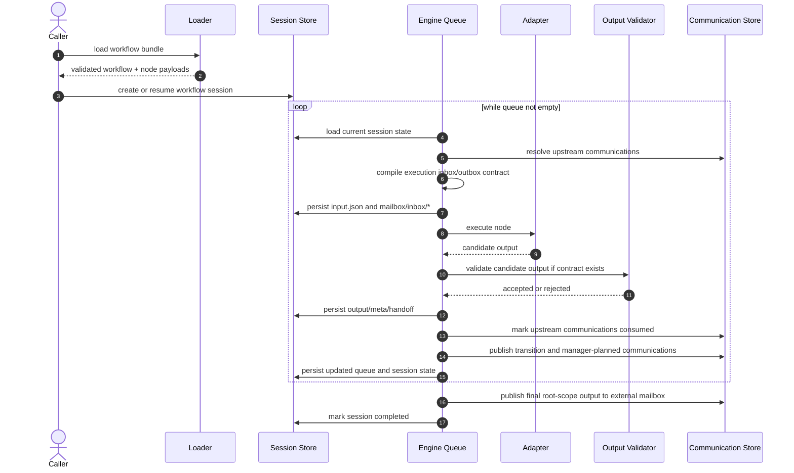

# Architecture Design

This document describes the current runtime architecture implemented in `src/workflow/`, `src/server/`, and `src/tui/`.

## Overview

`divedra` executes JSON-defined workflows by combining:

- workflow definition loading and validation
- queue-based session orchestration
- mailbox communication artifacts between nodes
- backend adapters for agent execution
- runtime-owned output validation and publication
- manager-scoped control-plane access for manager nodes

The current implementation is centered on the persisted workflow session and its queue. Manager nodes are important, but they do not replace the queue-based engine. The repository is in a mixed transitional state: step-addressed authoring and several public inspection surfaces are already in place, while some runtime and compatibility paths still retain older node-addressed behavior.

Current direction:

- workflow authoring uses jump-driven routing via runtime-owned output mail instead of dedicated branch/loop primitives
- workflows use `workflow -> steps[] + nodes[]`, where steps are the canonical execution addresses and `workflow.json.nodes[]` is a reusable node registry
- manager nodes should default to a deterministic `code` manager, with `llm` manager retained as experimental
- repeated visits to the same node should materialize distinct mailbox instances and support same-session continuation with prompt variants
- `auto improve mode` should run a paired `divedra superviser` workflow that monitors a target workflow, decides between rerun and workflow repair, and reruns against an execution-scoped mutable workflow copy by default

Supporting design:
- `design-docs/specs/design-node-jump-and-code-manager-runtime.md`
- `design-docs/specs/design-workflow-steps-and-node-reuse.md`
- `design-docs/specs/design-auto-improve-superviser-mode.md`

## Core Architectural Boundaries

### Workflow Definition Boundary

Workflow definitions live under `<workflow-root>/<workflow-name>/` and are composed from:

- `workflow.json`
- optional `steps/step-*.json` files when steps are file-backed
- referenced node payload JSON files
  - default location: `nodes/node-{id}.json`
  - authors may also place payloads in workflow-relative nested paths such as `workflows/<lane>/nodes/node-{id}.json`
- optional prompt files referenced by `systemPromptTemplateFile`, `promptTemplateFile`, and `sessionStartPromptTemplateFile`

The loader resolves those workflow-local prompt files into effective inline template text before validation and execution.

Workflow roots can be resolved directly or through the scoped workflow catalog.
The scoped model defines:

- project scope root: nearest project `.divedra`
- user scope root: `~/.divedra` by default
- workflow root: `<scope-root>/workflows`
- add-on root: `<scope-root>/addons`
- runtime data root: `<scope-root>/artifacts`
- log root: `<scope-root>/logs`

Project scope is searched before user scope for bare workflow names, while
`--workflow-root` and `DIVEDRA_WORKFLOW_ROOT` remain direct workflow-root
overrides for examples and automation. Supporting design:
`design-docs/specs/design-user-scope-workflows.md`.

### Runtime State Boundary

The runtime persists three distinct forms of state:

- workflow session state in `{rootDataDir}/sessions/`
- node and communication artifacts in `{rootDataDir}/workflow/`
- query-oriented runtime index data in `{rootDataDir}/divedra.db`

In scoped catalog mode, `{rootDataDir}` defaults to the owning workflow scope's
`<scope-root>/artifacts`.

File artifacts remain the authoritative source for execution payloads. SQLite is a best-effort index for CLI, TUI, and GraphQL inspection queries.

When CLI, API, library, or catalog-aware runtime entrypoints receive explicit
artifact and/or session-store roots, they infer `rootDataDir` from those
explicit storage roots when possible so `divedra.db` stays co-located with the
selected runtime tree instead of drifting to an ambient default. An explicit
`DIVEDRA_ARTIFACT_DIR` remains the canonical root data directory override and is
not replaced by scoped defaults.

### Execution Boundary

The main runtime entrypoint is `runWorkflow()` in `src/workflow/engine.ts`.

It owns:

- session creation, resume, and rerun
- queue progression
- timeout and stuck-restart handling
- output-contract validation and retry
- communication publication and consumption
- step jump resolution and timeout-policy routing
- manager-control validation
- final workflow-output publication

Execution-time working directory is resolved separately from workflow/artifact/session root resolution.

- default workflow execution working directory: command invocation `cwd`
- run-scoped override: explicit execution input working directory
- node-scoped override: `nodePayload.workingDirectory`, resolved from the effective workflow execution working directory

Supporting design: `design-docs/specs/design-workflow-working-directory.md`.

## Primary Components

### Workflow Loader and Validator

Source:

- `src/workflow/load.ts`
- `src/workflow/validate.ts`

Responsibilities:

- read workflow bundle files
- resolve `promptTemplateFile`
- validate step definitions, node registry entries, transitions, and payload shapes

Important validation facts:

- worker-only workflows are valid when `entryStepId` is explicit
- `managerStepId`, when present, must resolve to an authored step
- every step must resolve `nodeId` through the explicit node registry in `workflow.json.nodes[]`
- in strict step-addressed mode, dedicated authored fields such as `edges`, `loops`, `branching`, and structural sub-workflow metadata are rejected; the repository default still loads a limited compatibility set while cutover work remains in progress
- cross-scope routing must still target the owning manager boundary

### Node Add-on Catalog

Workflow node references may use built-in add-ons as an authoring shortcut for
runtime-provided worker behavior. Add-ons are resolved by the loader into
effective node payloads before execution, while save/edit surfaces preserve the
authored add-on reference.

Initial scope:

- runtime-provided `divedra/*` add-ons
- scoped local add-on manifests under `<scope-root>/addons`, where project and
  user scopes use the same add-on directory layout as workflow scopes
- third-party add-on references through host-provided resolver functions; these
  are local process integrations and do not perform package or network
  resolution during workflow load
- no network resolution at workflow load time
- `divedra/chat-reply-worker` for provider-neutral event replies
- `divedra/codex-worker` and `divedra/claude-code-worker` for reusable
  agent-backed worker nodes
- `divedra/x-gateway-read` for read-only x-gateway GraphQL inspection through
  an explicit container runner binding
- `divedra/x-gateway` for intentional x-gateway GraphQL query or mutation
  execution, including X post mutations, through the same explicit container
  runner and environment binding model
- `divedra/mail-gateway-read` and `divedra/mail-gateway` for read-only mail
  inspection and intentional mail send mutations through the same explicit
  container runner and environment binding model
- add-on nodes remain ordinary worker nodes after resolution
- `divedra/` is reserved for runtime-provided add-ons; third-party add-ons use
  non-`divedra/` names such as `vendor/name`

The chat reply worker creates provider-neutral reply requests from
`runtimeVariables.event` and dispatches them through the event reply adapter
registry. Provider SDKs and credentials remain in the event layer, not in the
workflow engine. Add-ons that need invocation-specific values use
`addon.inputs`, and only descriptors that explicitly consume environment
bindings accept `addon.env`. Host applications can pass add-on resolvers through
workflow load, validation, save, and execution options to materialize
third-party add-on references into ordinary node payloads. The package root
exports the library API from `src/lib.ts` rather than the CLI entrypoint so
third-party add-on packages can type resolver exports from `divedra` without
deep imports.

Supporting design:
`design-docs/specs/design-node-addon-catalog-and-chat-reply-worker.md`.

### Prompt and Input Assembly

Source:

- `src/workflow/input-assembly.ts`
- `src/workflow/prompt-composition.ts`
- `src/workflow/prompt-template-context.ts`

Responsibilities:

- merge runtime variables with node variables
- resolve `argumentBindings`
- expose inbox/upstream payloads to templates
- compose manager and worker system prompt layers
- choose the default manager system prompt by the active step-based execution model so manager guidance reflects current-workflow state and any supported cross-workflow invocation contract
- prepend node-authored session-start prompts only when a backend session is first created
- inject workflow and cross-workflow structure summaries when applicable
- keep manager mailbox/control guidance aligned with the active execution model so role-authored workflows advertise current-workflow retry/replay/optional-step actions

The runtime distinguishes:

- node `kind`: structural role
- node `nodeType`: execution flavor

That separation is still fundamental to the current runtime design, even though authored workflow design is moving toward `role` plus `control` rather than structural `kind`.

### Adapter Layer

Source:

- `src/workflow/adapter.ts`
- `src/workflow/adapters/*`

Responsibilities:

- execute agent nodes against concrete backends
- propagate backend session reuse when `sessionPolicy.mode = "reuse"`
- enforce runtime timeout boundaries through adapter cancellation

Current implementation status:

- `agent` nodes execute
- `command` and `container` nodes execute through the native node executor

### Session and Communication Model

Source:

- `src/workflow/session.ts`
- `src/workflow/session-store.ts`
- `src/workflow/runtime-db.ts`

Responsibilities:

- persist queue and step/node execution history
- track step visits, restart counts, and transition decisions
- record mailbox communications and conversation turns
- expose stable session identity for CLI, TUI, GraphQL, and library consumers

The queue is deduplicated after each scheduling pass. Multiple valid transition deliveries may still target more than one next execution site, but duplicate queue entries for the same pending execution are collapsed in the queue view.

### Workflow Invocation and Legacy Structural Planning

Source:

- `src/workflow/sub-workflow.ts`
- `src/workflow/conversation.ts`
- `src/workflow/manager-control.ts`

Responsibilities:

- move cross-workflow calls toward the same step-call runtime primitive used for local worker-step invocation
- treat the target design for a workflow call as a call to the callee workflow's callable entry step, normally its manager step
- keep older `workflowCalls` and structural sub-workflow planning behavior isolated as compatibility-only behavior while the runtime migrates
- converge compatibility `workflowCalls` and ordinary step calls behind one shared call abstraction instead of preserving separate long-term dispatch paths
- allow validated manager override actions
- run round-robin conversation turns for legacy compatibility bundles when still authored

Current planning behavior:

- the target design treats cross-workflow invocation as an ordinary call to another workflow's manager step rather than a separate `workflowCalls` channel
- current runtime compatibility still executes authored `workflowCalls` immediately after their caller node succeeds
- result delivery should use the same runtime-owned output/publication path as any other step call
- if current `workflowCalls` plumbing differs too much from local step-call plumbing, the implementation should be refactored so both lower into one normalized dispatch path
- manager output payloads may include `managerControl.actions`
- the runtime validates control scope before honoring those actions

### Server and GraphQL Control Plane

Source:

- `src/server/*`
- `src/graphql/*`

Responsibilities:

- expose `/graphql` for workflow-definition and execution/session control flows
- expose `/healthz` for liveness checks
- keep manager auth/session scope on the HTTP transport boundary

Serve-mode behavior:

- `divedra serve` and `divedra web serve` run the same local HTTP control plane
- `/`, `/web`, and `/ui` serve a read-only Solid workflow viewer shell
- `/assets/workflow-viewer.js` serves the bundled browser viewer asset, falling back to a source build in development
- an optional fixed workflow name constrains GraphQL workflow-definition access to that authored bundle
- `readOnly` is enforced for write mutations
- legacy workflow/session REST routes remain removed; browser data access goes through `/graphql`

Manager scope rules:

- manager auth is established from request transport metadata
- HTTP server ambient environment is not trusted as manager scope
- manager sessions are minted per real manager-step execution

### TUI Runtime Boundary

Source:

- `src/cli.ts`
- `src/tui/runtime.ts`
- `src/tui/opentui-screen.ts`
- `src/tui/opentui-model.ts`
- `src/tui/opentui-controller.ts`
- `src/tui/opentui-detail-content.ts`
- `src/tui/opentui-host-view.ts`
- `src/tui/opentui-solid-app.tsx`
- `src/tui/components/*.tsx`

Responsibilities:

- choose interactive versus fallback TUI runtime mode
- lazy-load the OpenTUI screen boundary only when interactive rendering is needed
- preserve direct resume behavior when `--resume-session` cannot use the full-screen TUI
- keep the checked-in screen host compatible with the `@opentui/solid` view layer

Current implementation status:

- `src/tui/opentui-screen.ts` now creates the renderer and orchestrates focus, key routing, popup wiring, and async workflow actions, while the rendered screen tree lives in `src/tui/opentui-solid-app.tsx` and `src/tui/components/*.tsx`
- `src/tui/opentui-model.ts` now owns the reusable workflow-preview/header and summary-selection helpers instead of duplicating that presentation logic in the host
- `src/tui/opentui-controller.ts` owns run/rerun/resume/copy/refresh/input-format orchestration so the host no longer embeds those async action bodies inline
- `src/tui/opentui-detail-content.ts` now owns mailbox/artifact-backed node-detail content loading plus history-detail pane state assembly so the host no longer embeds that file-IO and summary/viewer/detail decision tree directly
- `src/tui/opentui-host-view.ts` now owns mounted-ref validation and pane-chrome application so the host does not repeat view-wiring checks and border/title updates across render paths
- the remaining host-local helpers are renderer-specific concerns such as clipboard integration and bounded-select coordination; workflow/sub-workflow lookup helpers now live on the model seam
- CLI fallback detection now treats missing `@opentui/core`, `@opentui/solid`, and required `solid-js` runtime modules as reasons to use the non-OpenTUI path
- interactive `divedra tui` now enters the unified Solid workspace/history/run app directly instead of passing through a separate selector-only OpenTUI surface
- Bun and TypeScript are configured for the checked-in `.tsx` OpenTUI modules; JSX compilation uses the standard `solid-js` runtime while `@opentui/solid` provides the renderer and terminal component catalogue

## Event Listener Workflow Triggers

External events should be modeled as a separate trigger layer that invokes the
existing workflow execution boundary. Provider-specific cron, webhook, chat, and
UI adapters normalize incoming events into a canonical envelope, map that
envelope into workflow runtime input, persist an event receipt for idempotency,
and then call `createWorkflowExecutionClient()` or GraphQL `executeWorkflow`.

The workflow engine should not import provider SDKs or provider-specific event
types. Event bindings live outside workflow bundles so adding or changing an
event source does not mutate `workflow.json`.

Supporting design:
`design-docs/specs/design-event-listener-workflow-trigger.md`.

## Runtime Node Roles

Current authored direction:

- `steps[]` are the executable addresses
- steps may be manager or worker execution sites
- reusable node definitions live in `workflow.json.nodes[]` and backing `nodes/node-*.json` files
- `entryStepId` is always explicit

Execution policies:

- `user-action` is implemented as a `nodeType`, not as a new manager boundary, so human approval/input remains a runtime-owned execution flavor rather than a second structural control-flow system
- optional step execution is implemented as scheduler policy on authored steps
- node add-ons are an authoring reuse layer, not a third role axis; after
  resolution, an add-on node executes as a normal worker with descriptor
  provenance recorded in runtime metadata
- detailed design: `design-docs/specs/design-user-action-and-optional-node-execution.md`

## Current Execution Flow

## Mailbox Architecture

The runtime communicates between steps/nodes through persisted communication artifacts, not only in-memory transitions.

Each communication records:

- source step id, source node id, and node execution id
- destination step id and destination node id when the route stays inside the workflow
- routing scope
- payload reference
- delivery kind
- lifecycle timestamps

Routing scopes:

- `external-mailbox`
- `intra-workflow`
- `cross-workflow`

Delivery kinds:

- `step-transition`
- `step-revisit`
- `manual-rerun`
- `conversation-turn`
- `external-input`
- `external-output`

This mailbox layer is the architectural boundary that lets one workflow execution, cross-workflow invocation, and external callers use the same handoff model.

Worker nodes do not consume that canonical transport layout directly.
Before each node execution, the runtime compiles a worker-facing execution
inbox/outbox contract under the node artifact directory. That contract is the
stable node-facing ABI across `agent`, future `command`, and future
`container` execution. See
`design-docs/specs/design-node-execution-inbox-contract.md`.

## Output Ownership

The runtime, not the adapter, owns final publication.

That means:

- adapters may propose a candidate payload
- the runtime validates it
- the runtime writes canonical `output.json`
- the runtime publishes downstream mailbox artifacts only after acceptance

Workers may target execution-local outbox paths such as
`mailbox/outbox/output.json`, but those paths are staging surfaces only. They do
not grant authority over canonical mailbox publication.

This is especially important for nodes that declare `output.jsonSchema`.

## Control-Flow Semantics

### Routing

- outgoing step transitions define the legal jump graph
- worker output may include a validated `next.stepId` request
- the manager validates requested jumps against the current step transitions

### Completion

The engine checks workflow completion after successful execution and output publication.
In the step-addressed model, terminality comes from explicit manager decisions or the absence of a valid next step, not from a separate authored `CompletionRule`.

## Manager Control Architecture

Manager nodes may return `payload.managerControl.actions`.

Step-addressed manager actions should normalize to:

- `planner-note`
- `retry-step`
- `replay-communication`
- `execute-optional-step`
- `skip-optional-step`

Current runtime compatibility may still expose older node/sub-workflow action names while the implementation catches up to this target contract.

Scope enforcement:

- managers operate only within their allowed workflow scope
- retries must stay within the manager's allowed scope
- communication replay must stay within the manager's allowed scope
- optional-step decisions must stay within the manager's allowed scope

Manager sessions are minted per manager-step execution and expire when that execution finishes.

## Current Limitations

- the main runtime remains queue-based; the local `call-step` path is not the whole orchestration model
- runtime/tooling cleanup is still needed in older internal documents that describe removed branch/loop or structural sub-workflow authoring
- some supporting materials still assume node-centric naming even though authored execution is step-addressed

## References

- `design-docs/specs/design-workflow-json.md`
- `design-docs/specs/design-data-model.md`
- `design-docs/specs/design-node-execution-inbox-contract.md`
- `design-docs/specs/design-node-addon-catalog-and-chat-reply-worker.md`
- `design-docs/specs/design-graphql-manager-runtime-session-lifecycle.md`
