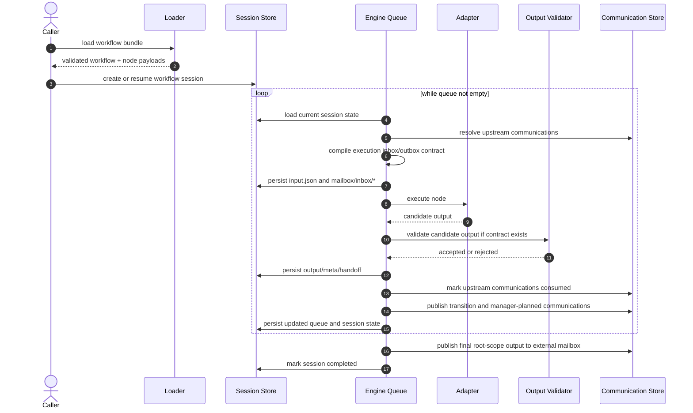

# Architecture Design

This document describes the current runtime architecture implemented primarily
under `packages/rielflow/src/`, with reusable package surfaces under
`packages/rielflow-core/src/`, `packages/rielflow-addons/src/`,
`packages/rielflow-adapters/src/`, `packages/rielflow-events/src/`,
`packages/rielflow-graphql/src/`, `packages/rielflow-server/src/`, and
`packages/rielflow-hook/src/`.

## Overview

`rielflow` executes JSON-defined workflows by combining:

- workflow definition loading and validation
- queue-based session orchestration
- mailbox communication artifacts between nodes
- backend adapters for agent execution
- runtime-owned output validation and publication
- manager-scoped control-plane access for manager nodes

The current implementation is centered on the persisted workflow session and its queue. Manager nodes are important, but they do not replace the queue-based engine. The intended architecture is now strict step-addressed execution with no backward-compatibility requirement for node-addressed or structural sub-workflow authoring. Any remaining compatibility path in the repository should be treated as technical debt scheduled for removal, not as an active architectural mode.

Compatibility-removal rule for ongoing refactors:

- no new public surface may introduce or preserve node-addressed aliases when a
  step-addressed field already exists
- new/additive control APIs must target `stepId`, `entryStepId`, and
  `managerStepId` rather than node-addressed aliases such as `nodeId` or
  removed top-level manager fields
- compatibility paths that still exist are removal targets only; they are not
  valid precedent for new runtime or API design

Current direction:

- workflow authoring uses jump-driven routing via runtime-owned output mail instead of dedicated branch/loop primitives
- workflows use `workflow -> steps[] + nodes[]`, where steps are the canonical execution addresses and `workflow.json.nodes[]` is a reusable node registry
- manager nodes should default to a deterministic `code` manager, with `llm` manager retained as experimental
- repeated visits to the same node should materialize distinct mailbox instances and support same-session continuation with prompt variants
- new workflow starts should be supervisor-backed by default at the CLI, GraphQL, and library entrypoint layer. The default supervisor is deterministic in-process runner-pool mode: it represents supervision as a workflow boundary, but the runtime service that owns lifecycle control starts, tracks, cancels, resumes, and reruns target workflows asynchronously in the same process. The supervisor command surface is the default lifecycle boundary for event sources and operators; `runWorkflow()` remains the low-level engine primitive used by the runner pool, tests, and specialized embedding.
- scheduled workflow sleeps and cron occurrences should share a scheduled event
  manager. Sleep nodes register resumable workflow continuation events instead
  of blocking the executor, and cron sources register their next occurrence
  through the same manager after each firing. See
  `design-docs/specs/design-scheduled-sleep-node-runtime.md`.
- chat-created workflow schedules should register durable `workflow-schedule`
  records through an LLM-driven schedule-registration workflow, then enqueue the
  next due occurrence through the same scheduled event manager on registration,
  recurring execution re-arm, and event listener startup. Due occurrences
  dispatch through the existing event receipt and trigger-runner path. See
  `design-docs/specs/design-scheduled-workflow-execution.md`.
- sequential prompt lists are event sources, not workflow control-flow
  primitives. A `sequential-list` source drains a configured ordered prompt
  list through the event binding and trigger-runner path one item at a time,
  waiting for the prior workflow execution or supervised run to reach a
  terminal state before dispatching the next item. Sequence cursor state lives
  with event runtime state and receipts, not in workflow bundles. See
  `design-docs/specs/design-event-listener-workflow-trigger.md`.
- Discord Gateway chat ingestion is a rielflow-owned event source, distinct
  from the generic Chat SDK Discord webhook boundary. It listens to configured
  Discord channels and threads, filters bot/self messages by default, attaches
  bounded recent channel or thread history to the normalized chat event,
  persists compact normalized history under the event data root so `events
  serve` restarts preserve channel/thread context, and reuses the
  provider-neutral chat reply worker and output destination boundary for
  same-conversation replies. See
  `design-docs/specs/design-discord-gateway-chat-history.md`.
- Matrix chat ingestion may opt into bounded, text-compatible attachment media
  downloads during `/sync`; extracted text is appended to normalized
  `chat.message` input while binary OCR, transcription, and decryption remain
  out of scope. See `design-docs/specs/design-matrix-attachment-text.md`.
- `auto improve mode` persists incidents, remediations, and mutable-workspace audit data on the target session; phase 2 optionally runs a paired `rielflow superviser` workflow (`nestedSuperviserDriver` / `--nested-superviser`) using the same audit model
- dedicated workflow self-improve is a separate retrospective analysis and
  optional canonical workflow-edit service; it reads recent workflow run
  artifacts after executions complete, writes reports under
  `~/.rielflow/self-improve-log/`, and may patch/commit workflow bundles only
  through explicit self-improve policy. See
  `design-docs/specs/design-self-improve.md`.
- server workflow manifests are a serve-time allowlist for publishing multiple
  explicitly configured workflows from one server process. A manifest-backed
  server exposes only enabled manifest entries through browser, GraphQL catalog,
  and server-backed start paths. See
  `design-docs/specs/design-server-workflow-manifest.md`.

### Product Rename to Rielflow

The product rename changes the repository, package, command, documentation,
workflow bundle, and user-facing product identity from `rielflow` to
`rielflow`, using `Rielflow` for human-readable product naming. The rename is a
behavior-preserving migration: workflow execution, mailbox semantics, GraphQL
contracts, event dispatch, adapters, TUI behavior, and session persistence keep
their current behavior except where an identifier, file path, command name, URL,
or displayed product label intentionally changes.

Canonical naming after the rename:

- human-readable product name: `Rielflow`
- lowercase command, package, directory, workflow, and repository identifiers:
  `rielflow`
- repository origin: `https://github.com/tacogips/rielflow`
- backend execution identifiers such as `codex-agent`, `claude-code-agent`,
  `official/openai-sdk`, and `official/anthropic-sdk` remain backend names, not
  product names

The rename boundary is product ownership, not every literal string. Rename
product-owned package directories, public package names, CLI binary names,
workflow catalog roots, examples, scripts, configuration, documentation,
release packaging, Homebrew formula paths, GraphQL/TUI/server labels, and
workflow prompt text where those strings refer to the product or repository.
Do not rename compatibility-neutral protocol concepts, persisted historical
artifacts, third-party backend names, or references whose value is part of an
external agent identity. Any retained `rielflow` literal must be classified as
one of: compatibility alias, migration support, historical artifact reference,
or intentionally unchanged backend/reference text.

Runtime persistence needs a compatibility plan before changing on-disk storage
roots or persisted identifiers. Existing workflow executions, mailbox
artifacts, self-improve logs, event receipts, and GraphQL inspection paths may
contain `rielflow` in historical data. New writes should use `rielflow` where
the value is product-owned, while read paths should either continue to discover
legacy roots or provide an explicit migration/alias rule. The implementation
plan must identify every persisted-path change and its verification command.

Rollout validation must include both behavior checks and rename consistency
checks:

- repository search for stale product-owned `rielflow` / `Rielflow` references
- repository search for expected retained backend and compatibility references
- package/build/typecheck/test commands for the renamed workspace
- workflow bundle validation for `.rielflow/workflows` and `examples`
- command help or smoke checks for the `rielflow` CLI surface and any retained
  compatibility alias
- `git remote -v` verification for `https://github.com/tacogips/rielflow`

Codex-agent is relevant only as the current worker execution backend and as
part of the `codex-design-and-implement-review-loop` workflow context. This
rename introduces no Cursor-specific behavior mapping and no intentional
divergence from Codex behavior.

### Dedicated Workflow Self-Improve

Self-improve is provider-neutral core workflow infrastructure, not a manager
message and not a live supervision mode. CLI, GraphQL, and library entrypoints
must call the same core service so source-run discovery, report shape, backup,
validation, and optional patch behavior stay identical across local and served
execution.

Core responsibilities:

- resolve the workflow through the normal direct/project/user catalog rules
- select source runs from the same runtime session/artifact store used by
  `workflow status`, `session status`, and GraphQL inspection
- default to runs since the last successful self-improve marker for the
  workflow directory, or the latest configurable limit when no marker exists
- assess purpose achievement from workflow descriptions, step/node intent,
  output contracts, and concrete run evidence
- write durable `report.json` and `report.md` artifacts under the user-root
  self-improve log
- before any canonical workflow edit, back up the full workflow directory under
  the same self-improve execution directory
- when the workflow directory is git-managed, create a local commit containing
  only the workflow files changed by that self-improve execution

The self-improve service must not mutate runtime session artifacts or source
code. Its write scope is the resolved workflow directory and its own
`self-improve-log` execution directory. Report-only mode is always valid;
report-and-auto-improve mode requires workflow config or explicit caller
authorization and post-patch workflow validation.

Implementation owners should keep the compatibility public facade in
`packages/rielflow/src/lib.ts`, expose the served contract through GraphQL
schema/resolver modules, and keep backend transcript parsing behind existing
agent adapter/session-history boundaries. Codex-agent is a reference for
session discovery and transcript/file-change summary patterns only; Cursor CLI
behavior remains isolated behind adapter validation and runtime-readiness
probes.

### Duplicate-Scavenge Refactoring Workflow Mode

The existing `.rielflow/workflows/refactoring-divide-and-conquer` workflow should
support duplicate-scavenge refactoring as an operator-selectable mode of the
same divide-and-conquer flow. It must not become a separate duplicate-only
workflow. The parent workflow still slices the codebase, fans out read-only
slice reviews through `.rielflow/workflows/refactoring-slice-review`, merges
findings into one implementation plan, implements one bounded task at a time,
self-reviews, runs independent post-refactor review, and loops until the plan is
complete or blocked.

Duplicate-scavenge mode is enabled by workflow input rather than by a separate
workflow id. Operators may express it through `workflowInput.requestedOutcome`,
`workflowInput.refactoringMode`, constraints, or equivalent freeform intent in
the skill example. Prompt guidance should treat the mode as additive: normal
slice ownership, risk control, and plan-only behavior remain valid, while each
phase also searches for duplicated or parallel implementations of the same
concept.

Mode-specific search targets include:

- duplicate implementations of one behavior across packages, commands, server
  handlers, GraphQL resolvers, event sources, workflow helpers, tests, or skills
- repeated parsing, validation, normalization, serialization, path resolution,
  retry/idempotency, control-flow, or mailbox/output handling logic
- custom local implementations that should be replaced by an existing shared
  helper, core API, add-on, workflow primitive, or well-known dependency already
  accepted by the repository
- near-duplicate abstractions whose naming differs but whose inputs, failure
  behavior, and verification needs are equivalent enough to evaluate together

Data flow through the existing workflow:

1. `step1-slice-codebase` preserves ordinary package or processing-group
   slicing, then adds duplicate-oriented review questions to each slice when
   duplicate-scavenge intent is present. Slices should include likely
   cross-slice counterpart paths and search hints instead of requiring every
   reviewer to rediscover the entire repository.
2. Each child `refactoring-slice-review` run remains read-only. Reviewers
   report candidate duplicates, counterpart paths, the repeated concept,
   current behavioral differences, proposed consolidation target, risk,
   confidence, and verification suggestions. They may recommend no abstraction
   when apparent duplication has intentional domain differences.
3. `step3-merge-review-plan` groups duplicate findings across slices before
   creating tasks. The merged plan should prefer shared helpers, APIs, or
   workflow primitives only when a clear owner, migration order, conflict notes,
   and verification path exist. Findings that need more discovery should remain
   blocked or investigation tasks rather than implementation-ready tasks.
4. `step4-implement-next-task` implements exactly one ready consolidation task
   per pass. It must keep behavior preservation explicit, avoid broad unrelated
   cleanups, preserve dirty worktree changes, and update the active plan with
   progress and residual risk.
5. `step5-self-review` and `step6-post-refactor-review` verify that the latest
   consolidation did not change external behavior and did not create a broader
   abstraction than the plan authorized. High or mid findings route back through
   the existing implementation loop.

The implementation plan produced by duplicate-scavenge mode must make ownership
and verification explicit for every task:

- owner paths and counterpart duplicate paths
- behavior to preserve and known differences not to collapse
- selected consolidation target, or the reason to defer consolidation
- dependency and conflict notes for other plan tasks
- narrow verification commands, plus any workflow validation required for
  changed workflow bundles

Rollout is prompt/config focused. The expected changed surfaces are
`.rielflow/workflows/refactoring-divide-and-conquer/workflow.json`, the parent
workflow prompts, `.rielflow/workflows/refactoring-slice-review/workflow.json`,
the child slice-review prompt, and
`.agents/skills/rielflow-refactoring-workflow/SKILL.md`. Runtime TypeScript code
is not required unless validation proves the current workflow input or fanout
contracts cannot carry the mode guidance.

Validation must include both changed workflow bundles:

- `bun run packages/rielflow/src/bin.ts workflow validate refactoring-divide-and-conquer --workflow-definition-dir .rielflow/workflows --output json`
- `bun run packages/rielflow/src/bin.ts workflow validate refactoring-slice-review --workflow-definition-dir .rielflow/workflows --output json`

Codex-agent remains only the execution backend for relevant worker nodes in
this issue. No Codex-reference behavior was provided for duplicate-scavenge
refactoring, and the default local reference root `../../codex-agent` was not
available during intake. The design therefore introduces no Cursor-specific
mapping and no intentional divergence from Codex behavior.

### Product-Code Duplicate-Scavenge Consolidation Boundaries

The active product-code duplicate-scavenge plan at
`impl-plans/active/refactoring-duplicate-scavenge-product-code.md` is the
source of truth for implementation order, task ownership, and verification. It
continues the workflow-mode design above after the root source tree was removed:
live runtime, event, hook, GraphQL, server, shared, workflow, and test sources
are package-local under `packages/rielflow/src`, with reusable package surfaces
under `packages/rielflow-core`, `packages/rielflow-addons`,
`packages/rielflow-adapters`, `packages/rielflow-events`,
`packages/rielflow-graphql`, `packages/rielflow-server`, and
`packages/rielflow-hook`.

Consolidation should prefer narrow helpers that preserve existing observable
behavior. Shared logic may move only when the active plan identifies a repeated
concept, an owning package or module, counterpart paths, behavior to preserve,
and focused verification commands. Refactors must not broaden public APIs or
change command, GraphQL, event-source, workflow-runtime, or adapter behavior
unless the plan explicitly authorizes a behavior-preserving contract cleanup.

Important boundary rules:

- `REF-007` may introduce package-local shared helpers for artifact-safe path
  segment sanitizing and JSON SHA-256 hashing, but it must preserve the current
  sanitize regex, truncation policy, fallback-label ownership, and exact
  `sha256(JSON.stringify(value))` semantics.
- `REF-008`, `REF-016`, and `REF-017` may share parsers, option projectors, and
  GraphQL response helpers only behind caller-owned envelopes, so CLI wording,
  GraphQL transport trust boundaries, and library option names remain stable.
- `REF-011` and `REF-012` may share communication/output artifact persistence
  helpers only if replay, routing scope, manager-message provenance, direct
  call-step metadata, sleep metadata, optional-step metadata, and runtime DB
  records remain distinguishable.
- `REF-013` and `REF-014` may share adapter lifecycle scaffolding, but provider
  request bodies, SDK output extraction, Codex event normalization, Claude
  runner error-listener behavior, and Cursor materialized-session fallback stay
  adapter-owned.
- `REF-018` should add explicit DTO projection mappers between persisted
  workflow session state and public GraphQL/control-plane DTOs rather than
  relying on structural casts.

The delegated completion run for `REF-003` and `REF-015` includes explicit
owner decisions that resolve the prior public-surface blockers. `REF-003` may
add or expose the narrowest package-owned Docker-compatible runner predicate
surface needed by root runtime readiness, including a top-level
`packages/rielflow-addons/src/index.ts` export when that follows the package's
existing convention. The shared predicate covers `podman`, `docker`, and
`nerdctl`, while readiness reporting and native executor policy errors remain
caller-owned. `REF-015` may establish core-owned node execution backend
constants and normalization in `packages/rielflow-core/src/workflow-model.ts`.
Root validation, adapter dispatch, runtime-readiness, node-patch, and payload
validation modules must use wrappers or compatibility helpers where needed so
existing null-versus-undefined caller semantics and public validation issue
shapes remain stable. The resolved owner decisions are recorded in
`design-docs/user-qa/qa-product-code-duplicate-scavenge-blockers.md`.

For delegated completion reruns of the active plan, the explicit owner
decisions in workflow input now supersede the previous blocked state for
`REF-003` and `REF-015`. Later workflow steps should implement both tasks in
dependency order with the focused verification commands in the plan. If a new
constraint is discovered, it must be recorded as a new blocker or residual risk
rather than reviving the superseded public-surface questions.

No Codex-reference implementation behavior is required for this active plan.
The default local reference root `../../codex-agent` was checked for this
design pass and was unavailable. `codex-agent` remains an execution backend and
adapter-behavior reference only. Cursor CLI behavior remains isolated behind
`packages/rielflow-adapters/src/cursor.ts` and related runtime-readiness or
adapter-validation modules; shared local-agent helpers must not alter Codex
adapter semantics.

### Workflow Node Runtime Patches

Workflow node runtime patches are invocation-scoped overlays applied after a
workflow bundle is loaded and before validation, readiness checks, or execution.
They are intended for changing LLM execution settings without editing
`workflow.json` or `nodes/node-*.json`.

Patch input shape:

```json
{
  "worker-node-id": {
    "executionBackend": "cursor-cli-agent",
    "model": "gpt-5.5",
    "effort": "high"
  }
}
```

Rules:

- the top-level patch value must be a JSON object
- top-level keys are reusable workflow node ids, not step ids
- each node patch value must be an object
- the only accepted node patch fields are `executionBackend`, `model`, and
  `effort`
- `executionBackend` uses the existing `NodeExecutionBackend` values; it is the
  canonical workflow field for the user-facing "LLM vendor/backend" setting
- `model` must remain a backend-specific model name and must not contain CLI
  wrapper identifiers such as `codex-agent` or `cursor-cli-agent`
- `effort` is a transient LLM effort override. It is valid only when the
  selected backend adapter exposes a concrete effort capability; otherwise
  patched validation returns an invalid `NodeValidationResult`
- patch application must clone or rebuild the loaded workflow state rather than
  mutating shared loader output in place
- patch application must never write authored workflow bundle files

Data flow:

1. CLI, GraphQL, or library entrypoint parses inline JSON, `@file`, or existing
   file-path patch input into a JSON object.
2. The workflow loader resolves the selected direct or scoped workflow bundle.
3. The patch overlay is applied to the loaded in-memory node payload map.
4. Structural validation and optional executable preflight run against the
   patched state.
5. Runtime readiness and workflow execution receive the same patched state that
   validation accepted.

Unknown node ids, invalid JSON, arrays/scalars, unreadable patch files,
disallowed fields, invalid backend values, empty model values, and unsupported
effort values are user errors. Error messages should name the patch source,
node id, field path, and accepted fields or values.

Because node ids are reusable registry entries, one patch affects every step
that references that node id. This is an intentional exception to the general
step-addressed public-control rule: the patch surface changes reusable node
payload settings, not execution routing or step selection.

Codex-to-Cursor switching is permitted only for loaded agent node payloads whose
patched `executionBackend` and `model` pass the same structural and executable
validation used by authored nodes. Cursor-specific behavior, including auth
uncertainty, model probing, mode mapping, and unsupported effort handling, must
remain isolated behind the Cursor adapter and runtime-readiness probe modules.
The Codex adapter remains the behavioral reference for local session/model
dispatch shape, but Codex-specific process options are not copied into the
generic patch schema.

The authoritative implementation for those behaviors lives in:

- `packages/rielflow/src/workflow/engine.ts`
- `packages/rielflow/src/workflow/call-step.ts`
- `packages/rielflow/src/workflow/superviser.ts`
- `packages/rielflow/src/workflow/superviser-control.ts` (phase-2 `SuperviserRuntimeControl` and add-on argument validation)
- `packages/rielflow/src/workflow/node-addons.ts` (native `rielflow/*` supervision add-ons)
- `packages/rielflow/src/workflow/types.ts` (shared step-addressed runtime identifiers, including phase-2 superviser-control add-on names)
- `packages/rielflow/src/workflow/validate.ts`

### Default Supervisor-Backed Starts

Workflow start surfaces should prefer deterministic supervised execution without
requiring an operator to remember `--auto-improve`. The start boundary is:

- CLI `workflow run <name>` starts under deterministic in-process runner-pool
  supervision.
- CLI `workflow run <name> --endpoint ... --no-auto-improve` must forward an
  enabled lifecycle-only supervision policy with `maxWorkflowPatches: 0`,
  because `--no-auto-improve` disables patching, not supervision.
- GraphQL `executeWorkflow` synthesizes the same deterministic supervisor policy
  when `autoImprove` is omitted; callers can pass
  `autoImprove: { enabled: false }` for lifecycle-only supervision.
- Library `executeWorkflow()` uses the same default and exposes
  `disableAutoImprove` to disable workflow patching while preserving lifecycle
  supervision.
- Resume, rerun, continuation, direct `call-step`, and low-level
  `runWorkflow()` do not silently add supervision because those paths may target
  old unsupervised sessions, imported history, or isolated test fixtures.

Implementation boundaries for this default are strict:

- helper entrypoints that accept a `defaultAutoImprove` behavior toggle must
  apply it when no explicit `autoImprove` or `disableAutoImprove` option was
  supplied; ignoring the toggle is a contract violation because it silently
  reverts the default local path to unsupervised execution.
- CLI local execution, CLI endpoint execution, GraphQL `executeWorkflow`, and
  library `executeWorkflow()` must make the same default/lifecycle-only decision
  before invoking the engine or transport. Endpoint-backed CLI calls must
  serialize `--no-auto-improve` as an enabled policy with `maxWorkflowPatches: 0`.
- nested supervisor execution is valid only when the effective policy is
  supervised. Because lifecycle-only mode is still supervised, nested supervisor
  flags remain compatible with `--no-auto-improve` and `disableAutoImprove`.

This keeps the user-facing execution model supervisor-first while avoiding a
second lifecycle implementation. The default policy records
`rielflow-default-workflow-supervisor` as the supervisor workflow name and uses a
deterministic runner-pool service for lifecycle control. Explicit LLM-backed
supervisor decisions remain opt-in through `intentMapping.mode = "llm-command"`
or an explicit nested supervisor mode; auto-improve patching remains opt-in and
must not be implied by ordinary deterministic lifecycle supervision.

The runner pool executes target workflow runs in-process and asynchronously. It
retains active run handles by runner-pool run id, workflow execution id,
supervised run id, optional operator alias or managed workflow key, and
event-source correlation key. Command arguments are assembled from structured
command objects, never from raw event text. Event text first passes through the
deterministic command parser: split on spaces/tabs, match the first token
against configured command strings, and preserve remaining tokens as arguments.
Text without a known first-token command routes to a command-analysis LLM node
that returns a typed command proposal; the supervisor itself remains
deterministic and validates the proposal before applying it.

Runner-pool handle storage must distinguish mutating async commands from
inspection commands. A dispatch that produces a real async task may create or
replace the active handle indexes for that supervised run. A status, progress,
inbox, logs, export, or other inspection dispatch that does not invoke
`onAsyncRun` must not overwrite an existing live handle with a non-async view.
This preserves later wait, cancel, and resume semantics for the original active
run while still allowing inspection commands to return fresh persisted state.

Run-pool targeting must be strongest-id first. Public callers that have a
runner-pool run id, supervised run id, or workflow execution/session id should
use that id for wait, cancel, status, progress, input, resume, restart, and
rerun operations. Alias, workflow key, and correlation-key lookup are
convenience routes only; when they match more than one active run, mutating
operations must fail with an explicit ambiguous-target result instead of
choosing arbitrarily. Read-only status may return a list or require the caller
to refine the target, but it must not collapse multiple active runs into one
answer.

Cancellation and wait semantics are split between live process control and
durable inspection. Cancellation is a live-handle operation: it must target only
the matching active in-process run, reconcile the supervised-run/session records
to `stopped` or the terminal engine status, and report a not-live result when
only durable records remain. Wait may block on the active in-process handle and
prune that handle from live indexes after terminal completion, while subsequent
status/progress queries continue through persisted supervised-run and session
records. These semantics preserve public API compatibility by adding stricter
target resolution and clearer failures without changing existing successful
call shapes.

#### Supervisor Runner-Pool Multi-Run Review Contract

Follow-up work on the supervisor runner pool should treat commit
`b2b00b592360aa326b59766b1c157f78c3a548d8` as the accepted baseline. The review
target is correctness around concurrent and historical supervised runs, not a
rewrite of the supervision model.

Multi-run lookup rules:

- `runnerPoolRunId`, `supervisedRunId`, and `workflowExecutionId` are strong
  identifiers. If more than one strong identifier is supplied, they must resolve
  to the same active handle or fail rather than silently picking one.
- `workflowKey`, `alias`, and source/binding/correlation lookup are convenience
  identifiers. They may locate a single active run, but ambiguous active matches
  must be surfaced as explicit ambiguous-target failures for lookup, wait, and
  cancellation.
- `idempotencyKey` remains a persisted command replay key, not a live
  runner-pool handle key. Adding runner-pool ids must not change existing
  idempotency request or response compatibility.
- Completed, failed, stopped, or restarted-process runs may still be inspected
  through durable supervised-run/session records by their durable ids, but live
  wait and cancellation require an active in-process handle.

GraphQL request-boundary rules:

- `dispatchSupervisedWorkflowCommand` returns `runnerPoolRunId` only when the
  server process has an active runner-pool handle for the async run.
- `supervisedWorkflowRun(input: { runnerPoolRunId })` must resolve through the
  same server-process runner pool. It must not fall back to "latest run" or a
  process-global convenience lookup when the runner-pool id is missing,
  unknown, expired, or from another process.
- GraphQL lookup inputs should preserve the same precedence as the core
  supervisor-client lookup: runner-pool id first, then supervised run id,
  workflow execution id, workflow key, alias, correlation tuple, and finally
  idempotency replay lookup when explicitly provided.
- Cross-request behavior is intentionally process-local for
  `runnerPoolRunId`. Durable cross-process inspection should use
  `supervisedRunId` or `workflowExecutionId`.

Public surface and package-boundary rules:

- The runner-pool implementation and lookup semantics belong to the core
  supervisor-client surface. CLI, server, event-source, and GraphQL adapters may
  translate transport inputs, but they must not maintain independent live-run
  pools with different ambiguity, wait, or cancellation behavior.
- `packages/rielflow/src/lib.ts` and the `rielflow-core` package boundary should expose the stable
  supervisor-client and runner-pool types needed by embedders. Deep imports from
  `packages/rielflow/src/workflow/*` remain internal unless intentionally re-exported.
- `codex-agent` and any Cursor CLI integration remain backend adapters. They do
  not define runner-pool lifecycle semantics, and Cursor-specific behavior must
  stay isolated from provider-neutral supervisor-client contracts.

Verification for this contract should include targeted tests for:

- two active runs sharing a workflow key or alias and failing ambiguous
  convenience lookup
- successful strongest-id lookup by `runnerPoolRunId`, `supervisedRunId`, and
  `workflowExecutionId`
- GraphQL dispatch followed by a separate `supervisedWorkflowRun` request using
  the returned `runnerPoolRunId`
- wait and cancel behavior for active, terminal, unknown, and process-local-only
  runner-pool ids
- idempotency replay compatibility for existing supervised command ids
- package export parity for root and core supervision surfaces

Current compatibility-removal sequence (see
`impl-plans/workflow-legacy-compatibility-removal.md`):

- rerun, resume, and direct-control entrypoints should accept authored `stepId`
  targets only
- workflow validation/load/save reject legacy **authored** fields outright
- normalized `WorkflowJson` no longer synthesizes compatibility companions such
  as removed top-level manager aliases, structural `subWorkflows`, `edges`, or
  repeat-driven `loops`
- cross-workflow dispatch is derived only from `steps[].transitions` with
  `toWorkflowId` / `resumeStepId` (deterministic ids `__cw:*` via
  `cross-workflow-from-steps.ts`); validation **rejects** authored top-level
  `workflow.workflowCalls` on every bundle kind, so the runtime does not execute
  merged explicit call records
- derived cross-workflow dispatch rows, readiness attribution, and new
  `workflow-calls/*.json` artifact metadata should use caller/resume **step**
  ids as the canonical addresses; node-registry ids may remain only in explicitly
  scoped compatibility payloads such as `runtimeVariables.workflowCall`, and
  new artifacts should not emit redundant plain `workflowId` mirrors alongside
  caller/callee-named fields
- workflow inspection and runtime-readiness surfaces should expose execution
  sources as `stepId`-named fields (`sourceStepIds`) rather than node-named
  aliases, because the normalized runtime scheduler is step-addressed
- runtime-readiness filtering for direct-step execution and inspection should
  also be keyed by executing **step** ids so reusable node-registry entries can
  back multiple authored steps without reintroducing node-addressed selection
  assumptions
- phase-2 superviser-control add-on identifiers are part of the runtime control
  surface and should stay centralized; duplicating the same `rielflow/*`
  catalog across validation, add-on resolution, and native execution is
  implementation drift, not intended architecture
- node ids remain reusable payload registry identifiers, not execution
  addresses

### TypeScript Source Module Size Boundary

Biome `lint/nursery/noExcessiveLinesPerFile` is an architectural guardrail for
the source tree, not a reason to change runtime behavior. Non-test TypeScript
source files should stay below the configured 1000-line maximum by splitting
large implementation files along existing responsibility boundaries while
preserving public import paths where practical.

Earlier oversized source files have already been split into semantic modules
and now remain as small facades where their public import paths still matter.
The current lint issue target is:

- `packages/rielflow/src/workflow/engine/workflow-runner-lifecycle.ts`

For the issue-resolution workflow "Split only workflow-runner-lifecycle.ts
below 1000 lines", this boundary is implementation work, not planning-only
work. The implementation must make real TypeScript extractions from
`packages/rielflow/src/workflow/engine/workflow-runner-lifecycle.ts`; implementation-plan-only or
progress-log-only updates do not satisfy the design intent.

Module splits should follow these boundaries:

- keep facade files only when they preserve existing caller imports and keep
  those facades small enough to satisfy Biome
- name extracted files by responsibility, such as command routing, GraphQL
  resolver groups, validation domains, runtime persistence stores, supervisor
  dispatch transport, native add-on command handling, and event trigger
  execution
- avoid moving unrelated behavior only to satisfy a line count; each extracted
  module should have a coherent owner and a narrow import surface
- keep shared type definitions in existing shared modules when already present,
  and introduce a local `types` or `shared` module only when multiple extracted
  files need the same contract
- preserve initialization order, side-effect timing, and adapter/backend
  dispatch semantics when extracting helpers from workflow runtime modules
- do not update repository skill or user documentation unless a documented file
  path, module responsibility, or workflow instruction becomes stale after the
  split

Validation for this boundary is layered:

- after formatting, no non-test TypeScript source file under `src/` may exceed
  1000 lines
- `bun run lint:biome` must pass and must not report
  `noExcessiveLinesPerFile` for non-test TypeScript sources
- `bun run typecheck` must pass after import and type-boundary changes
- focused tests must cover each touched area with broad blast radius, especially
  CLI command dispatch, event trigger execution, GraphQL schema/resolvers,
  workflow engine execution, direct step calls, native node execution, add-on
  resolution, runtime DB persistence, supervisor client dispatch, and workflow
  validation
- full tests should be run when module extraction crosses multiple workflow
  runtime areas or when focused coverage does not exercise the changed public
  surface

#### Workflow Runner Module Split

`packages/rielflow/src/workflow/engine/workflow-runner-lifecycle.ts` is the remaining oversized
workflow engine source file and should be split without changing the public
workflow engine surface. `packages/rielflow/src/workflow/engine.ts` remains the stable facade,
`packages/rielflow/src/workflow/engine/workflow-runner.ts` remains a small internal facade for the
runner contract, and `packages/rielflow/src/workflow/engine/auto-improve-and-runner.ts` remains
the public runner entrypoint that exports `runWorkflow()` and delegates to the
internal runner. The extracted files must use responsibility-based names, not
ordinal or `part-NN` names, and must not add Biome suppression comments.

The split should preserve `runWorkflowInternal()` as the orchestration contract
inside the lifecycle shell while moving cohesive internal responsibilities
behind narrow local modules:

- run setup (`run-setup.ts`): working-directory resolution, mutually exclusive
  entry-mode validation, source-session preload for resume/rerun/continuation,
  workflow bundle loading and auto-improve execution-copy reload, runtime
  readiness, adapter selection, cancellation probing, manager session store
  creation, and static runtime maps derived from the loaded workflow
- session entry (`session-entry.ts`): fresh run, resume, rerun,
  history-linked continuation, auto-improve supervision state attachment,
  bootstrap human input communication, nested superviser handoff, and early
  paused/completed return handling
- step input (`step-input.ts`): missing-step failures, optional-step decision
  gating, scenario/dry-run payload resolution, execution id and artifact
  directory setup, workflow-run event emission, upstream/latest-output mailbox
  input resolution, prompt/input assembly, and output-contract candidate path
  preparation
- node execution (`node-execution.ts`): user-action pauses, optional skips,
  agent/native execution, manager control-plane environment setup, timeout and
  stall policy, output-contract candidate attempts, schema validation,
  process/LLM log capture, backend session persistence, and execution-log
  normalization
- result finalization (`result-finalization.ts`): input/output/meta/handoff
  artifact writing, runtime DB persistence, manager session finalization,
  optional manager decisions, completion-rule evaluation, communication
  consumption, edge and loop transition selection, local fanout dispatch,
  cross-workflow dispatch, retry queue updates, workflow output runtime
  variable updates, terminal failure mapping, and final external output
  publication

The existing placeholder files `run-setup.ts`, `session-entry.ts`,
`step-input.ts`, and `node-execution.ts` are reserved for these real extracted
responsibilities. They should either be replaced with the corresponding
implementation or superseded by better responsibility-named modules in the same
engine directory. Empty marker interfaces or other placeholders are not
acceptable as the final state. `result-finalization.ts` is already a real
extracted module and should remain responsibility-owned rather than being
folded back into the lifecycle shell.

The lifecycle shell should be responsible only for sequencing these phase
helpers, owning the queue loop, and carrying the typed runner context from one
phase to the next. Shared mutable values that cross phase boundaries should be
explicit fields on local context records; extracted modules should not depend
on hidden lexical state, generated source strings, `eval`, `Function`, or
`globalThis.Function`.

Existing semantic helper modules under `packages/rielflow/src/workflow/engine/` should remain the
preferred owners for behavior they already encapsulate:

- `types-and-session-state.ts` for shared runner primitives, failure helpers,
  timestamps, ids, output validation helper paths, optional decisions, and
  session persistence helpers
- `mailbox-communication-artifacts.ts` for mailbox indexes, communication
  artifacts, session cloning, supervision-state cloning, and output payload
  reads
- `cross-workflow-dispatch.ts` for manager optional decisions and published
  workflow-result lookup
- `fanout-dispatch.ts` for local fanout and cross-workflow transition execution
- `auto-improve-and-runner.ts` for public `runWorkflow()` and nested superviser
  driver integration

New local modules are acceptable only when the extracted responsibility does
not belong in one of those existing owners. Suggested names should describe the
runtime boundary directly, for example `run-setup.ts`,
`session-entry.ts`, `step-input.ts`, `node-execution.ts`, or
`result-finalization.ts`.

Large additions should not be moved into already near-limit files outside the
target engine split. Known near-limit files at the time this issue was triaged
include `packages/rielflow/src/workflow/call-step-impl/direct-step-execution.ts` and
`packages/rielflow/src/workflow/supervisor-client/workflow-supervisor-client-factory.ts`; those
modules may be imported from when appropriate, but they are not expansion
targets for this lifecycle split.

Verification for the workflow-runner split must include:

- `bun run format`
- `bun run lint:biome`
- `bun run typecheck`
- `find packages/rielflow/src -path '*test*' -prune -o -name '*.ts' -print0 | xargs -0 wc -l | sort -nr | head`
- `bun test packages/rielflow/src/workflow/engine.test.ts packages/rielflow/src/workflow/call-step.test.ts packages/rielflow/src/workflow/call-step-impl-execution.test.ts packages/rielflow/src/workflow/call-step-impl-failures.test.ts packages/rielflow/src/workflow/history-continuation.test.ts packages/rielflow/src/workflow/manager-control.test.ts packages/rielflow/src/workflow/manager-message-service.test.ts packages/rielflow/src/workflow/manager-session-store.test.ts packages/rielflow/src/workflow/superviser.test.ts packages/rielflow/src/workflow/auto-improve-policy.test.ts packages/rielflow/src/workflow/supervisor-runner-pool.test.ts`

## Core Architectural Boundaries

### Workflow Definition Boundary

Workflow definitions live under `<workflow-definition-dir>/<workflow-name>/` and are composed from:

- `workflow.json`
- optional `steps/step-*.json` files when steps are file-backed
- referenced node payload JSON files
  - default location: `nodes/node-{id}.json`
  - authors may also place payloads in workflow-relative nested paths such as `workflows/<lane>/nodes/node-{id}.json`
- optional prompt files referenced by `systemPromptTemplateFile`, `promptTemplateFile`, and `sessionStartPromptTemplateFile`

The loader resolves those workflow-local prompt files into effective inline template text before validation and execution.

Temporary workflow execution is a separate source boundary for callers that
provide a complete workflow payload with `--workflow-json`,
`--workflow-json-file`, or an equivalent local API input. Temporary workflows
are not installed into project or user workflow roots and must not resolve
prompt, step, or node content from workflow-local files. Instead, prompt content
and node payloads are embedded in the supplied JSON and normalized in memory
before execution.

Supporting design:

- `design-docs/specs/design-temporary-workflow-execution.md`

Authored workflow boundary rules are centralized in `packages/rielflow/src/workflow/authored-workflow.ts`:

- removed top-level authored fields, their rejection messages, and canonical validation issue construction live there
- save-time persistence strips only normalized-only workflow fields from in-memory `WorkflowJson` inputs before validation and write
- `packages/rielflow/src/workflow/load.ts`, `packages/rielflow/src/workflow/validate.ts`, and `packages/rielflow/src/workflow/save.ts` should reuse that module rather than carrying separate copies of authored-schema guard logic

Workflow roots can be resolved directly or through the scoped workflow catalog.
The scoped model defines:

- project scope root: nearest project `.rielflow`
- user scope root: `~/.rielflow` by default
- workflow root: `<scope-root>/workflows`
- add-on root: `<scope-root>/addons`
- runtime data root: `<scope-root>/artifacts`
- log root: `<scope-root>/logs`

Project scope is searched before user scope for bare workflow names, while
`--workflow-definition-dir` and `RIEL_WORKFLOW_DEFINITION_DIR` remain direct workflow-definition-dir
overrides for examples and automation. Scope resolution is implemented in
`packages/rielflow/src/workflow/catalog.ts`.

### Workflow Checkout Boundary

`workflow checkout <url>` adds a GitHub-directory import path without changing
the authored workflow bundle format or the runtime lookup model. It is a
scoped catalog write surface layered above the existing loader and validation
boundary.

Checkout data flow:

1. parse and normalize a supported GitHub directory URL
2. derive the workflow name from the remote directory basename and reject names
   that fail the normal safe workflow-name rule
3. resolve the destination scope and workflow root
4. fetch the remote directory tree into a temporary staging directory outside
   the final destination
5. load and validate the staged workflow bundle through the same authored
   workflow validation path used by `workflow validate`
6. fail without touching the destination when validation fails
7. reject duplicates unless `--overwrite` was supplied
8. atomically install the staged directory into the destination workflow root
   where practical for the host filesystem
9. write checkout registry metadata under the resolved user root

Supported first-iteration URL shape is:

```text
https://github.com/<owner>/<repo>/tree/<ref>/<workflow-directory-path>
```

The GitHub fetch adapter should treat branch or tag names containing slashes as
ambiguous until it has resolved the URL against GitHub directory metadata. It
must not guess a ref/path split and install a different directory silently.
Tests should exercise the parser and fetcher through mocked GitHub responses so
normal verification remains offline.

The destination scope model is intentionally command-specific:

- default checkout destination is project scope, creating
  `<cwd>/.rielflow/workflows` when no project `.rielflow` exists
- `--user-scope` selects `<user-root>/workflows`
- `--workflow-definition-dir` is rejected for checkout because registry records
  are keyed by project/user scope, not by arbitrary direct roots

Checkout registry records are operational metadata, not workflow definitions.
They live under:

```text
<user-root>/workflow-registry/checkouts/<scope>-<workflow-name>.json
```

Each record must include:

- `workflowName`
- `sourceUrl`
- `scope`
- `checkedOutAt`
- `destinationDirectory`
- `contentDigestAlgorithm`
- `contentDigest`
- `includedFiles`

The checkout content digest is the SHA-256 identity of the installed workflow
bundle, not package provenance or registry metadata. Direct GitHub-directory
checkout and registry-backed package install must use the same workflow-root
relative hashing rules: include `workflow.json`, file-backed nodes, prompt
files, workflow-local `scripts/`, workflow-local `skills/`, and any other
ordinary bundle files; exclude generated checkout metadata, `.rielflow` runtime
state, `.git` state, and temporary files. Package install may separately verify
and persist package integrity data from `rielflow-package.json`, but that package
integrity digest must not be reused as the checkout `contentDigest` and package
root paths must not be recorded as checkout `includedFiles`.

Registry writes should be staged and renamed into place to avoid corrupt JSON on
interrupted writes. Duplicate detection must consider both the destination
directory and registry record. With `--overwrite`, the old destination must not
be removed until the newly staged remote bundle has passed validation; deletion
must be constrained to the resolved `<scope-root>/workflows/<workflow-name>`
path.

Checkout is provider-neutral. Agent backends such as `codex-agent`,
`claude-code-agent`, and `cursor-cli-agent` only appear inside downloaded node
payloads and remain validated by the existing node/backend validation layers.
No Cursor-specific or codex-agent-specific checkout behavior should be added to
the command layer; backend differences stay behind adapter modules.

### Runtime State Boundary

The runtime persists three distinct forms of state:

- workflow session state in `{rootDataDir}/sessions/`
- node and communication artifacts in `{rootDataDir}/workflow/`
- query-oriented runtime index data in `{rootDataDir}/rielflow.db`

In project-scoped catalog mode, `{rootDataDir}` defaults to
`<user-root>/projects/<project-basename>-<project-root-hash>/artifacts`.
In user-scoped catalog mode, `{rootDataDir}` defaults to `<user-root>/artifacts`.
For direct workflow-definition-dir and other non-scoped runtime entrypoints, the default
`{rootDataDir}` is `<user-root>/artifacts`.

File artifacts remain the authoritative source for execution payloads. SQLite is a best-effort index for CLI and GraphQL inspection queries.

Temporary workflow runs add one source-specific artifact area under the
individual run artifact tree:

```text
<artifactWorkflowRoot>/<workflowExecutionId>/temporary-workflow-payload/
```

That directory stores the submitted payload, normalized execution bundle, and
source metadata for temporary runs only. It is the durable reload source for
resume/rerun of temporary sessions. Normal scoped, direct-directory, manifest,
and registry-backed runs keep their existing artifact shape and must not receive
temporary payload directories.

When CLI, API, library, or catalog-aware runtime entrypoints receive explicit
artifact and/or session-store roots, they infer `rootDataDir` from those
explicit storage roots when possible so `rielflow.db` stays co-located with the
selected runtime tree instead of drifting to an ambient default. An explicit
`RIEL_ARTIFACT_DIR` remains the canonical root data directory override and is
not replaced by scoped defaults.

### LLM Session Message Inspection Boundary

GraphQL workflow inspection should distinguish runtime logs from backend LLM
session messages. Runtime logs describe rielflow-owned execution milestones,
process output summaries, and hook metadata. LLM session messages are
provider-originated records emitted while an agent backend is executing a node.

The runtime should persist a normalized, provider-neutral message index in the
runtime SQLite database, keyed by workflow execution id and node execution id.
The record should preserve ordering, backend session id when available, provider
event type, optional role, optional text content, and a raw JSON snapshot for
debugging. This index is best-effort like other runtime DB views: canonical node
artifacts and session state must remain valid even if message indexing fails.

GraphQL should expose these records as inspection-only data on workflow
execution and node execution views. This avoids overloading `nodeLogs` with LLM
conversation content and keeps `hookEvents.transcriptPath` as metadata rather
than an arbitrary file-read API.

The `llmMessages` field on `WorkflowExecutionView`,
`WorkflowExecutionOverviewView`, and `NodeExecutionView` should support bounded
selection at the field boundary. With no arguments, each field returns the
latest one persisted message. The `order` argument is a GraphQL enum with
`ASC` and `DESC` values and defaults to `DESC`; it is not a free-form string in
the public GraphQL schema. The `limit` argument is configurable per field
selection. Resolver internals may retain full persisted message arrays while
applying the requested order and limit only at the GraphQL field resolver layer,
so one query can request different message windows for workflow-level and
node-level views.

### Session Health Inspection Boundary

`session health <session-id>` should assemble an operator-facing health snapshot
from persisted session state, runtime DB summaries, bounded recent runtime and
process logs, active-node metadata, artifact/candidate timestamps, and optional
recent LLM session messages. It is an observational diagnostic surface: it does
not mutate session state, create auto-improve incidents, rerun steps, or patch
workflow definitions.

The health surface must keep uncertainty explicit. Persisted state can prove
terminality and recent progress evidence, but it cannot always prove that a
backend process is currently alive. The optional `--live` probe can add
adapter-supported local liveness evidence, but when live process state is not
available through a supported check, health output reports an unknown or
not-proven live signal instead of inferring liveness from stale or fresh
timestamps alone.

Supporting design:

- `design-docs/specs/design-session-health.md`

### Human Workflow Overview Boundary

Non-TUI human workflow inspection should use an overview-only surface layered on
top of the scoped workflow catalog and execution-summary data.

Rules:

- humans see workflow list and selected-workflow status only
- browser mode under `serve` defaults to the same overview model
- AI and advanced tooling use GraphQL detail queries for node, communication,
  hook-event, and log inspection
- duplicate workflow names from different scopes remain distinct in human list
  surfaces
- the operator-facing status view is workflow-level aggregate state, not a dump
  of raw runtime artifacts
- direct workflow-definition-dir mode is labeled as source scope `direct`; scoped catalog
  mode uses `project` and `user`
- aggregate workflow status reuses runtime statuses and adds only `never-run`
  for workflows without executions
- active execution count is derived from non-terminal `running` and `paused`
  executions

Supporting design:

- `design-docs/specs/design-workflow-overview-status-surface.md`

### Execution Boundary

The main runtime entrypoint is `runWorkflow()` in `packages/rielflow/src/workflow/engine.ts`.

It owns:

- session creation, resume, and rerun
- queue progression
- bounded fanout work-item scheduling and join aggregation for step-addressed
  fanout transitions, with cross-workflow fanout supported and parent-session
  local fanout tracked as the remaining inline execution gap
- timeout and stuck-restart handling
- output-contract validation and retry
- communication publication and consumption
- step jump resolution and timeout-policy routing
- manager-control validation
- final workflow-output publication

It must not print normal execution progress directly. Local progress visibility
is expressed through `WorkflowRunEvent` records delivered to an optional
`WorkflowRunEventSink`; the default sink is a no-op. CLI verbose mode wires that
sink to the supervisor progress renderer, which owns stderr formatting and keeps
JSON stdout clean. The legacy `onProgress` callback is reserved for explicit
debug consumers and only fires when debug mode is enabled.

Planned extension:

- history-linked continuation from one concrete prior step run into a new
  workflow execution; see `design-docs/specs/design-step-run-history-rerun.md`
- continued runs keep `session.nodeExecutions`, `session.communications`,
  backend-session handles, and other mutable execution state local to the owning
  run; imported provenance is exposed through dedicated merged-history readers
  instead of mutating the meaning of existing local session fields
- runtime helpers that currently scan only local `session.nodeExecutions` or
  `session.communications` for upstream resolution or published workflow output
  must be reviewed explicitly during continuation work; the current hotspots are
  in `buildUpstreamOutputRefs()`, `buildUpstreamInputs()`,
  `findLatestPublishedWorkflowResult()`, and
  `findLatestWorkflowCallResultExecution()` in `packages/rielflow/src/workflow/engine.ts`

Execution-time working directory is resolved separately from workflow/artifact/session root resolution.

- default workflow execution working directory: command invocation `cwd`
- run-scoped override: explicit execution input working directory
- node-scoped override: `nodePayload.workingDirectory`, resolved from the effective workflow execution working directory

Working-directory resolution is implemented in
`packages/rielflow/src/workflow/working-directory.ts`.

### Bounded Fanout And Join Boundary

Source:

- `packages/rielflow/src/workflow/engine.ts`
- `packages/rielflow/src/workflow/cross-workflow-from-steps.ts`
- `packages/rielflow/src/workflow/types.ts`
- `packages/rielflow/src/workflow/validate.ts`

Target design:

- `design-docs/specs/design-bounded-fanout-join-workflow-execution.md`

Bounded fanout/join is a step-addressed workflow-engine capability. It lets a
completed source step create a persisted fanout group from an output payload
array, run branch work items with an effective concurrency such as `20`, and
queue a join step only after all required branch results complete.

Two target modes share the same authored `WorkflowStepTransition.fanout` model.
Cross-workflow fanout targets `toWorkflowId` and runs bounded callee workflow
executions before resuming the caller at `fanout.joinStepId`. Local inline
fanout targets only `toStepId`; its required behavior is to run every branch as
a distinct work item inside the parent workflow session, not as a child workflow
and not as a plain queue entry that could dedupe repeated target-step runs.

The fanout scheduler must not treat queue entries as bare step ids internally
when a fanout branch is active. Branch work needs distinct work-item identity
(`fanoutGroupRunId`, `branchIndex`, source step run, target step/workflow) so
the same target step can execute concurrently for multiple source items without
being collapsed by existing queue dedupe. Non-fanout workflows keep the current
single-step queue behavior.

Session mutation remains engine-owned and single-writer. Concurrent branch
promises report completion events back to the scheduler, and the scheduler
serializes updates to counters, communications, transitions, fanout group state,
runtime DB rows, and `saveSession()` writes. This keeps artifact paths,
communication ids, node execution ids, and aggregate join ordering
deterministic under concurrency.

Shared-worktree mutation is a separate safety boundary. Read-only analysis and
planning branches may share the parent worktree, but code-writing fanout branches
must either declare disjoint owned paths or run in branch-local isolated
workspaces such as child workflow worktrees. Fanout group state records branch
workspace roots when they differ from the parent workspace so retry, review,
status, and cleanup surfaces can explain where branch work happened.
When an isolated branch is retried with a replacement workspace, the new branch
record also keeps the superseded workspace root for lineage and cleanup.

Cursor-specific behavior is not part of the fanout scheduler. Cursor or Codex
process behavior remains behind ordinary agent adapter modules; fanout branches
execute the same backend-neutral node payload contract as every other step.

### Auto-Improve Supervision Boundary

Source:

- `packages/rielflow/src/workflow/engine.ts`
- `packages/rielflow/src/workflow/superviser.ts`
- `packages/rielflow/src/workflow/superviser-control.ts`
- `packages/rielflow/src/workflow/node-addons.ts`
- `packages/rielflow/src/workflow/mutable-workspace.ts`
- `packages/rielflow/src/workflow/auto-improve-policy.ts`

Current phase-1 responsibilities:

- normalize and validate `autoImprove` policy input before execution
- seed and persist supervision state on the target session
- detect terminal failure and stalled progress from persisted runtime state
- choose deterministic remediations (`rerun-workflow`, `rerun-step`, `patch-workflow`, `stop-supervision`)
- create execution-copy mutable workflow workspaces and patch audit records

**Phase 2 (optional)** is implemented as an opt-in path: with `WorkflowRunOptions.nestedSuperviserDriver` (CLI `--nested-superviser` plus `--auto-improve`), the engine runs `superviserWorkflowId` as a nested step-addressed workflow and passes a runtime `SuperviserRuntimeControl` handle to native `rielflow/*` add-ons for start/status/rerun/load/save on the paired target session. Without that flag, the engine still uses the phase-1 outer `runAutoImproveLoop`. Supervision state records `nestedSuperviserSessionId` when the nested path is used; it is exposed in library/GraphQL inspection. Target-session resume with the nested flag continues the saved nested superviser session when that id is present.

### Repository Lint Policy Boundary

Repository code quality checks use Biome as the primary lint entrypoint. Local
development, task automation, and CI-oriented commands must keep the same
effective Biome lint path so repository policies cannot be bypassed by choosing
`bun run lint:biome`, `bun run lint`, `task lint`, or `task ci`.

The TypeScript source filename policy rejects numbered split-file names of the
form `part-<digits>.ts` and `part-<digits>.tsx` in the same source path scope
covered by the current Biome includes. Examples of forbidden source basenames
include `part-1.ts`, `part-01.ts`, `part-1.tsx`, and `part-01.tsx`.
Descriptive split names such as `workflow-loader.ts`,
`node-output-contract.ts`, or `session-partition.ts` remain valid because the
policy targets only a full path segment basename matching `part-<digits>`.

Biome configuration should remain the preferred home for this policy when the
installed Biome version can express an exact filename/path rule without changing
the repository's existing include set or diagnostic behavior. For Biome 2.3.15,
the local CLI/config surface does not expose a safe native rule for rejecting
arbitrary path basenames, so the design fallback is a small repository-owned
check invoked as part of the Biome lint entrypoint. The fallback check must:

- inspect only the repository source paths already covered by Biome includes
- match path basenames exactly rather than scanning arbitrary path substrings
- report every forbidden file path and exit non-zero when any are found
- avoid requiring committed forbidden fixture files; tests should create
  temporary fixture trees or exercise a pure path-matching helper
- be wired through all existing Biome lint entrypoints instead of creating a
  separate optional command that developers can skip accidentally

This rule is a repository naming policy, not an agent-adapter behavior. It has
no Codex-agent or Cursor-specific runtime mapping; any implementation should
stay in repository lint scripts/tests rather than in backend adapter modules.

## Primary Components

### Workflow Loader and Validator

Source:

- `packages/rielflow/src/workflow/load.ts`
- `packages/rielflow/src/workflow/validate.ts`

Responsibilities:

- read workflow bundle files
- resolve `promptTemplateFile`
- validate step definitions, node registry entries, transitions, and payload shapes
- share authored-schema guard rules with the save path through `packages/rielflow/src/workflow/authored-workflow.ts` so validation and persistence reject the same removed fields with the same messages

Important validation facts:

- worker-only workflows are valid when `entryStepId` is explicit
- `managerStepId`, when present, must resolve to an authored step
- every step must resolve `nodeId` through the explicit node registry in `workflow.json.nodes[]`
- node payloads distinguish `executionBackend` from `model`; model names are not used as backend selectors in newly authored workflow bundles
- step-addressed bundles reject dedicated legacy graph-control fields such as `edges`, `loops`, `branching`, and structural sub-workflow metadata
- cross-scope routing must still target the owning manager boundary
- executable node validation is an additive workflow validation layer described
  in `design-docs/specs/design-workflow-node-executability-validation.md`;
  it returns `NodeValidationResult(status,message)` records for resolved nodes,
  add-on validation hooks, and adapter-owned backend preflight without
  replacing structural `ValidationIssue` output
- active backend preflight is explicit and bounded; ordinary validation remains
  passive so structural checks do not spawn agent CLIs, consume model quota, or
  mutate workflow state

### Node Add-on Catalog

Workflow node references may use built-in add-ons as an authoring shortcut for
runtime-provided worker behavior. Add-ons are resolved by the loader into
effective node payloads before execution, while save/edit surfaces preserve the
authored add-on reference.

Initial scope:

- runtime-provided `rielflow/*` add-ons
- scoped local add-on manifests under `<scope-root>/addons`, where project and
  user scopes use the same add-on directory layout as workflow scopes
- third-party add-on references through host-provided resolver functions; these
  are local process integrations and do not perform package or network
  resolution during workflow load
- no network resolution at workflow load time
- `rielflow/chat-reply-worker` for provider-neutral event replies
- `rielflow/chat-persona-router` for provider-neutral initial persona selection
- `rielflow/codex-worker` and `rielflow/claude-code-worker` for reusable
  agent-backed worker nodes
- `rielflow/x-gateway-read` for read-only x-gateway GraphQL inspection through
  an explicit container runner binding
- `rielflow/x-gateway` for intentional x-gateway GraphQL query or mutation
  execution, including X post mutations, through the same explicit container
  runner and environment binding model
- `rielflow/mail-gateway-read` and `rielflow/mail-gateway` for read-only mail
  inspection and intentional mail send mutations through the same explicit
  container runner and environment binding model
- add-on nodes remain ordinary worker nodes after resolution
- `rielflow/` is reserved for runtime-provided add-ons; third-party add-ons use
  non-`rielflow/` names such as `vendor/name`

The chat persona router selects one initial responder from configured persona
ids, display names, and aliases using provider-neutral chat text. It must not
inspect Discord, Telegram, Matrix, or other raw provider payloads. The chat
reply worker creates provider-neutral reply requests from `runtimeVariables.event`
and dispatches them through the event reply adapter registry. Provider SDKs and
credentials remain in the event layer, not in the workflow engine. Add-ons that
need invocation-specific values use
`addon.inputs`, and only descriptors that explicitly consume environment
bindings accept `addon.env`. Host applications can pass add-on resolvers through
workflow load, validation, save, and execution options to materialize
third-party add-on references into ordinary node payloads. The package root
exports the library API from `packages/rielflow/src/lib.ts` rather than the CLI entrypoint so
third-party add-on packages can type resolver exports from `rielflow` without
deep imports. Third-party resolver calls are package-boundary validation
boundaries: both synchronous and asynchronous resolver paths must normalize
handled, unhandled, malformed, and throwing resolver outcomes into ordinary
validation results. A throwing async resolver must return `ValidationIssue`
output from `validateWorkflowBundleDetailedAsync` instead of escaping as an
uncaught exception, and any resolver-provided `nodeValidationResults` on valid
handled results must remain intact.

Add-on descriptors may also provide side-effect-free validation hooks that
return `NodeValidationResult` records. These hooks are part of the shared
workflow validation pipeline, so CLI, GraphQL, library validation, and runtime
readiness surfaces all consume the same add-on result instead of duplicating
transport-specific checks.

### Prompt and Input Assembly

Source:

- `packages/rielflow/src/workflow/input-assembly.ts`
- `packages/rielflow/src/workflow/prompt-composition.ts`
- `packages/rielflow/src/workflow/prompt-template-context.ts`

Responsibilities:

- merge runtime variables with node variables
- resolve `argumentBindings`
- expose inbox/upstream payloads to templates
- compose manager and worker system prompt layers
- render workflow-level manager and worker prompt templates when authored
- choose the default manager system prompt by the active step-based execution model so manager guidance reflects current-workflow state and any supported cross-workflow invocation contract
- prepend node-authored session-start prompts only when a backend session is first created
- inject workflow and cross-workflow structure summaries when applicable
- keep manager mailbox/control guidance aligned with the active execution model so role-authored workflows advertise current-workflow retry/replay/optional-step actions

The runtime distinguishes:

- node `kind`: structural role
- node `nodeType`: execution flavor

That separation is still fundamental to the current runtime design, even though authored workflow design is moving toward `role` plus `control` rather than structural `kind`.

Node payloads may also separate stable role instructions from per-turn prompts
through `systemPromptTemplate*` and `sessionStartPromptTemplate*`, which lets
reused backend sessions keep a stable system prompt while applying first-turn
wrappers only when a session is first created.

### Adapter Layer

Source:

- `packages/rielflow/src/workflow/adapter.ts`
- `packages/rielflow/src/workflow/adapters/*`

Responsibilities:

- execute agent nodes against concrete backends
- propagate backend session reuse when `sessionPolicy.mode = "reuse"`
- keep system prompt text and per-turn user prompt text as separate adapter
  fields whenever a backend runner exposes a `systemPrompt` option
- enforce runtime timeout boundaries through adapter cancellation
- normalize common LLM response wrappers before the runtime validates candidate
  output payloads

Current implementation status:

- `agent` nodes execute
- `command` and `container` nodes execute through the native node executor

Adapter output parsing is a runtime-owned tolerance boundary, not a workflow
prompt requirement. `parseJsonObjectCandidate()` accepts only JSON objects as
candidate payloads, but it may recover an object from common structured-output
wrappers before validation:

- an exact JSON object
- a fenced JSON object, including when the fence is surrounded by prose
- the first balanced JSON object embedded in prose

The parser must still reject non-object JSON such as arrays, strings, numbers,
or partial/unbalanced object text. Backend-specific output collection remains in
`packages/rielflow/src/workflow/adapters/*`; wrapper recovery stays in the shared adapter module
so `codex-agent`, `claude-code-agent`, and SDK-backed adapters converge before
engine-level schema, completion, and manager-control validation.

#### Local Agent Prompt Splitting on Reused Sessions

Issue-resolution handoff:
`codex-recent-change-quality-loop/riel-codex-recent-change-quality-loop-1779948622-fae615cb`
reported two mid-severity findings against
`packages/rielflow-adapters/src/codex.ts` and
`packages/rielflow-adapters/src/cursor.ts`: the backend-session reuse path sent
`buildCombinedPromptText(input)` as the resume prompt while also forwarding
`systemPromptText` through the backend runner's `systemPrompt` field. That can
duplicate stable system instructions on resumed sessions.

The adapter contract is:

- first-turn starts pass `prompt: input.promptText` and, when present,
  `systemPrompt: input.systemPromptText`
- backend-session reuse passes the per-turn user prompt only
  (`input.promptText`) and keeps `systemPromptText` in the backend runner option
  only
- stall-watch resume callbacks keep the stall-nudge prompt supplied by the
  watcher and continue forwarding the stable `systemPrompt` through backend
  options; they must not replace nudge prompts with the original node prompt
- `buildCombinedPromptText(input)` remains available only for backend surfaces
  that do not expose a separate `systemPrompt` field

Codex-agent reference mapping: installed `node_modules/codex-agent` shows
`src/process/manager.ts` builds both start and resume CLI prompts by appending
`options.systemPrompt` to the supplied prompt. Cursor reference mapping:
installed `node_modules/cursor-cli-agent/src/cursor/process-runner.ts` applies
the same final prompt assembly for start and resume paths. The default local
reference root `../../codex-agent` was checked during this design pass and was
not available, so installed package sources are the concrete reference trail for
this issue. The references are behavioral only; rielflow should not copy their
implementation.

Cursor-specific behavior remains isolated in
`packages/rielflow-adapters/src/cursor.ts`. The intentional divergence from a
single shared local-agent prompt helper is that Codex and Cursor adapters both
share the same semantic split but translate it into their backend-specific
runner APIs independently.

Regression coverage should exercise backend-session reuse with
`systemPromptText` in:

- `packages/rielflow/src/workflow/adapters/codex.test.ts`
- `packages/rielflow/src/workflow/adapters/cursor.test.ts`

The expected assertion is that resume receives the user prompt and system prompt
as separate values, and no resumed user prompt contains the system prompt text.
Verification commands:

- `bun test packages/rielflow/src/workflow/adapters/codex.test.ts packages/rielflow/src/workflow/adapters/cursor.test.ts`
- `bun test packages/rielflow/src/workflow/adapters/claude.test.ts`
- `git diff -- packages/rielflow-adapters/src/codex.ts packages/rielflow-adapters/src/cursor.ts packages/rielflow/src/workflow/adapters/codex.test.ts packages/rielflow/src/workflow/adapters/cursor.test.ts design-docs/specs/architecture.md`

For nodes with `output` configured, output-contract normalization also accepts a
valid adapter envelope from inline adapter payloads or reserved candidate files:
`when` is the transition predicate map, `payload` is the business object to
schema-validate and publish, and optional `completionPassed` overrides the
completion flag. Invalid envelope fields are validation failures. This keeps
review workers that return `when.needs_revision` from being misread as ordinary
business payloads and incorrectly routed through `!(needs_revision)`.

### Session and Communication Model

Source:

- `packages/rielflow/src/workflow/session.ts`
- `packages/rielflow/src/workflow/session-store.ts`
- `packages/rielflow/src/workflow/runtime-db.ts`

Responsibilities:

- persist queue and step/node execution history
- track step visits, restart counts, and transition decisions
- record mailbox communications and conversation turns
- expose stable session identity for CLI, TUI, GraphQL, and library consumers

The queue is deduplicated after each scheduling pass. Multiple valid transition deliveries may still target more than one next execution site, but duplicate queue entries for the same pending execution are collapsed in the queue view.

### Cross-Workflow Dispatch and Legacy Compatibility

Source:

- `packages/rielflow/src/workflow/cross-workflow-from-steps.ts` (projection of step transitions to dispatch rows)
- `packages/rielflow/src/workflow/engine.ts` (enqueue and run callee workflows; artifacts under `workflow-calls/`)
- `packages/rielflow/src/workflow/runtime-readiness.ts` (readiness checks for callee targets and dispatch chains)
- `packages/rielflow/src/workflow/manager-control.ts` (validates manager-emitted control actions)

Responsibilities:

- treat cross-workflow handoff as a normal step completion side effect: after a caller registry node succeeds, matching step-derived dispatches run against the configured workflow root
- expose callee input through runtime `workflowCall` variables (stable template key; name is historical) and deliver optional results through runtime-owned communications (`workflow-call:<dispatch-id>` prefix is historical)
- keep historical compatibility-era concepts isolated from the primary step-addressed authoring surface; new work should not reintroduce authored `workflow.edges`, `workflow.loops`, or similar node-addressed control fields
- allow validated manager override actions (`manager-control.ts` scope checks)
- reject structural manager-control actions such as `start-sub-workflow` / `deliver-to-child-input`
- when a step-derived cross-workflow transition is also a fanout transition,
  dispatch one isolated callee workflow run per fanout item through the bounded
  fanout scheduler and deliver a deterministic aggregate result to the caller's
  join step

Current behavior:

- cross-workflow invocation targets the callee workflow's callable entry step (`managerStepId` when present, otherwise `entryStepId`); there is no supported authored top-level `workflow.workflowCalls` array
- matching dispatches run after their caller step's node execution succeeds, in deterministic step order
- manager output payloads may include `managerControl.actions`; the runtime validates control scope before honoring those actions

Fanout extension:

- ordinary cross-workflow dispatches may keep deterministic sequential execution
  when no `fanout` is authored
- fanout cross-workflow dispatches resolve branch items from the source output
  payload, run callees with bounded concurrency, preserve the existing
  cross-workflow recursion guard per branch, and persist `fanoutGroupRunId` plus
  `branchIndex` in dispatch artifacts
- for cross-workflow fanout, authored `resumeStepId` remains required and must
  match `fanout.joinStepId`, because the join step is always in the caller
  workflow

### Server and GraphQL Control Plane

Source:

- `packages/rielflow/src/server/*`
- `packages/rielflow/src/graphql/*`

Responsibilities:

- expose `/graphql` for workflow-definition and execution/session control flows
- expose `/healthz` for liveness checks
- keep manager auth/session scope on the HTTP transport boundary

Serve-mode behavior:

- `rielflow serve` runs the local HTTP control plane
- an optional fixed workflow name constrains GraphQL workflow-definition access to that authored bundle
- `readOnly` is enforced for write mutations
- legacy workflow/session REST routes remain removed

Manager scope rules:

- manager auth is established from request transport metadata
- HTTP server ambient environment is not trusted as manager scope
- manager sessions are minted per real manager-step execution

## Event Listener Workflow Triggers

External events are modeled as a separate trigger layer that invokes the
existing workflow execution boundary. Provider-specific cron, webhook, chat, and
UI adapters normalize incoming events into a canonical envelope, map that
envelope into workflow runtime input, persist an event receipt for idempotency,
and then dispatch through the event trigger runner (direct execution via
`createWorkflowExecutionClient()` / GraphQL `executeWorkflow`, or supervised
routing when the binding opts into lifecycle control; same pipeline powers library
`dispatchSupervisorChat` and webhook ingestion).

The workflow engine should not import provider SDKs or provider-specific event
types. Event bindings live outside workflow bundles so adding or changing an
event source does not mutate `workflow.json`. The current implementation lives
under `packages/rielflow/src/events/`.

Target architectural direction: event bindings should be understood as bridges
between provider transports and the runtime-owned `external-mailbox` boundary,
not as the only place where workflow execution semantics are defined. External
input and output mailbox surfaces exist independently of any attached event
source; adapters normalize inbound provider events into external mailbox input
and deliver provider-neutral external mailbox output back to the provider. The
detailed design for that direction is
`design-docs/specs/design-event-external-mailbox-binding.md`.

Event bindings that need ongoing lifecycle control should use the supervised
event control path rather than direct target execution. In that path, the event
listener maps an event to a structured supervisor command and routes it to the
runtime supervisor control service (library or remote GraphQL), which owns
supervised-run records and target workflow start, stop, restart, status, and
restart-budget policy for that correlation key. A packaged authored supervisor
workflow is optional and layers on the same public contract in a later phase.
The detailed design is `design-docs/specs/design-event-supervisor-control.md`.

Chat-facing dispatch where one supervisor must decide among multiple workflows
uses a supervisor conversation backed by a supervisor profile. The profile
names the supervisor workflow and the allow-list of workflows it may start,
stop, switch, inspect, or receive input for. The supervisor's dispatcher step
may be an LLM manager node, but its output is only a structured proposal;
runtime profile validation enforces all privileged lifecycle actions. The
detailed design is
`design-docs/specs/design-workflow-supervisor-dispatcher.md`.

## Runtime Node Roles

Current authored direction:

- `steps[]` are the executable addresses
- steps may be manager or worker execution sites
- reusable node definitions live in `workflow.json.nodes[]` and backing `nodes/node-*.json` files
- `entryStepId` is always explicit

Execution policies:

- `user-action` is implemented as a `nodeType`, not as a new manager boundary, so human approval/input remains a runtime-owned execution flavor rather than a second structural control-flow system
- optional step execution is implemented as scheduler policy on authored steps
- node add-ons are an authoring reuse layer, not a third role axis; after
  resolution, an add-on node executes as a normal worker with descriptor
  provenance recorded in runtime metadata
- this behavior is implemented across `packages/rielflow/src/workflow/engine.ts`,
  `packages/rielflow/src/workflow/types.ts`, and `packages/rielflow/src/events/`

## Current Execution Flow



## Mailbox Architecture

The runtime communicates between steps/nodes through persisted communication artifacts, not only in-memory transitions.

Each communication records:

- source step id, source node id, and node execution id
- destination step id and destination node id when the route stays inside the workflow
- routing scope
- payload reference
- delivery kind
- lifecycle timestamps

Routing scopes:

- `external-mailbox`
- `intra-workflow`
- `cross-workflow`

Delivery kinds:

- `step-transition`
- `step-revisit`
- `manual-rerun`
- `conversation-turn`
- `external-input`
- `external-output`

This mailbox layer is the architectural boundary that lets one workflow execution, cross-workflow invocation, and external callers use the same handoff model.

Planned continuation extension:

- a new workflow execution may import a prefix of one prior workflow
  execution's step-run history by reference, anchored by a concrete
  `stepRunId`/`nodeExecId` plus execution ordinal, rather than by step id
  alone; see `design-docs/specs/design-step-run-history-rerun.md`

Worker nodes do not consume that canonical transport layout directly.
Before each node execution, the runtime compiles a worker-facing execution
inbox/outbox contract under the node artifact directory. That contract is the
stable node-facing ABI across `agent`, `command`, `container`, and `addon`
execution. The current implementation is centered on
`packages/rielflow/src/workflow/node-execution-mailbox.ts`.

## Output Ownership

The runtime, not the adapter, owns final publication.

That means:

- adapters may propose a candidate payload
- the runtime validates it
- the runtime writes canonical `output.json`
- the runtime publishes downstream mailbox artifacts only after acceptance
- external workflow publication selects the latest accepted root-scope `output`
  node artifact in the current workflow execution rather than any arbitrary
  "last response"

Workers may target execution-local outbox paths such as
`mailbox/outbox/output.json`, but those paths are staging surfaces only. They do
not grant authority over canonical mailbox publication.

This is especially important for nodes that declare `output.jsonSchema`.

The runtime also persists handoff-oriented audit helpers alongside accepted node
artifacts, including `handoff.json` metadata and `commit-message.txt` operator
templates used for Git/Jujutsu checkpoint workflows.

## Control-Flow Semantics

### Routing

- outgoing step transitions define the legal jump graph
- worker output may include a validated `next.stepId` request
- the manager validates requested jumps against the current step transitions

### Completion

The engine checks workflow completion after successful execution and output publication.
In the step-addressed model, terminality comes from explicit manager decisions or the absence of a valid next step, not from a separate authored `CompletionRule`.

## Manager Control Architecture

Manager nodes may return `payload.managerControl.actions`.

The runtime treats `payload.managerControl: null` the same as an absent
`managerControl` field. Nullable output from an LLM or structured-output wrapper
therefore means "no manager control action requested" and must not fail an
otherwise valid manager response. Non-null `managerControl` values must remain
objects, and `managerControl.actions`, when present, must remain an array that
passes the same scope and action validation rules.

**Target** step-addressed naming (see `impl-plans/workflow-legacy-compatibility-removal.md`) is:

- `planner-note`
- `retry-step` (replacing node-id-oriented `retry-node`)
- `replay-communication`
- `execute-optional-step` / `skip-optional-step` (replacing `execute-optional-node` / `skip-optional-node`)
- no structural child-workflow actions

**Current** implementation in `packages/rielflow/src/workflow/manager-control.ts` accepts `planner-note`, `retry-step`, `replay-communication`, `execute-optional-step`, and `skip-optional-step` (retry/optional actions use `stepId`). Removal-bound aliases `retry-node` / `execute-optional-node` / `skip-optional-node` are **rejected** (no `nodeId` field on these actions). Structural compatibility actions `start-sub-workflow` and `deliver-to-child-input` are **rejected**. Remaining follow-up work in `impl-plans/workflow-legacy-compatibility-removal.md` is now mostly naming/doc cleanup rather than live authored compatibility logic. Cross-workflow dispatch is step-derived only; the engine does not execute authored top-level `workflow.workflowCalls`.

Scope enforcement:

- managers operate only within their allowed workflow scope
- retries must stay within the manager's allowed scope
- communication replay must stay within the manager's allowed scope
- optional-step decisions must stay within the manager's allowed scope

Manager sessions are minted per manager-step execution and expire when that execution finishes.

## Package Boundary Architecture

Issue-resolution workflow `design-and-implement-review-loop` for "Split
rielflow TypeScript packages" introduces package boundaries without changing the
existing CLI or library contract. The current single package publishes
`dist/lib.js` as `import "rielflow"` and `dist/main.js` as the CLI entrypoint;
the split must preserve those entrypoints through compatibility facades while
moving implementation ownership into workspace packages.

The package graph should use Bun workspaces and flake-provided tooling only.
Repository commands must continue to work through `nix develop --command ...`
or the flake app, and must not assume globally installed Bun, TypeScript,
Biome, Vitest, or Task.

Required packages:

- `rielflow-core`: owns workflow definitions, validation, execution engine,
  runtime DB/session artifacts, mailbox contracts, supervisor primitives,
  backend adapter dispatch contracts, dedicated self-improve service contracts,
  and provider-neutral public library API contracts exported through package
  surfaces rather than root source files.
- `rielflow-addons`: owns built-in node add-on catalog resolution, native
  add-on execution, add-on configuration validation, and any reusable add-on
  types that should not force downstream callers to depend on the CLI/server
  surface.
- `rielflow`: remains the compatibility package name and published CLI/library
  facade. It re-exports the stable library surface from `rielflow-core` and
  keeps the `./cli` export/bin behavior compatible with current callers.

Additional package candidates should be evaluated during implementation:

- `rielflow-cli`: separate when CLI parsing, command handlers, help text, and
  process I/O can depend on `rielflow-core` without creating reverse imports.
  If split, `rielflow` should keep a CLI shim that delegates to this package.
- `rielflow-graphql`: separate when GraphQL schema/client/server resolver code
  can depend only on `rielflow-core` and optional server transport helpers.
- `rielflow-events`: separate when external event source parsing, receipts,
  listener service, and supervisor chat dispatch can depend on core runtime
  contracts without importing CLI-only behavior.
- `rielflow-server`: separate only if HTTP serving and GraphQL endpoint wiring
  become independently reusable; otherwise keep server transport with the CLI
  package to avoid over-splitting.

Boundary rules:

- dependencies point inward toward `rielflow-core`; `rielflow-core` must not
  import CLI, server, GraphQL endpoint, event listener, or add-on package code
  except through narrow type-only contracts that belong in core
- add-on resolution may depend on core workflow types, but core workflow
  validation must access built-in add-ons through explicit registries instead
  of hard-coded package-local imports that prevent package reuse
- `rielflow-addons` is an implementation ownership boundary, not a separate
  end-user installation boundary; release artifacts for the `rielflow` CLI must
  make built-in add-ons available when only `rielflow` is installed
- backend-specific behavior for `codex-agent`, `claude-code-agent`,
  `official/openai-sdk`, `official/anthropic-sdk`, and `cursor-cli-agent`
  remains behind adapter modules; Cursor CLI behavior must stay isolated to the
  Cursor adapter and must not alter Codex adapter semantics
- package exports expose stable entrypoints only; deep internal imports across
  package boundaries are disallowed unless explicitly exported for extension
- examples under `examples/` remain runnable with
  `--workflow-definition-dir ./examples`; example workflow JSON and prompt
  paths must not depend on repository-internal source paths

Root source removal cutover:

- the repository root `src/` directory is not a runtime, test, or compatibility
  location; former root runtime and tests live under `packages/rielflow/src`
- executable commands in root tooling, README guidance, examples, and workflow
  fixtures must invoke `bun run packages/rielflow/src/bin.ts ...` or another
  package-local entrypoint; `bun run src/main.ts ...` is obsolete
- root `package.json`, `tsconfig.json`, `tsconfig.build.json`,
  `vitest.config.ts`, `biome.json`, `scripts/run-bun-tests.sh`,
  `scripts/check-source-filenames.ts`, and
  `scripts/sync-package-declarations.ts` must resolve package-local sources
  only
- `packages/rielflow/src/package-boundaries.test.ts` is the design guard for the
  cutover: it must fail if root `src/` is recreated or package-local code
  imports from root source paths
- current docs and workflow fixtures should use package-local paths for live
  commands and verification; historical design notes or archived mock payloads
  may retain old `src/...` text only when that text is clearly historical
  scenario data

Supervisor runner-pool package boundary:

- runner-pool lifecycle types, client request/response shapes, and the
  deterministic in-process pool implementation belong to `rielflow-core`
- `packages/rielflow/src/lib.ts` and `packages/rielflow-core/src/index.ts` should
  expose the same stable supervision client surface needed by embedders without
  requiring deep imports from `packages/rielflow/src/workflow/*`
- `rielflow` remains a compatibility facade and CLI package; it may re-export
  core supervision APIs but must not own independent runner-pool state
- GraphQL, event-source, and CLI adapters may translate transport-specific
  commands into core supervisor-client operations, but process/run-pool
  management remains keyed by the core ids: `runnerPoolRunId`,
  `supervisedRunId`, `workflowExecutionId`, workflow key/alias, and correlation
  key
- Cursor CLI behavior, if present, remains isolated behind its adapter module;
  it must not change codex-agent runner-pool semantics or the provider-neutral
  supervisor-client contract
- generated declarations, copied prompt assets, native add-on assets, and CLI
  executable shims must be produced by package-local build steps orchestrated
  from the root task scripts
- test and build commands must run from the root and from affected package
  scopes using flake-defined tooling

Self-improve package-boundary contract:

- the dedicated retrospective self-improve service is a core runtime service,
  not CLI-owned behavior; `packages/rielflow-core/src/index.ts` should export
  `executeWorkflowSelfImprove`, report lookup/listing functions, policy
  resolution, default log-limit constants, and the public self-improve
  input/result/report types
- `packages/rielflow/src/index.ts` remains the compatibility library facade and
  may wrap core self-improve calls with endpoint-backed GraphQL routing, but it
  must not define a second self-improve execution path
- package CLI handlers must call package-local or exported package surfaces; root
  source compatibility imports are no longer allowed after the root `src/`
  removal
- package-boundary tests are part of the design contract: export-contract
  expectations should include intentional self-improve core exports, and root
  import checks should reject package-to-root source dependencies

Rollout is staged. First introduce workspace metadata, package-local entrypoints,
and compatibility facades without behavior changes. Then move implementation
files by ownership, replacing relative imports with package imports only after
the receiving package exports the needed surface. The root `src/` removal is the
final cutover for the compatibility phase: examples, README command snippets,
workflow fixtures, Taskfile tasks, `tsconfig` project references or build
configs, Vitest configuration, and flake packaging must all resolve package-local
entrypoints before the cutover is considered complete.

Compatibility validation for the package split:

- `nix develop --command bun install --frozen-lockfile`
- `nix develop --command bun run typecheck`
- `nix develop --command bun test`
- `nix develop --command task test`
- `nix develop --command task build`
- `nix build .#default`
- `nix run . -- workflow list --workflow-definition-dir ./examples`

### Homebrew Release Packaging

Homebrew installation should be supported through standalone release archives
that contain a compiled `rielflow` executable. The release path is additive to
the current source-run and Nix-flake paths: it must not replace `bun run
packages/rielflow/src/bin.ts`, `nix run`, or the package-local build outputs used
by development and tests.

The packaging boundary is a release artifact builder plus a Homebrew formula
template. Runtime behavior stays in the existing CLI entrypoint under
`packages/rielflow/src/bin.ts`; packaging code must not introduce a second CLI
dispatcher or change workflow/session storage defaults. The compiled binary
should be produced with Bun's standalone compile flow so Homebrew users do not
need Bun installed at runtime. Built-in add-ons must be bundled into that
executable; `rielflow-addons` is a source/package boundary, not a separate user
install requirement. The archive should install only the executable and required
static runtime assets, such as bundled prompt assets when the compiled binary
cannot embed or locate them reliably.

Release artifact data flow:

1. build the normal package outputs so declarations and copied prompt assets
   remain synchronized with the workspace build contract
2. compile the package-local CLI entrypoint into platform-specific executable
   outputs
3. stage each artifact under a deterministic directory containing `bin/rielflow`,
   `README.md`, `LICENSE` when present, and any required runtime assets
4. create compressed archives with names that include package version, target
   operating system, and architecture
5. compute SHA-256 checksums for every archive
6. render or update the Homebrew formula from the selected release URL,
   artifact matrix, version, and checksums
7. verify the staged archive by extracting it and running executable smoke tests

Artifact names should be stable enough for release automation and formula
updates, for example `rielflow-<version>-darwin-arm64.tar.gz` and
`rielflow-<version>-darwin-x64.tar.gz`. Linux archive support may use the same
builder shape for Linuxbrew, but Homebrew-on-macOS support is the required first
slice. When cross-compilation is unavailable or unreliable, the builder should
fail with a clear unsupported-target message rather than producing a mislabeled
archive.

The Homebrew formula should live in a repository-owned Homebrew surface, such as
`Formula/rielflow.rb`, so it can be copied into a tap or published from the same
repository when the release hosting decision is resolved. The formula installs
from prebuilt release archives, selects the correct archive for supported OS and
CPU combinations, installs `bin/rielflow`, and runs a formula `test do` smoke
check. The formula is not intended for Homebrew core submission unless later
policy work replaces binary-only installation with a source build acceptable to
Homebrew core.

Validation rules:

- the release builder must refuse dirty or missing version metadata only when
  the release mode requires a publishable artifact; local dry-run builds may use
  the current package version
- every generated archive must have a checksum record
- the formula must not contain placeholder URLs or placeholder SHA values in
  publish mode
- formula tests must run `rielflow --help`; `rielflow --version` should be added
  to the release smoke test after the CLI exposes a stable version command
- local verification should install from the generated formula or extracted
  archive where Homebrew is available, otherwise it should perform archive
  extraction plus binary smoke tests, including a workflow usage command that
  loads built-in add-ons

Rollout is documentation and packaging focused. Expected implementation
surfaces are `scripts/`, `package.json`, `Taskfile.yml`, `Formula/rielflow.rb`,
`README.md`, and release-related tests or shell checks. TypeScript runtime code
is only required if smoke testing proves the CLI lacks a stable `--version`
surface or the compiled binary cannot locate required runtime assets.

Codex-agent is not a release-packaging reference for this issue. It remains an
execution backend dependency bundled or resolved according to the existing
adapter/package boundary. Cursor CLI behavior, if present, remains isolated in
the Cursor adapter and must not influence release artifact layout or Homebrew
formula behavior.

### OpenTelemetry Runtime Instrumentation

Rielflow should support coarse OpenTelemetry tracing for workflow execution,
server/control-plane entrypoints, backend adapter calls, and mailbox handoff
without making tracing a required runtime dependency for ordinary local use.
The tracing boundary is lifecycle visibility, not instruction-level or
template-level debugging. Instrumentation should describe when a workflow,
step, node execution, backend invocation, communication delivery, replay, or
GraphQL/server operation starts and ends, plus stable identifiers needed to
correlate runtime artifacts.

The first implementation slice should use standard OpenTelemetry environment
configuration for exporter behavior and add only Rielflow-specific privacy
configuration where the generic OpenTelemetry surface has no product semantics.
Telemetry startup is process-wide and should be initialized once by CLI,
library, and server entrypoints before workflow execution begins. If telemetry
is disabled or no exporter endpoint is configured, runtime wrappers should be
cheap no-ops and must not affect workflow outcomes.

Required coarse span boundaries:

- `workflow run` / `executeWorkflow` / `runWorkflow`: one root span per workflow
  execution attempt with `workflowId`, `workflowExecutionId`, resolved workflow
  source, and terminal status attributes
- `session resume`, `session rerun`, `call-step`, and GraphQL mutations such as
  `executeWorkflow` and `rerunWorkflowExecution`: entrypoint spans that link to
  the workflow execution span when the execution id is known
- step/node execution in `packages/rielflow/src/workflow/engine/` and
  `packages/rielflow/src/workflow/call-step-impl/`: one span per executable
  step invocation with `stepId`, reusable `nodeId`, `nodeExecId`,
  `mailboxInstanceId`, backend name, status, retry/resume flags when present,
  and duration
- backend adapter execution under `packages/rielflow/src/workflow/adapters/`:
  one child span per adapter call with backend, model, command/session metadata
  safe for export, and error status
- communication and mailbox handoff in
  `packages/rielflow/src/workflow/communication-service.ts`,
  `packages/rielflow/src/workflow/communication-artifact-persistence.ts`, and
  `packages/rielflow/src/workflow/node-execution-mailbox.ts`: spans or span
  events for communication creation, delivery, replay, retry, consumption, and
  execution-local mailbox preparation
- server and GraphQL control-plane handling in `packages/rielflow-server/src/`
  and `packages/rielflow-graphql/src/`: request spans with operation names,
  workflow/session identifiers when available, and no raw GraphQL variables by
  default

Privacy is part of the telemetry contract. By default, spans must not export
raw inbox/outbox message content, prompt text, model output, manager messages,
GraphQL variables, attachment content, file contents, secrets, tokens,
authorization headers, or command stdout/stderr. The default attribute set is
metadata-only: ids, statuses, timestamps/durations, counts, byte lengths,
artifact-relative paths, backend/model names, and sanitized error classes or
messages. The library option `WorkflowTelemetryOptions.exportMessages` and the
process environment variable `RIELFLOW_OTEL_EXPORT_MESSAGES` may explicitly opt
into exporting inbox/outbox message bodies for trusted local debugging. The
legacy alias `DIVEDRA_OTEL_EXPORT_MESSAGES` may be accepted during the product
rename transition. Even when message export is enabled, secret redaction must
still run before attributes are emitted, and large payloads should be
size-limited.

Data flow:

1. Entry points parse telemetry configuration from the process environment and
   optional library/server options.
2. A shared telemetry module owns tracer/provider setup, shutdown, attribute
   redaction, and no-op fallback behavior.
3. Runtime services receive the shared telemetry context through existing
   execution options or module-level helpers, then create spans only at coarse
   lifecycle boundaries.
4. Mailbox and communication instrumentation records payload metadata by
   default and includes message content only when the explicit startup opt-in is
   true.
5. Jaeger verification uses Docker Compose to start a local collector/UI and an
   OTLP endpoint. A sample workflow run should create traces visible in Jaeger
   without changing the workflow bundle.

The local Jaeger setup is a development verification aid, not a production
runtime requirement. The repository-owned `compose.jaeger.yaml` file
should define a `jaeger` service exposing the Jaeger UI and OTLP collector
ports. Verification commands should start Jaeger with
`docker compose -f compose.jaeger.yaml up -d`, run a workflow with
`OTEL_EXPORTER_OTLP_ENDPOINT` pointing at the local collector, inspect service
status with `docker compose -f compose.jaeger.yaml ps`, and confirm
traces through the UI or Jaeger API where practical before cleanup with
`docker compose -f compose.jaeger.yaml down`.

Codex-agent reference mapping: Step 1 inspected the sibling `codex-agent`
checkout and its managed worktree for OpenTelemetry, OTEL, telemetry, trace,
and Jaeger behavior. No relevant implementation was found in either reference
root. Codex-agent therefore remains only the worker backend identity included
in telemetry
attributes such as `agent.backend = "codex-agent"`. No Codex-reference behavior
is being copied, and Cursor CLI behavior remains isolated behind any existing
Cursor adapter.

## Current Limitations

- the main runtime remains queue-based; the local `call-step` path is not the whole orchestration model
- runtime/tooling cleanup is still needed in older internal documents that describe removed branch/loop or structural sub-workflow authoring
- some supporting materials still assume node-centric naming even though authored execution is step-addressed
- some compatibility facades remain while package ownership continues to
  converge, but root source files are no longer an allowed compatibility layer

## Telegram Gateway Agent Trio

Detailed design: `design-docs/specs/design-telegram-gateway-agent-trio.md`.

The `telegram-gateway` event source is the native Telegram counterpart to the
Discord Gateway path. It uses Telegram Bot API polling and send APIs directly
instead of routing through the generic Chat SDK boundary. Normalized Telegram
messages share the `chat.message`, `replyTarget`, bounded history, and chat
reply-worker contracts used by the other chat event sources. Photo updates are
exposed as deterministic attachment descriptors for workflows without storing
bot credentials or downloading binary image content.

The chat trio example contract applies to Discord, Telegram, and Matrix:
`discord-agent-trio-chat`, `telegram-agent-trio-chat`, and
`matrix-agent-trio-chat` should share the same provider-neutral graph shape
with `rielflow/chat-persona-router`, Yui Codex, Mika Trend, Rina Cursor, and
one `rielflow/chat-reply-worker` step per persona. Matrix trio parity uses the
existing `matrix` event source and Matrix chat reply destination adapter rather
than adding Matrix-specific workflow fields; optional Matrix `replyBots`
select per-persona access-token env vars from `replyAsTemplate`. The smaller
`matrix-chat-reply` example remains a reply-worker smoke fixture.

## References

- `README.md`
- `packages/rielflow/src/workflow/`
- `packages/rielflow/src/events/`
- `packages/rielflow/src/graphql/`
- `packages/rielflow/src/server/`
- `design-docs/specs/design-workflow-supervisor-dispatcher.md`
