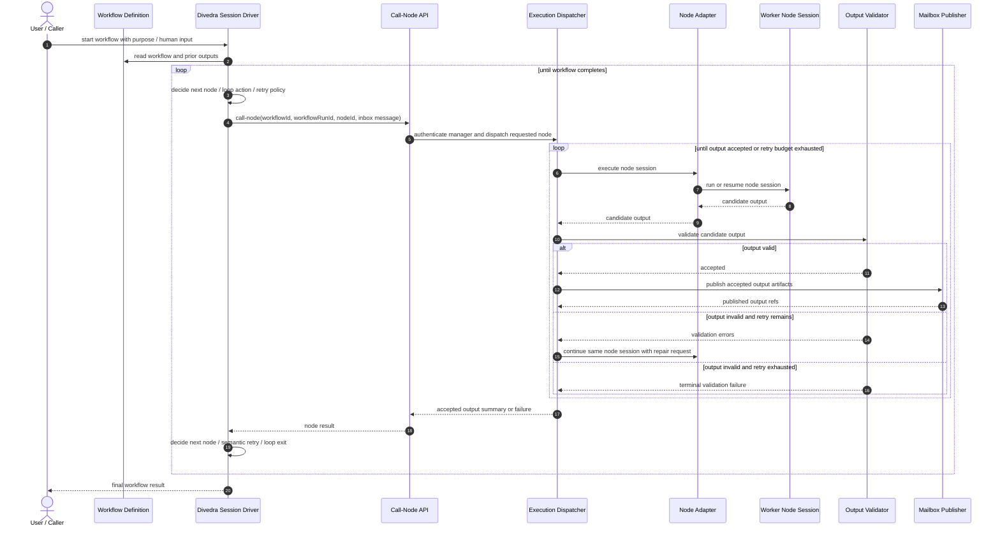

# Manager-Driven Call-Node Runtime

This document defines the near-term runtime direction where one long-lived `divedra` manager session drives workflow execution by explicitly calling child nodes.

## Overview

The goal of this design is to simplify orchestration while preserving the parts of the runtime that make workflow execution reliable:

- node roles remain explicitly defined in the workflow
- execution order and loop structure remain workflow-owned
- the active `divedra` manager session decides which node to call next
- the manager prompt must keep workflow order and loop intent explicit without adding a separate runtime order-state machine
- node output is still accepted and published by the runtime, not by the node itself

This design intentionally removes the idea of a separate autonomous runtime scheduler for near-term execution.
Policy such as retry choice, timeout reaction, and duplicate-call avoidance is owned by the active manager session.

Near-term policy:

- do not introduce dedicated runtime state management or order-management logic for deciding which node is legal next
- instead, make the manager LLM explicitly aware of the workflow and instruct it to call nodes in the authored workflow order

The runtime remains responsible for:

- invoking the requested node backend
- preserving execution artifacts
- validating structured output contracts
- re-entering the same node session for output repair when needed
- publishing accepted output artifacts for downstream consumption

## Design Goals

- keep orchestration mentally simple enough for one manager session to drive
- preserve explicit workflow order and loop guarantees
- preserve workflow-aware manager behavior through prompt composition rather than through a second runtime planner/order tracker
- preserve durable execution artifacts for every node call
- preserve machine-checkable output contracts for nodes that must emit structured JSON
- allow a node session to continue and repair its own output when validation fails
- avoid introducing a separate `Runtime Arbiter` component in the near-term design

## Non-Goals

- replacing workflow JSON with a freeform plan-only system
- allowing worker nodes to publish final output artifacts directly
- removing output contract validation
- making the runtime infer next-step policy independently of the manager session

## Approved Component Names

- `Divedra Session Driver`
  - long-lived manager AI session for one workflow run
  - reads workflow state, decides next node, interprets prior results, and decides semantic retries/loop progression
- `Call-Node API`
  - constrained manager tool interface used by the `Divedra Session Driver`
  - transports a node-call request into the runtime
- `Execution Dispatcher`
  - lifecycle owner for one `call-node` request
  - materializes inbox/input state, invokes the adapter, coordinates retries for invalid structured output, and returns accepted result status
- `Node Adapter`
  - backend execution bridge only
  - starts or resumes the concrete worker AI/code session and returns a candidate output
- `Output Validator`
  - runtime-side contract checker for node outputs
  - validates candidate payloads with `zod`, JSON Schema, or equivalent contract enforcement
- `Mailbox Publisher`
  - runtime-side publisher for accepted output artifacts
  - writes canonical `output.json`, mailbox-visible output, and related metadata after successful acceptance

## Roles and Responsibilities

### Divedra Session Driver

Responsibilities:

- hold the active orchestration conversation
- read workflow definition and prior execution state
- decide which node to call next
- decide whether a completed node should be retried semantically
- decide whether a loop continues or exits according to workflow intent

Non-responsibilities:

- writing final accepted node output artifacts directly
- deciding that a malformed structured output is nevertheless valid

### Call-Node API

Responsibilities:

- expose a constrained runtime call surface to the manager
- authenticate the active manager session and resolve its workflow scope
- identify workflow, run, target node, and manager-authored inbox/input message
- return accepted output summary and execution status

Recommended direction:

- keep GraphQL as the underlying control plane
- provide `divedra call-node` as a dedicated wrapper for manager use
- prefer structured message payloads or file-backed payload input over raw prompt text in argv

### Execution Dispatcher

Responsibilities:

- receive one node-call request
- persist node inbox / `input.json`
- call the `Node Adapter`
- hand adapter output to the `Output Validator`
- if validation fails, re-enter the same node session with repair instructions
- stop only when output is accepted or retry budget is exhausted
- return the accepted output summary or terminal failure back to the manager

Near-term scope:

- not a planner
- not an independent scheduler
- not the owner of semantic retry policy

### Node Adapter

Responsibilities:

- execute the node backend
- preserve or reuse node-local session state when supported
- return a candidate output payload or candidate output file reference

Non-responsibilities:

- publishing final accepted `output.json`
- writing mailbox/outbox artifacts as canonical runtime state
- being the final authority on output contract validity

### Output Validator

Responsibilities:

- validate candidate node output against the node contract
- return machine-actionable validation errors
- distinguish accepted output from candidate output

Validation sources:

- `zod`
- JSON Schema subset
- equivalent deterministic runtime-side validators

### Mailbox Publisher

Responsibilities:

- publish only accepted outputs
- write canonical `output.json`
- write execution metadata such as `meta.json`
- write mailbox/outbox-visible artifacts used by downstream nodes

Publication rule:

- worker nodes may propose output
- only the runtime publishes accepted output

## Output Validation and Repair Loop

Structured-output nodes need a runtime-owned acceptance path.

Required behavior:

1. The node session produces a candidate output.
2. The `Output Validator` checks the candidate against the node contract.
3. If valid, the `Mailbox Publisher` promotes it to accepted output artifacts.
4. If invalid, the `Execution Dispatcher` re-enters the same node session and requests a corrected output.
5. The repair request includes:
   - validation errors
   - prior candidate summary or reference when useful
   - instruction to regenerate only the structured output
6. The loop repeats until success or the configured retry budget is exhausted.
7. If the retry budget is exhausted, the node call fails and control returns to the `Divedra Session Driver`.

This keeps structured-output reliability without requiring a separate runtime planner.

## Node Contract Model

Each worker node is still conceptually simple:

- read inbox/input context
- perform its task, which may include code changes in the workspace
- produce outbox/output content

When a node has a structured-output contract, its produced output is treated as a candidate until the runtime accepts it.

That means:

- the node session may write candidate output
- the runtime decides whether that output is accepted
- downstream workflow progression should rely only on accepted output

## Command and API Direction

Preferred manager-facing shape:

```text
divedra call-node <workflow-id> <workflow-run-id> <node-id> [structured message input]
```

Recommended request content:

- workflow id
- workflow run id
- manager session identity carried by transport auth plus manager-session id
- node id
- manager-authored message payload destined for the node inbox
- optional node-session continuation hint when the adapter supports session reuse

Avoid making the manager pass the final fully rendered prompt directly.
The runtime should still own prompt assembly from:

- workflow context
- node template
- inbox/input payload
- validation-repair feedback when applicable

## Workflow-Adherence Prompt Contract

Manager-driven execution should keep runtime responsibilities narrow.
That means the near-term design relies on prompt composition to keep the manager aware of workflow order.

Policy statement:

- do not solve next-step ordering by adding another runtime state/order subsystem
- solve it by rendering the workflow clearly to the manager and instructing the manager to call nodes in workflow order

Required prompt/runtime behavior:

1. The manager prompt must render the workflow structure clearly enough that the manager can choose the next node according to the authored order, branch rules, and loop rules.
2. The manager prompt must include the current scope, prior accepted outputs, and the role/expected return of each callable child.
3. The prompt should instruct the manager to call only the next node or sub-workflow that is valid in the authored workflow, and to treat repeated loops as explicit obligations rather than optional suggestions.
4. When a rerun or retry is desired, the manager should explain that decision in its own reasoning and then issue the corresponding child call deliberately.
5. The runtime still authenticates manager identity/scope and preserves artifacts, but it does not introduce a second order-specific legality state machine for near-term execution.
6. This is a simplification tradeoff: correctness depends more on prompt quality and manager compliance than on hard runtime rejection of out-of-order calls.

The design therefore keeps ordering logic visible to the LLM instead of duplicating that logic in another runtime subsystem.

## Sequence



## Persistence Model

The design keeps runtime-owned artifact persistence:

- `input.json`
- accepted `output.json`
- `meta.json`
- validation-attempt artifacts when output repair is used
- mailbox/outbox publication for accepted outputs

The runtime may additionally index execution summaries in SQLite or another queryable store, but file artifacts remain the source of truth.

## Migration Notes

The current repository still contains queue-based execution internals and manager-control flows designed around runtime-scheduled re-entry.

The intended migration direction is:

1. keep workflow JSON and node payload contracts
2. introduce manager-facing `call-node`
3. shift next-step policy to the `Divedra Session Driver`
4. keep runtime-owned output validation and publication
5. reduce queue/scheduler responsibilities over time rather than removing durability or output-contract guarantees
